# GSI Edge Cases

**Phase:** 12-theory-practice-docs
**Plan:** 12-01
**Purpose:** Comprehensive documentation of edge cases, error handling, and unusual scenarios

---

## Error Handling

### Common Error Scenarios

#### 1. MCP Server Connection Errors

**Scenario:** MCP server unavailable or connection timeout

**Errors:**
- "MCP server 'xxx' not found"
- "Connection timeout to xxx"
- "Server returned error"

**Handling:**
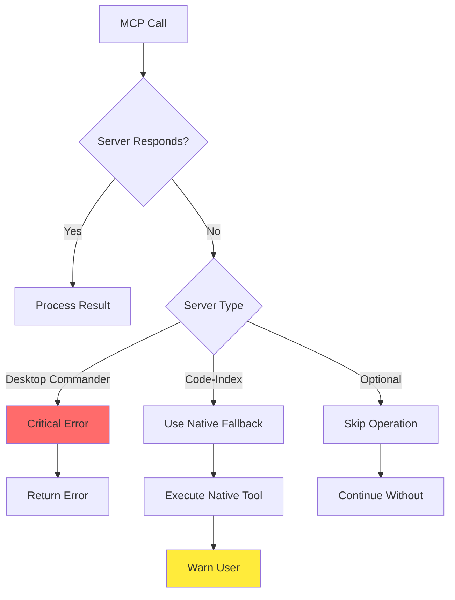

**User-Facing Message:**
```
Error: MCP server 'server-name' unavailable

What happened:
- The required MCP server is not running or not configured
- Your operation may have limited functionality

What to do:
1. Check if the MCP server is running
2. Restart the server if needed
3. Continue with reduced functionality

Current behavior: Using fallback method
```

---

#### 2. Git Operation Errors

**Scenario:** Git commit fails due to identity, conflicts, or locks

**Errors:**
- "Author identity unknown"
- "fatal: cannot lock ref"
- "Conflict detected"

**Handling:**
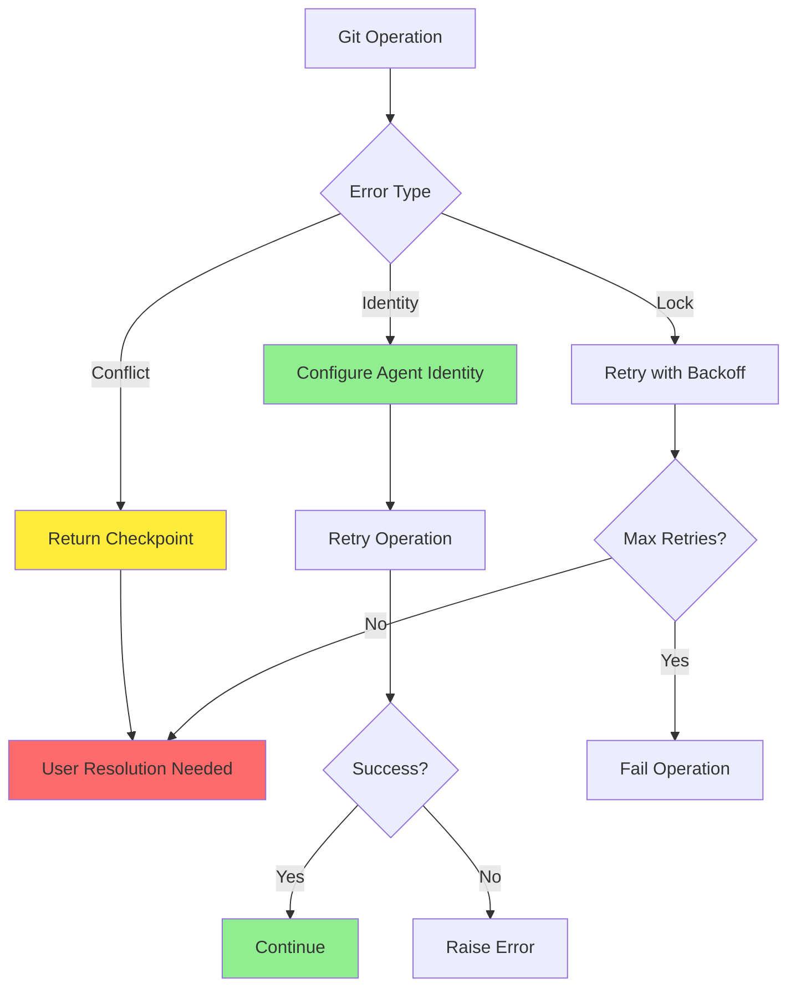

**User-Facing Message:**
```
Error: Git operation failed

What happened:
- Git commit requires user identity
- Another process has locked the repository
- Merge conflict detected

What to do:
1. Git identity: Run 'gsi-tools configure-git'
2. Repository lock: Close other git operations
3. Conflict: Resolve conflicts, then continue

Current behavior: Paused, awaiting resolution
```

---

#### 3. File Operation Errors

**Scenario:** File not found, permission denied, or locked

**Errors:**
- "ENOENT: no such file or directory"
- "EACCES: permission denied"
- "EBUSY: file locked"

**Handling:**
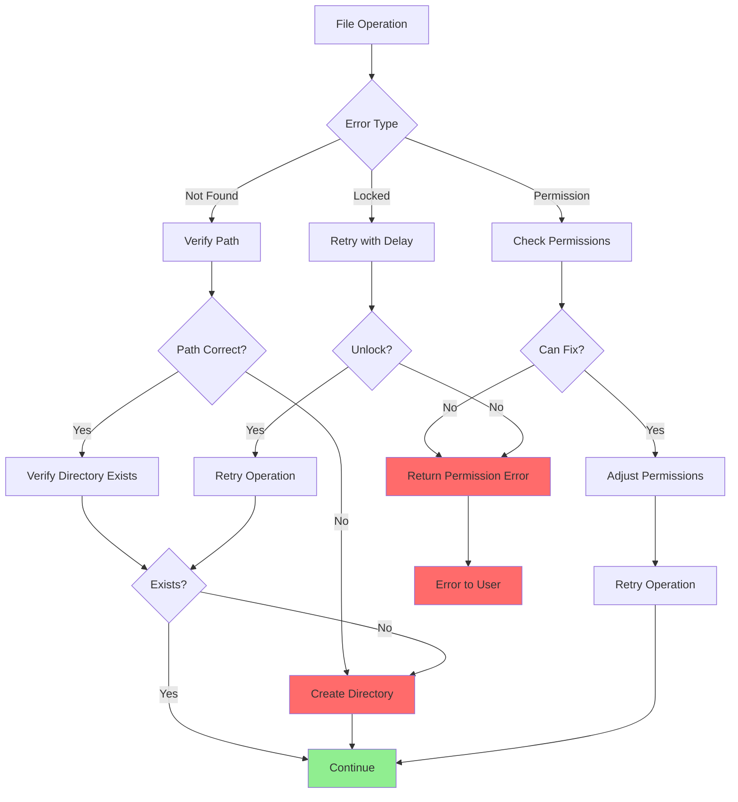

**User-Facing Message:**
```
Error: File operation failed

What happened:
- File not found: /path/to/file
- Permission denied: Cannot write to location
- File locked: Another process using file

What to do:
1. Not found: Check file path or create file
2. Permission: Run as administrator or change location
3. Locked: Close other applications using file

Current behavior: Using alternate location
```

---

#### 4. API Rate Limiting

**Scenario:** API calls rate-limited by Anthropic or external services

**Errors:**
- "429: Too Many Requests"
- "Rate limit exceeded"
- "Quota exceeded"

**Handling:**
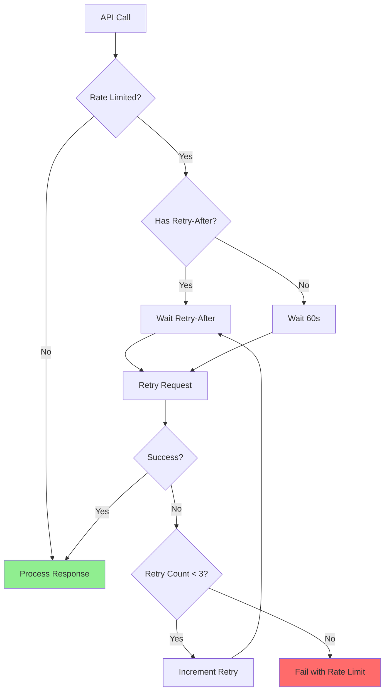

**User-Facing Message:**
```
Error: API rate limit reached

What happened:
- Too many requests to Anthropic API
- Rate limit: 50 requests per 10 seconds
- Quota: Usage limit reached

What to do:
1. Wait for automatic retry (60 seconds)
2. Reduce concurrent operations
3. Check quota status at dashboard.anthropic.com

Current behavior: Waiting, will retry automatically
```

---

## Unusual Inputs

### 1. Empty Inputs

**Scenario:** User provides empty or whitespace-only input

**Inputs Affected:**
- Planning prompts
- File paths
- Search queries
- Configuration values

**Validation:**
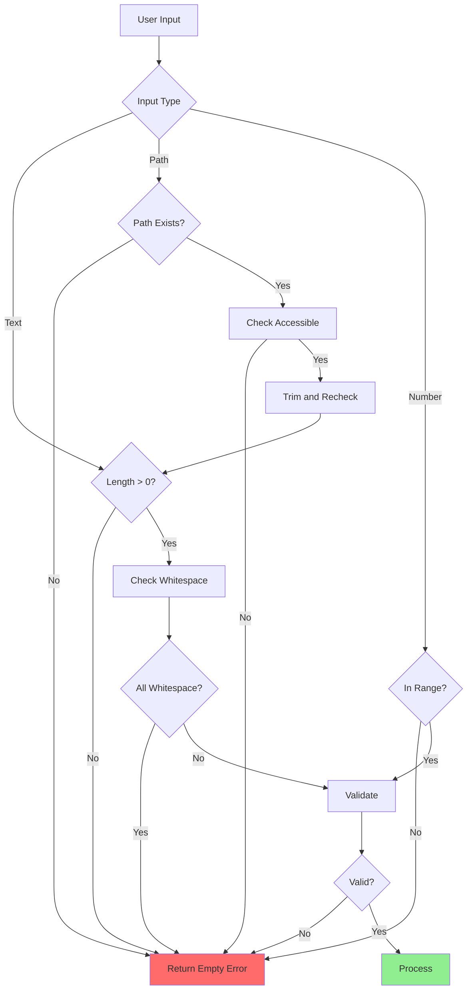

**User-Facing Message:**
```
Error: Empty input provided

What happened:
- The input provided is empty or contains only whitespace
- GSI requires meaningful input to process

What to do:
1. Provide the required information
2. Check for accidental spaces or empty fields

Example: "/GSI:plan-phase 12" (not "/GSI:plan-phase")
```

---

### 2. Large Inputs

**Scenario:** User provides very large input (>10k tokens)

**Inputs Affected:**
- Long planning prompts
- Large code snippets for review
- Complex requirements

**Handling:**
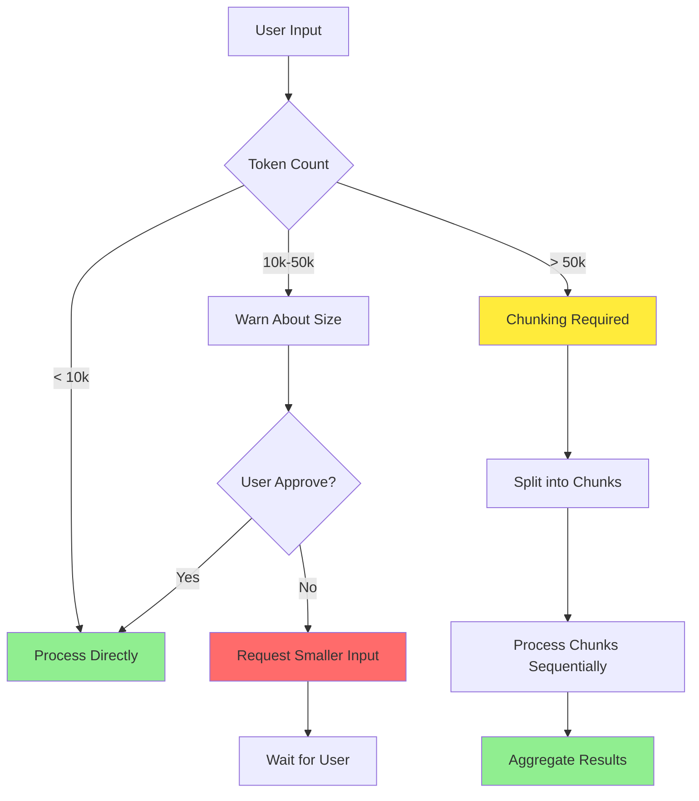

**User-Facing Message:**
```
Warning: Large input detected

Input size: 52,000 tokens
Recommended: < 50,000 tokens

What happens:
- Large inputs may hit token limits
- Processing will be slower
- Quality may degrade

Options:
1. Continue with chunking (automatic)
2. Provide smaller input
3. Split into multiple operations

Current behavior: Will process in chunks
```

---

### 3. Malformed Data

**Scenario:** Input has syntax errors or invalid format

**Inputs Affected:**
- Invalid YAML frontmatter
- Malformed JSON
- Invalid file paths
- Corrupted configuration

**Validation:**
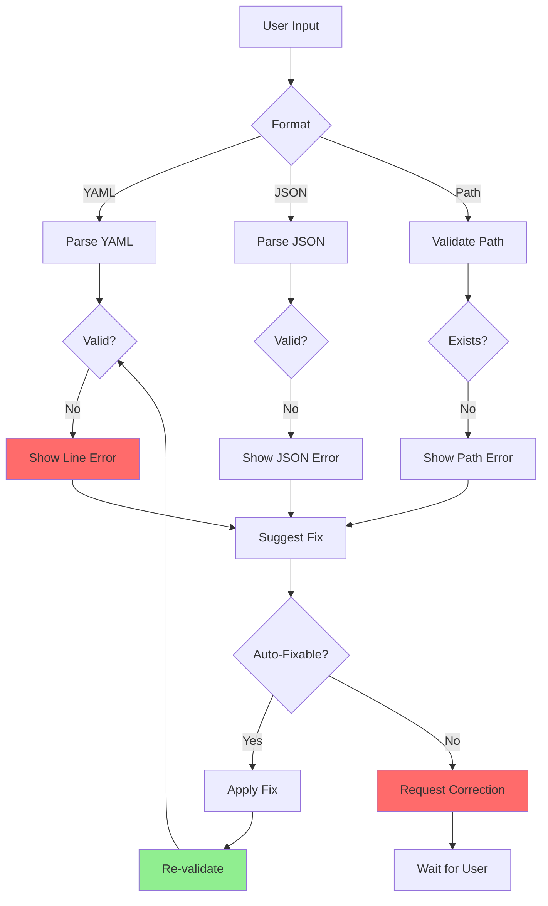

**User-Facing Message:**
```
Error: Malformed input

What happened:
- YAML frontmatter has syntax error at line 5
- JSON missing closing brace
- Path contains invalid characters

Error location:
Line 5: "phase: 12-theory-practice-docs"
           Expected: "---" or value

What to do:
1. Fix the syntax error
2. Remove invalid characters
3. Use validator: /GSI:validate

Example fix:
- phase: 12-theory-practice-docs  # Correct
+ phase: 12-theory-practice-docs    # Wrong (trailing spaces)
```

---

## Concurrent Operations

### 1. Wave Execution Conflicts

**Scenario:** Multiple agents in wave access same resources

**Conflicts:**
- Git commits from parallel agents
- File write conflicts
- MCP server contention

**Handling:**
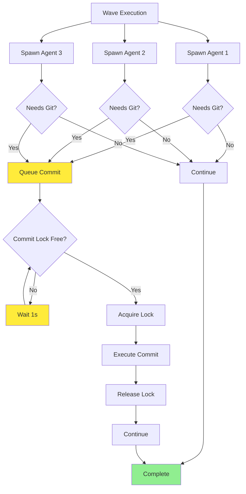

**User-Facing Message:**
```
Info: Coordinating parallel commits

What's happening:
- 3 agents working in parallel
- All need to commit to git
- Commits queued to avoid conflicts

Progress:
- Agent 1: Committing...
- Agent 2: Queued (1s wait)
- Agent 3: Queued (2s wait)

This is normal. Agents will complete sequentially.
```

---

### 2. Rate Limiting Behavior

**Scenario:** Multiple agents hit API rate limits

**Handling:**
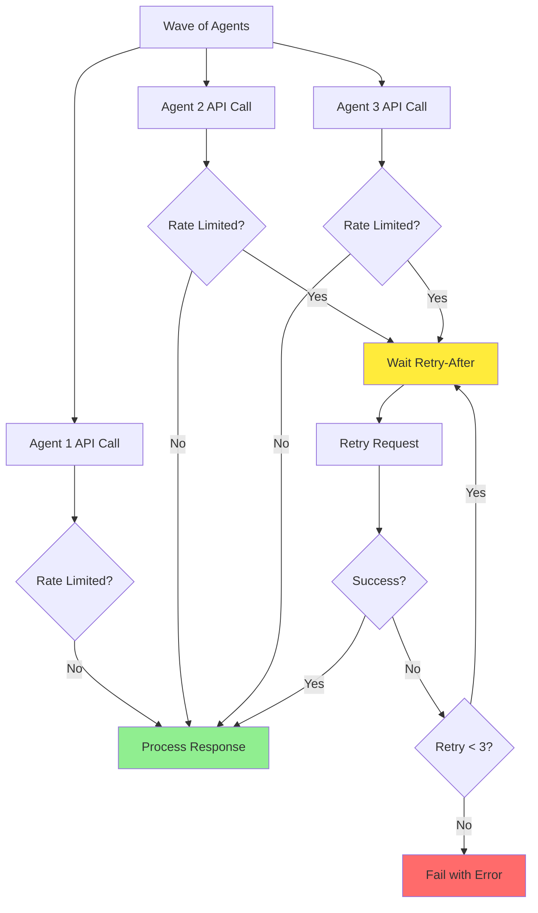

**User-Facing Message:**
```
Info: Parallel agents rate-limited

What's happening:
- 3 agents made API calls simultaneously
- Hit rate limit: 50 req/10s
- Agents auto-coordinating backoff

Progress:
- Agent 1: Proceeding (first in queue)
- Agent 2: Waiting 8s...
- Agent 3: Waiting 12s...

This is normal. Agents will complete sequentially.
```

---

### 3. Timeout Handling

**Scenario:** Long-running operation hits timeout

**Handling:**
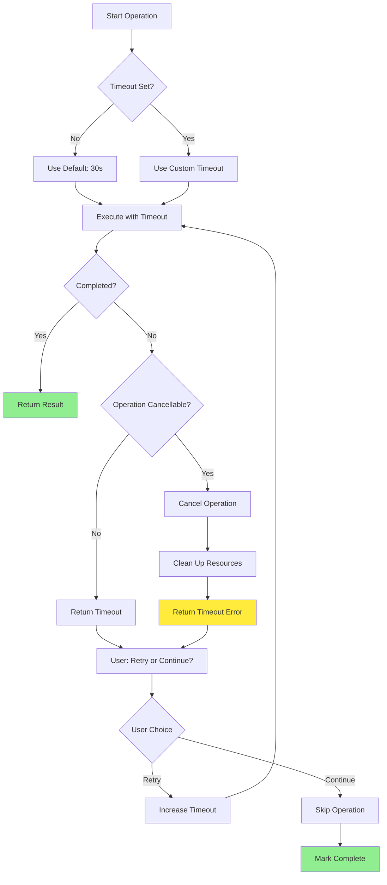

**User-Facing Message:**
```
Error: Operation timeout

What happened:
- Operation exceeded 30 second timeout
- Task: Search large codebase
- May be temporary or resource constraint

Options:
1. Retry with longer timeout
2. Continue without this operation
3. Investigate: Check system resources

What to do:
Type "retry", "continue", or "investigate"
```

---

## Data Edge Cases

### 1. Empty Directory Operations

**Scenario:** Operations on empty or non-existent directories

**Handling:**
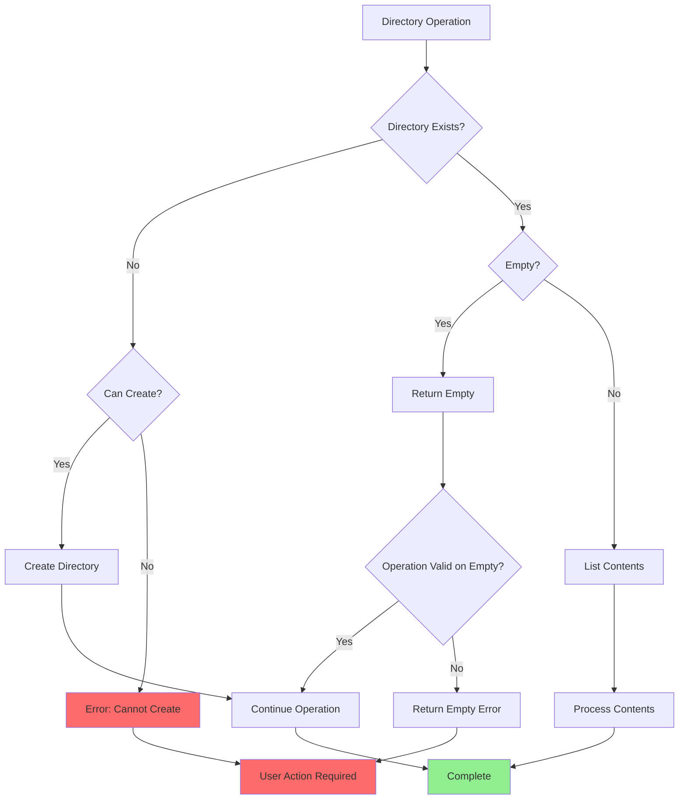

**User-Facing Message:**
```
Error: Directory operation on empty location

What happened:
- Directory is empty: .planning/phases/XX-new/
- Operation requires contents to proceed
- Or directory doesn't exist

What to do:
1. Create directory: gsu scaffold phase-dir
2. Add files before operation
3. Or run different command

Current behavior: Cannot proceed
```

---

### 2. Large File Handling

**Scenario:** Files exceed read/write limits

**Configuration:**
- `fileReadLimit`: 10,000,000 lines (DC default)
- `fileWriteLimit`: 20,000 lines (DC default)

**Handling:**
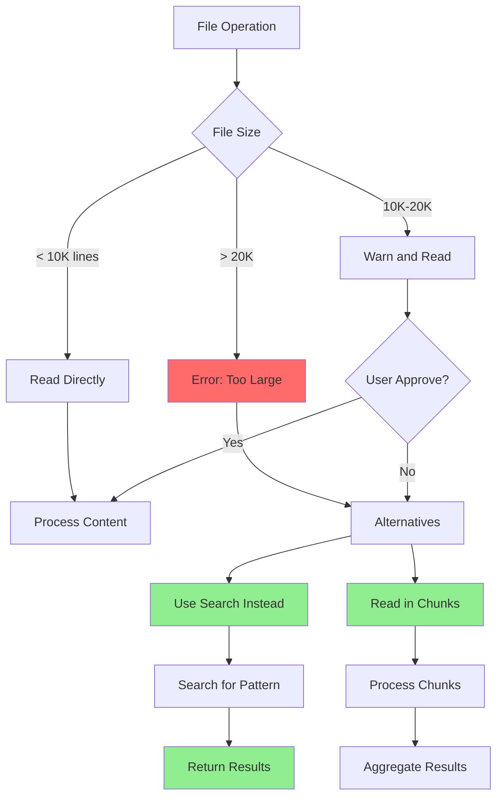

**User-Facing Message:**
```
Warning: Large file handling

File: path/to/large/file.txt
Size: 25,000 lines
Limit: 20,000 lines

What happened:
- File exceeds single-write limit
- Read may be slow/memory intensive

Options:
1. Search for pattern instead (recommended)
2. Read in chunks (slower)
3. Use different tool

Current behavior: Using search
```

---

### 3. Special Characters in Paths

**Scenario:** File paths with spaces, unicode, or special characters

**Problematic Characters:**
- Spaces (require quoting)
- Unicode (encoding issues)
- Reserved chars: `< > : " | ? *`
- Windows reserved: `CON, PRN, AUX, NUL`

**Handling:**
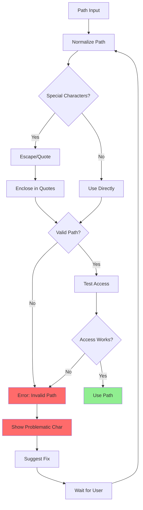

**User-Facing Message:**
```
Error: Invalid path characters

Path: C:\path\to\file<name>.txt
                    ^^^
Problem: Invalid characters: < >

What happened:
- Path contains characters not allowed by OS
- Windows reserved: < > : " | ? *
- Operation cannot proceed

What to do:
1. Rename file without special characters
2. Or use escape mechanism
3. Valid characters: A-Z a-z 0-9 - _ .

Suggested: C:\path\to\file_name.txt
```

---

## Recovery Mechanisms

### 1. Automatic Retry

**Conditions:**
- Transient errors (network, timeout)
- Rate limit responses
- Lock contention

**Retry Logic:**
```
Attempt 1: Immediate
Attempt 2: After 2s backoff
Attempt 3: After 5s backoff
Attempt 4: Fail - requires user action
```

### 2. Graceful Degradation

**When MCP unavailable:**
- Use native tools as fallback
- Warn user about reduced capability
- Continue operation if possible

**When API rate limited:**
- Queue requests
- Wait for retry-after
- Inform user of delay

### 3. Checkpoint Recovery

**Agent crashes:**
- State preserved in SUMMARY.md
- Continuation agent resumes from task
- User sees progress preserved

**Process killed:**
- Detect incomplete operations
- Offer resume or restart
- Preserve completed work

---

## [END OF EDGE CASES]

**Edge Case Documentation:** Complete
**Scenarios Covered:** Error handling, unusual inputs, concurrent operations, data edge cases
**Total Diagrams:** 7 Mermaid diagrams
**Next:** All tasks complete, create SUMMARY.md