# GSI Logic Flows

**Phase:** 12-theory-practice-docs
**Plan:** 12-01
**Purpose:** Comprehensive logic flow documentation with Mermaid diagrams for all major GSI workflows

---

## Planning Flow

### User Initiates Planning

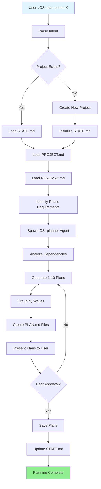

### Decision Points

| Decision | Criteria | Outcome |
|----------|-----------|----------|
| Project exists? | .planning/STATE.md present | Load or create |
| Dependencies | Phase depends_on complete | Proceed or block |
| Wave count | 10+ tasks or complexity | 1-3 waves |
| User approval | User types "approved" | Save or regenerate |

---

## Execution Flow

### User Initiates Execution

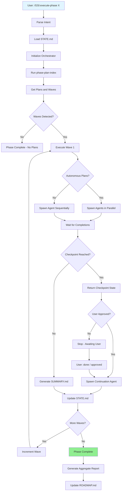

### Agent Lifecycle

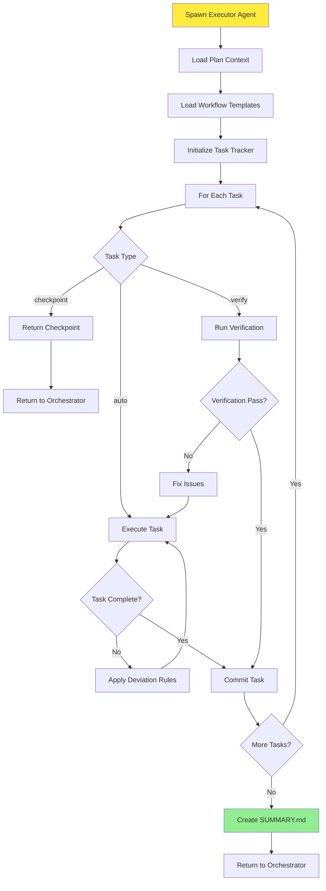

---

## Verification Flow

### Auto-Validation Trigger

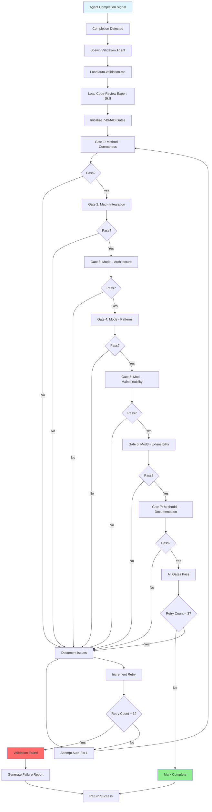

### Quality Gates Detail

| Gate | Circle | Checks | Pass Criteria |
|------|--------|--------|--------------|
| 1 | Method | Implementation correctness | Code compiles, logic correct, edges handled |
| 2 | Mad | Integration completeness | Dependencies integrated, APIs match, data flows |
| 3 | Model | Architecture alignment | Follows patterns, separation of concerns |
| 4 | Mode | Pattern consistency | Naming conventions, error handling |
| 5 | Mod | Maintainability | Readable, sized right, test coverage |
| 6 | Modd | Extensibility | Easy to extend, no hard-codes |
| 7 | Methodd | Documentation | README updated, API docs complete |

---

## Decision Trees

### Tool Selection Decision Tree

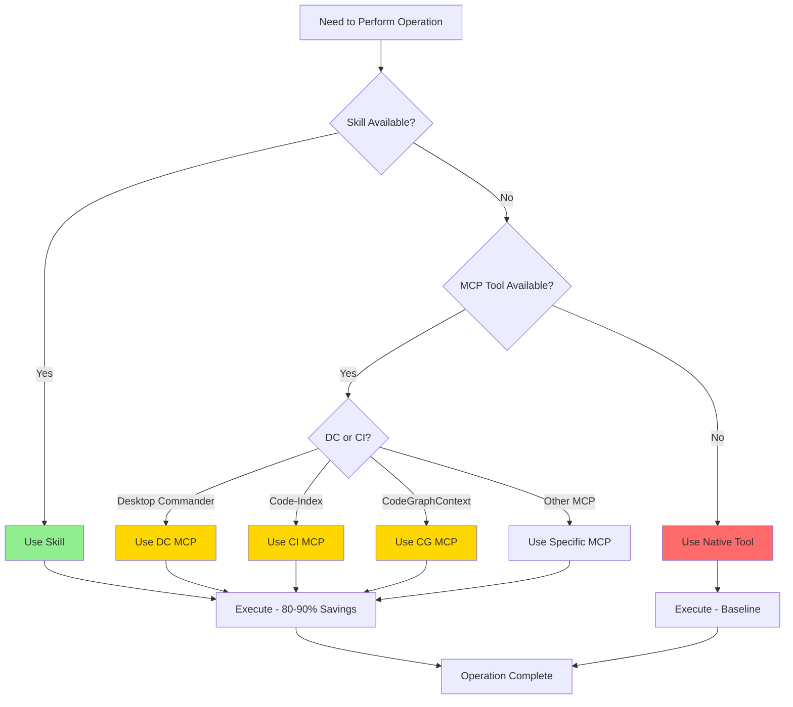

### Error Handling Decision Tree

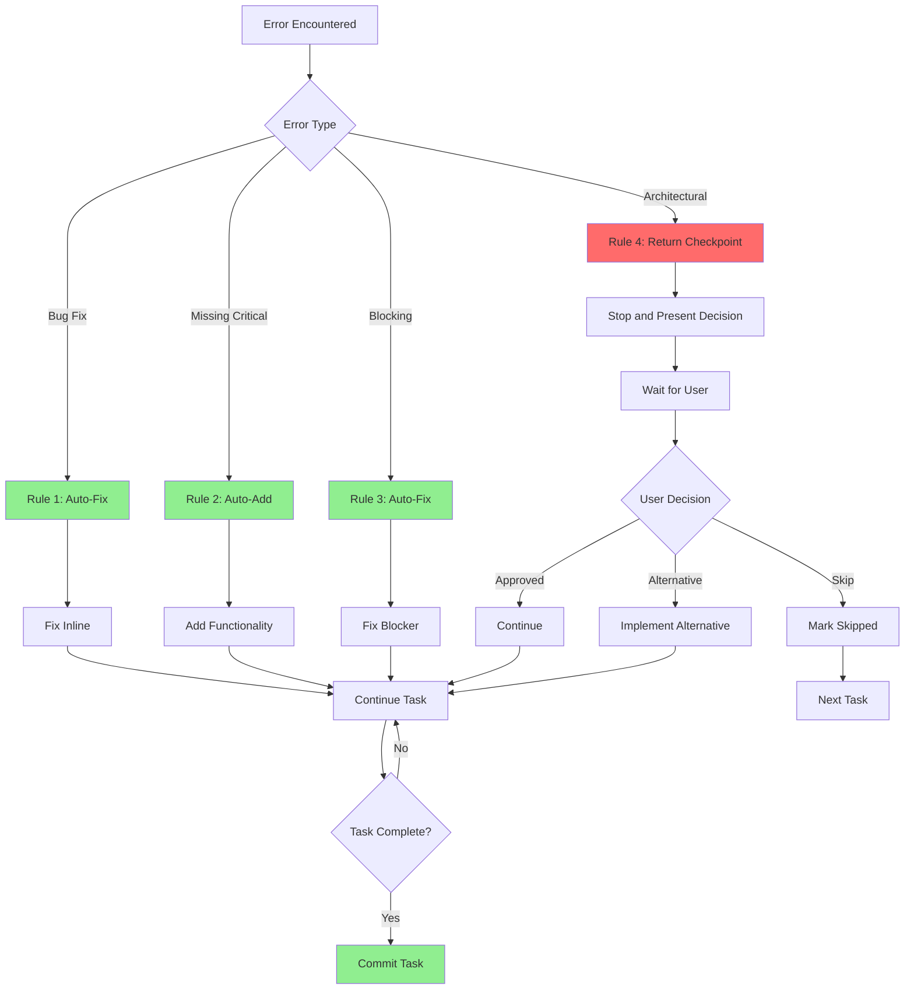

### MCP Server Selection Decision Tree

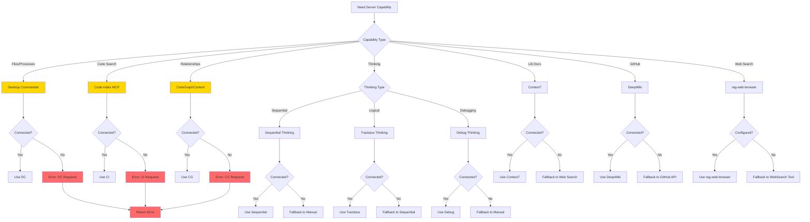

---

## Orchestration Flow

### Wave Execution Logic

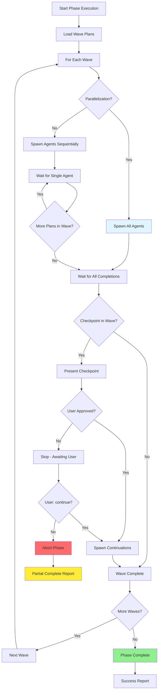

### Checkpoint Handling Flow

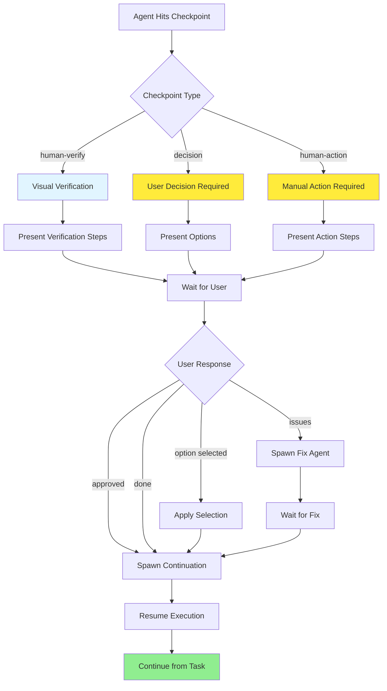

---

## Data Flow

### File Operation Flow

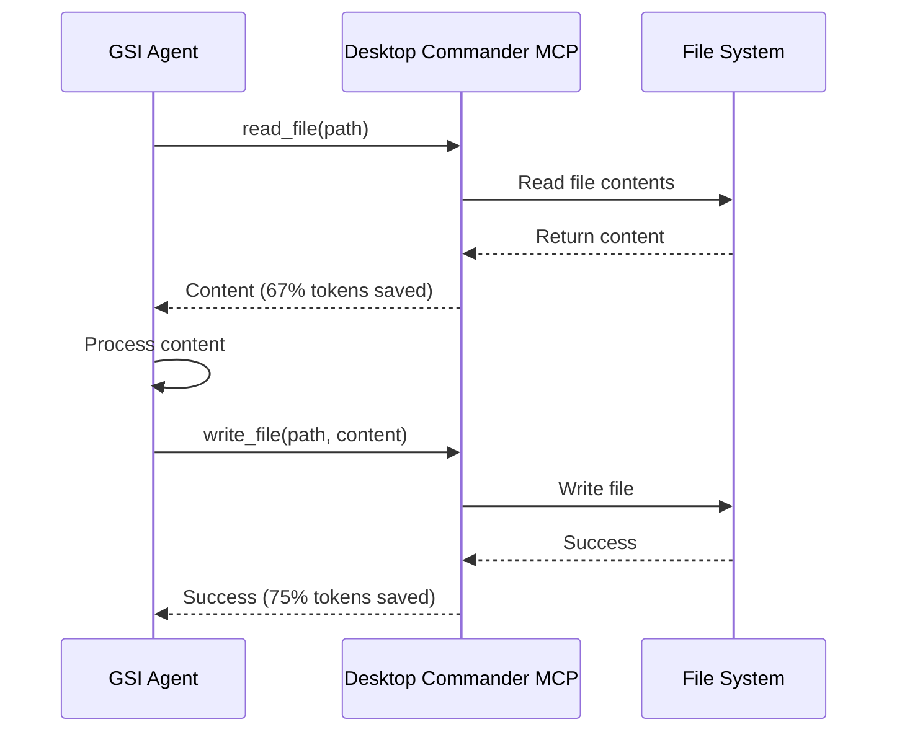

### Code Search Flow

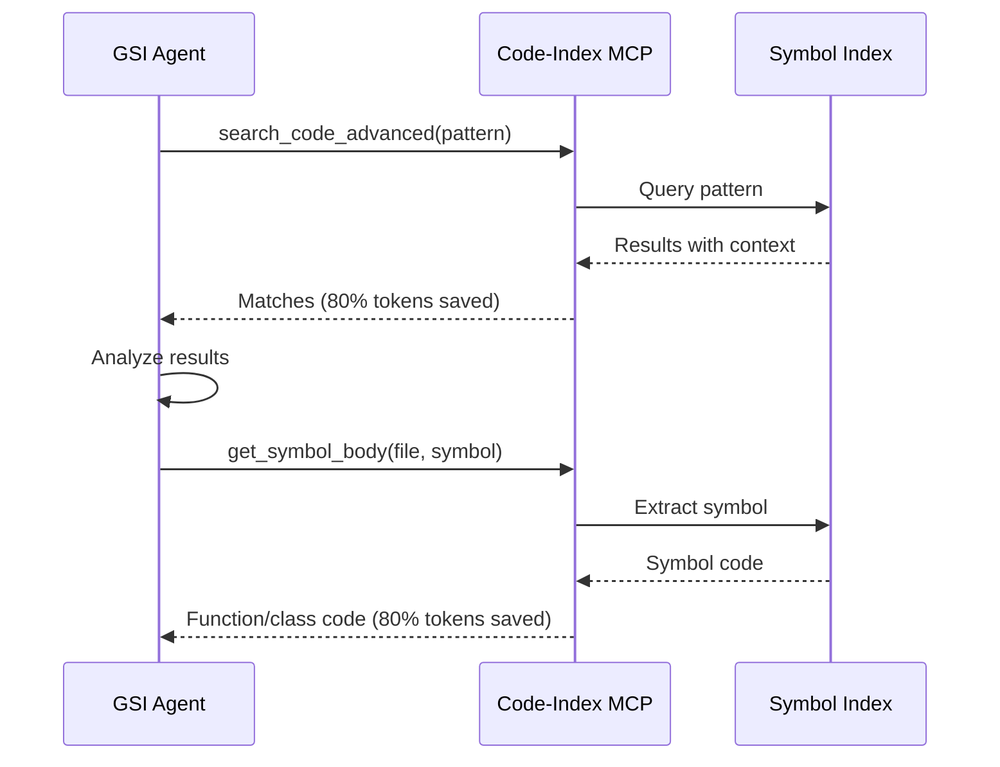

### Commit Flow

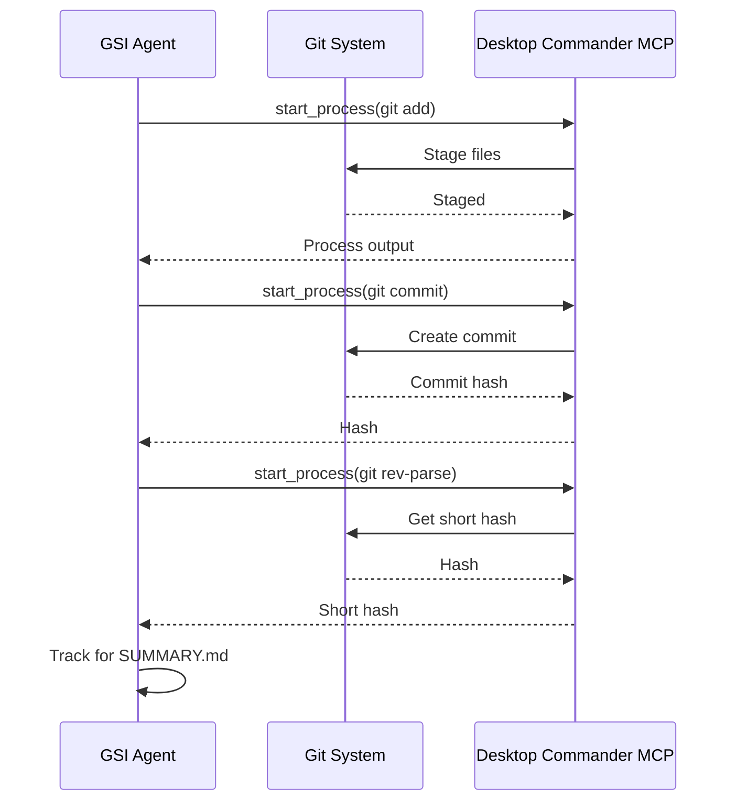

---

## [END OF LOGIC FLOWS]

**Flow Documentation:** Complete
**Total Diagrams:** 9 Mermaid diagrams
**Coverage:** Planning, Execution, Verification, Decisions, Orchestration, Data Flows
**Next:** Create EDGE-CASES.md