# Tool Chain Reference Guide

**Created:** 2026-02-13
**Updated:** 2026-02-16
**Purpose:** Unified reference for all 24 proven tool chain patterns with thinking integration

---

## Overview

This guide consolidates all tool chain patterns into a single reference with visual diagrams and thinking server integration.

### Pattern Categories

| Category | Count | Description | Use When |
|----------|-------|-------------|----------|
| Linear Patterns | 15 | Sequential one-way flows | Straightforward operations |
| Circular Patterns | 4 | Loops for iterative refinement | Verification, TDD, refinement |
| Hybrid Patterns | 5 | Complex multi-path workflows | Parallel ops, adaptive selection |
| Thinking-Enhanced | 9 | Cognitive enhancement patterns | Complex problems requiring analysis |

### Server Legend

- **DC** = Desktop Commander (files, processes)
- **CI** = Code-Index MCP (search, symbols)
- **CG** = CodeGraphContext (relationships, dependencies)
- **SEQ** = Sequential Thinking (multi-step planning)
- **TR** = Tractatus Thinking (structure analysis)
- **DBG** = Debug Thinking (problem investigation)

### Quick Decision Flow

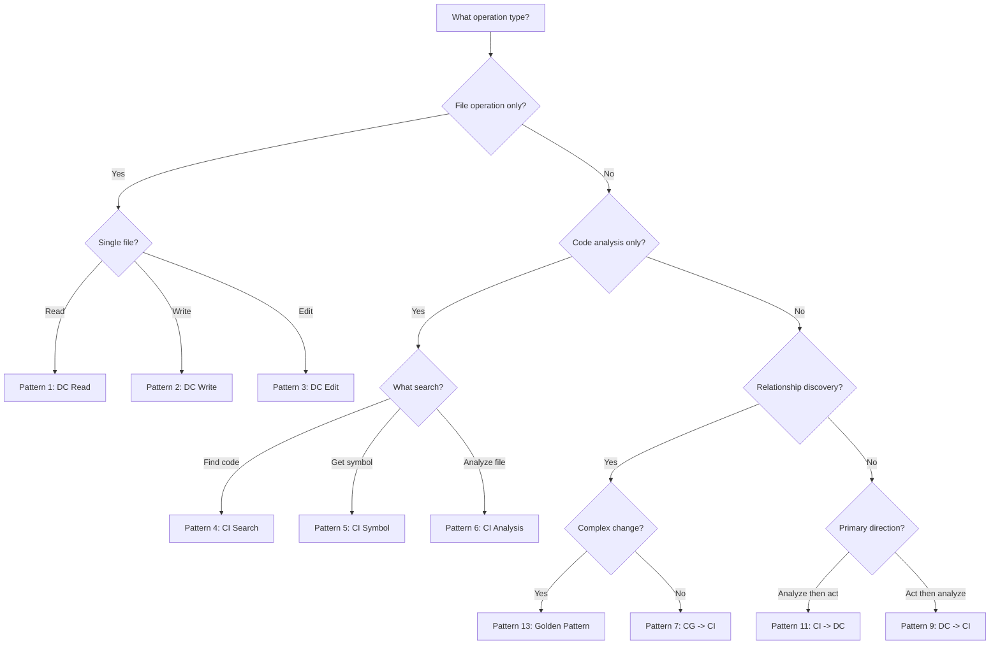

## Cross-References

- **CODE-INDEX-MCP-GUIDE.md:** CI tool details and parameters
- **GOLDEN-PATTERN.md:** Full golden pattern documentation
- **TOOL-PRIORITY-RULES.md:** Tool selection hierarchy

## How to Use This Guide

1. Start with Quick Decision Flow to identify pattern category
2. Browse patterns in that category for specific match
3. Refer to tool documentation for parameter details
4. Cross-reference to other guides for deeper information

---

## Linear Patterns (1-15)

Linear patterns flow in one direction with no loops. Simple and predictable.

### DC-Only Patterns (1-3)

#### Pattern 1: DC Read
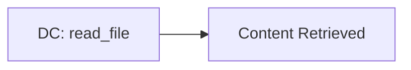
**Use:** Simple file reading
**Token:** ~85% savings vs native Read
**Example:** Read package.json to check version

#### Pattern 2: DC Write
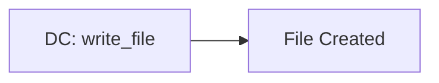
**Use:** Creating new files
**Token:** ~80% savings vs native Write

#### Pattern 3: DC Edit
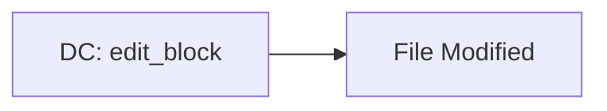
**Use:** Surgical text replacement
**Token:** ~75% savings vs native Edit

### CI-Only Patterns (4-6)

#### Pattern 4: CI Search
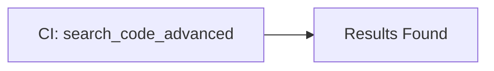
**Use:** Finding code patterns
**Token:** ~80% savings vs native Grep
**Example:** Find all uses of useState hook

#### Pattern 5: CI Symbol
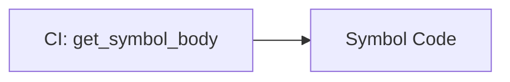
**Use:** Function implementation details
**Token:** ~85% savings vs manual search + read

#### Pattern 6: CI Analysis
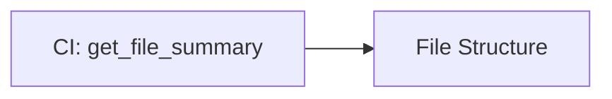
**Use:** Understanding file architecture
**Token:** ~75% savings vs manual analysis

### Two-Server Patterns (7-12)

#### Pattern 7: CG -> CI Discovery
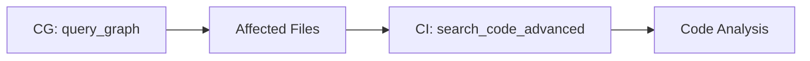
**Use:** Finding files affected by changes
**Token:** ~82% combined savings
**Example:** Find all files importing User model

#### Pattern 8: CG -> CI Path Discovery
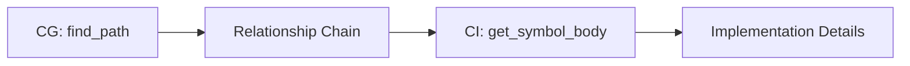
**Use:** Tracing import dependencies
**Token:** ~83% combined savings
**Example:** Trace how auth module depends on User model

#### Pattern 9: DC -> CI Impact Analysis
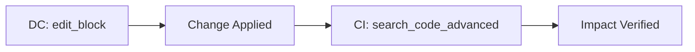
**Use:** Making change and checking usage
**Token:** ~78% combined savings
**Example:** Update function name and find all call sites

#### Pattern 10: DC -> CI Verification
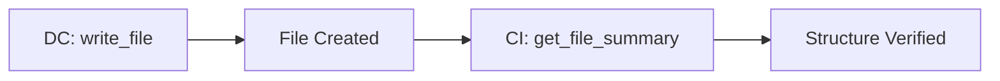
**Use:** Creating new file and verifying structure
**Token:** ~77% combined savings

#### Pattern 11: CI -> DC Implementation
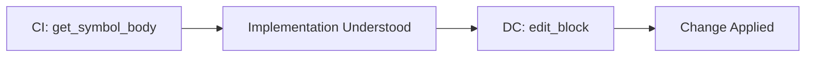
**Use:** Understanding existing pattern then applying elsewhere
**Token:** ~81% combined savings
**Example:** Read existing route pattern, create similar route

#### Pattern 12: CI -> DC Multi-File
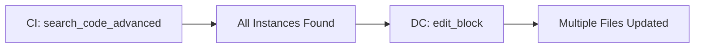
**Use:** Finding pattern instances across files
**Token:** ~84% combined savings (batch operation)
**Example:** Update import path in 5 files using old module

### Golden Pattern & Variants (13-15)

#### Pattern 13: Golden Pattern (Full)
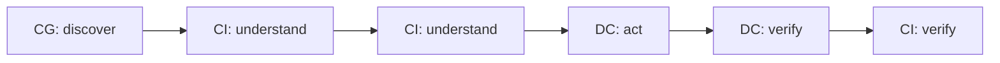
**Use:** Complex multi-file refactors
**Steps:**
1. CG query_graph - Find affected files
2. CI search_code_advanced - Understand patterns
3. CI get_symbol_body - Deep implementation dive
4. DC edit_block - Apply changes
5. DC read_file - Verify write success
6. CI search_code_advanced - Verify integration

**Token:** ~86% savings vs native
**Details:** See GOLDEN-PATTERN.md for full documentation

#### Pattern 14: Golden Pattern (CI-only fallback)
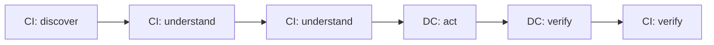
**Use:** Golden pattern when CG unavailable
**Difference:** Uses CI for discovery instead of CG
**Token:** ~75% savings (vs ~86% with CG)

#### Pattern 15: DC Process -> CI Verify
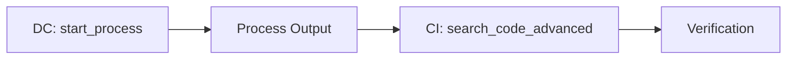
**Use:** Running tests and verifying results
**Example:** Run type check and verify no new errors
**Token:** ~70% combined savings

---

## Circular Patterns (16-19)

Circular patterns include loops for iterative refinement or verification.

### Pattern 16: CI Verify -> DC Act -> CI Verify
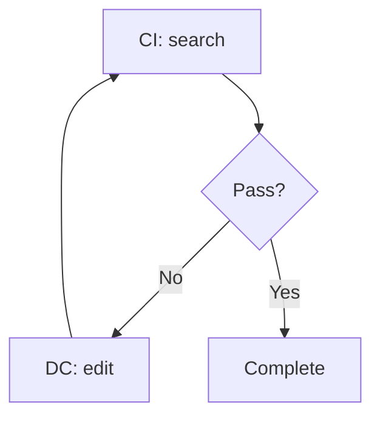
**Use:** Verification loop during refactoring
**Loop:** Until verification passes
**Example:** TDD workflow - test fails, fix code, test again

### Pattern 17: DC Act -> CI Analyze -> DC Adjust
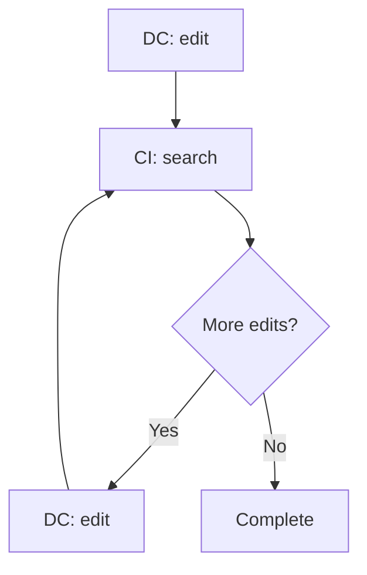
**Use:** Progressive refinement
**Loop:** Until no more edits needed
**Example:** Make change, find affected files, update affected files, repeat

### Pattern 18: CG Discover -> CI Understand -> CG Refine
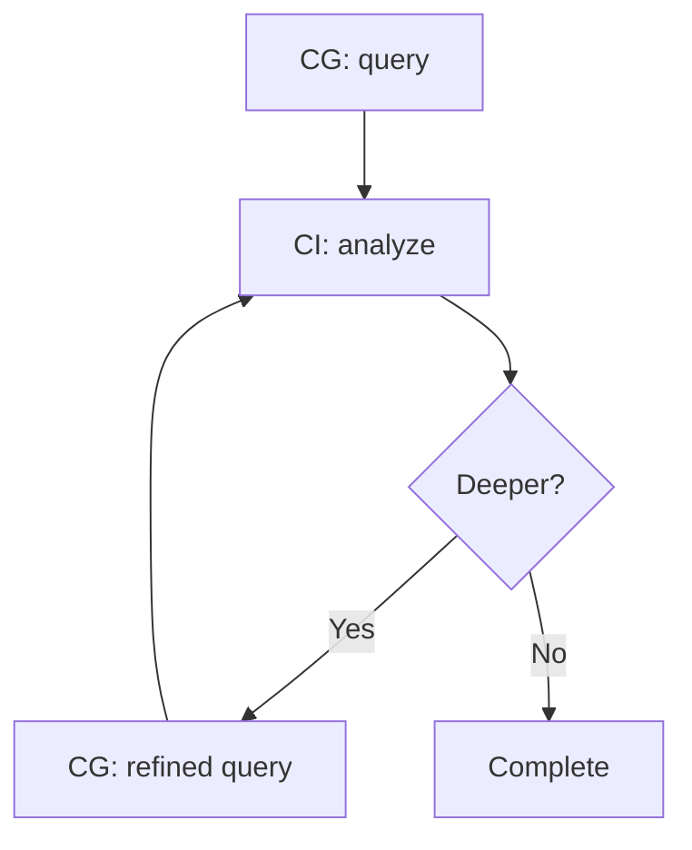
**Use:** Deep relationship exploration
**Loop:** Until full dependency chain mapped
**Example:** Find modules using User, analyze auth usage, find modules depending on auth

### Pattern 19: CI Symbol -> DC Apply -> CI Re-index
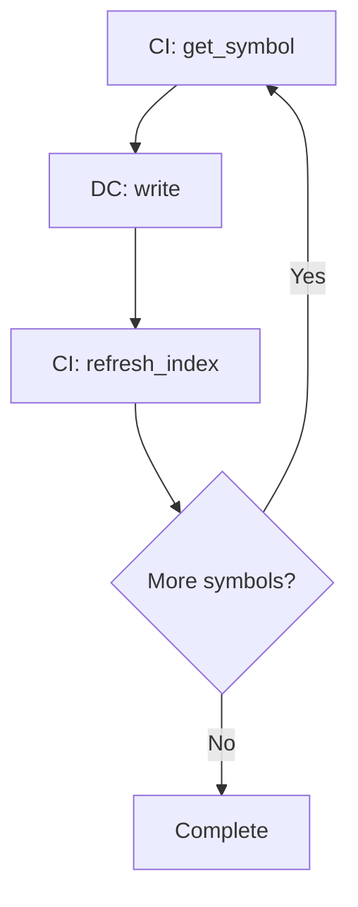
**Use:** Multi-step code generation
**Loop:** Until all symbols processed
**Example:** Generate interface methods one at a time, re-indexing after each

---

## Hybrid Patterns (20-24)

Hybrid patterns combine multiple flows or use parallel operations.

### Pattern 20: Parallel DC Operations
```mermaid
flowchart TB
    A[Start] --> B[DC edit 1]
    A --> C[DC edit 2]
    A --> D[DC edit 3]
    B --> E[Complete]
    C --> E
    D --> E
```
**Use:** Independent file operations
**Token:** Highest efficiency via parallelization
**Example:** Create 3 test files simultaneously

### Pattern 21: Batch CI -> DC
```mermaid
flowchart TB
    A[Start] --> B[CI search 1]
    A --> C[CI search 2]
    A --> D[CI summary]
    B --> E[DC act]
    C --> E
    D --> E
```
**Use:** Multiple analyses before action
**Token:** Batch queries share index context
**Example:** Search for all error handling patterns, then implement consistent handling

### Pattern 22: CG-Guided Multi-File DC
```mermaid
flowchart TB
    A[CG: dependency_map] --> B[DC edit 1]
    A --> C[DC edit 2]
    A --> D[DC edit 3]
    B --> E[Complete]
    C --> E
    D --> E
```
**Use:** Relationship-aware coordinated edits
**Token:** Single CG query guides multiple DC operations
**Example:** Update User model and all files that import it

### Pattern 23: CI Pre-Analysis -> DC -> CI Verify
```mermaid
flowchart LR
    A[CI: analysis 1] --> F[Context]
    B[CI: analysis 2] --> F
    F --> G[DC: act]
    G --> H[CI: verify]
```
**Use:** High-confidence changes with dual verification
**Token:** Dual verification reduces rollback likelihood
**Example:** Analyze current and target states, make change, verify both match

### Pattern 24: Adaptive Pattern Selection
```mermaid
flowchart TB
    A[Analyze Context] --> B{Complexity}
    B -->|Simple| C[DC-only]
    B -->|Medium| D[CI -> DC]
    B -->|Complex| E[Golden Pattern]
    C --> F[Execute]
    D --> F
    E --> F
```
**Use:** Dynamic workflow selection
**Decision Criteria:**
- Simple (single file): DC-only
- Medium (multi-file): CI -> DC
- Complex (dependencies): Golden Pattern

---

## Thinking-Enhanced Patterns (25-33)

Thinking servers add cognitive enhancement to tool chains. Use BEFORE MCP tools for complex problems.

### Pattern 25: Sequential -> CI -> DC (Planning Flow)
```mermaid
flowchart LR
    A[SEQ: Plan Steps] --> B[CI: Search]
    B --> C[DC: Execute]
```
**Use:** Multi-step implementation planning
**Thinking:** Sequential thinking decomposes problem into steps
**MCP:** CI finds existing patterns, DC implements
**Token:** ~2K (SEQ) + ~15K (CI+DC) = ~17K total
**Example:** Plan auth flow → Find existing patterns → Implement

### Pattern 26: Tractatus -> CG -> CI (Structure Flow)
```mermaid
flowchart LR
    A[TR: Analyze Structure] --> B[CG: Query Relations]
    B --> C[CI: Search Details]
```
**Use:** Architecture analysis and dependency mapping
**Thinking:** Tractatus decomposes architecture into propositions
**MCP:** CG maps relationships, CI finds implementation details
**Token:** ~2K (TR) + ~8K (CG+CI) = ~10K total
**Example:** Analyze module structure → Map dependencies → Find usage

### Pattern 27: Debug -> CI -> DC (Investigation Flow)
```mermaid
flowchart LR
    A[DBG: Query Similar] --> B[CI: Search Evidence]
    B --> C[DC: Apply Fix]
```
**Use:** Bug investigation and fix
**Thinking:** Debug queries similar problems, creates hypothesis
**MCP:** CI finds code evidence, DC applies fix
**Token:** ~1K (DBG query) + ~8K (CI+DC) = ~9K total
**Example:** Query past bugs → Find related code → Apply fix

### Pattern 28: Tractatus -> CG -> DC (Architecture Change)
```mermaid
flowchart LR
    A[TR: Decompose Architecture] --> B[CG: Map Impact]
    B --> C[DC: Multi-file Edit]
```
**Use:** Architecture refactoring
**Thinking:** Tractatus analyzes what needs to change
**MCP:** CG finds all affected files, DC makes coordinated edits
**Token:** ~3K (TR) + ~20K (CG+DC) = ~23K total
**Example:** Analyze refactoring → Map affected files → Update all

### Pattern 29: Sequential -> Golden Pattern (Complex Change)
```mermaid
flowchart LR
    A[SEQ: Plan Refactor] --> B[CG: Discover]
    B --> C[CI: Understand]
    C --> D[DC: Act]
    D --> E[SEQ: Verify]
```
**Use:** Complex multi-file refactor with planning
**Thinking:** Sequential plans steps, verifies completion
**MCP:** Golden pattern executes planned changes
**Token:** ~2K (SEQ plan) + ~33K (Golden) + ~1K (SEQ verify) = ~36K total
**Savings:** ~85% vs native equivalent (~240K)

### Pattern 30: Debug -> CI -> DC -> DBG (Learning Loop)
```mermaid
flowchart TB
    A[DBG: Query Problem] --> B[CI: Search Code]
    B --> C[DC: Apply Fix]
    C --> D[DBG: Record Learning]
```
**Use:** Bug fix with knowledge capture
**Thinking:** Debug tracks investigation and captures learning
**MCP:** CI finds code, DC fixes
**Token:** ~2K (DBG) + ~10K (CI+DC) + ~1K (DBG record) = ~13K total
**Example:** Query similar bugs → Find root cause → Fix → Record learning

### Pattern 31: Tractatus -> CI -> Tractatus (Verification Flow)
```mermaid
flowchart LR
    A[TR: Define Structure] --> B[CI: Search Implementation]
    B --> C[TR: Verify Completeness]
```
**Use:** Requirements verification
**Thinking:** Tractatus defines expected structure, verifies completeness
**MCP:** CI searches for implementation
**Token:** ~2K (TR define) + ~5K (CI) + ~1K (TR verify) = ~8K total
**Example:** Define auth requirements → Find implementation → Verify complete

### Pattern 32: Sequential -> DC (Planned Execution)
```mermaid
flowchart LR
    A[SEQ: Plan Steps] --> B[DC: Execute Step 1]
    B --> C[DC: Execute Step 2]
    C --> D[DC: Execute Step 3]
```
**Use:** Multi-file creation with plan
**Thinking:** Sequential thinks through file dependencies
**MCP:** DC creates files in planned order
**Token:** ~1.5K (SEQ) + ~10K (DC) = ~11.5K total
**Example:** Plan file structure → Create files in order

### Pattern 33: Thinking + Circular Pattern (Iterative Refinement)
```mermaid
flowchart TB
    A[SEQ: Analyze] --> B[CI: Search]
    B --> C{Pass?}
    C -->|No| D[TR: Identify Gap]
    D --> E[DC: Fix]
    E --> B
    C -->|Yes| F[DBG: Record Learning]
```
**Use:** Complex verification with learning
**Thinking:** Multiple servers for different phases
**MCP:** CI/DC for execution
**Token:** ~3K (thinking) + ~15K (MCP per iteration) = ~18K first iteration
**Example:** Analyze requirements → Check implementation → Identify gaps → Fix → Record

### Thinking Pattern Selection Guide

| Problem Type | Pattern | Thinking Server | MCP Flow |
|--------------|---------|-----------------|----------|
| Multi-step implementation | 25 | Sequential | CI -> DC |
| Architecture analysis | 26, 28 | Tractatus | CG -> CI/DC |
| Bug investigation | 27, 30 | Debug | CI -> DC |
| Complex refactor | 29 | Sequential | Golden Pattern |
| Requirements verification | 31 | Tractatus | CI -> TR |
| Multi-file creation | 32 | Sequential | DC only |
| Iterative refinement | 33 | All | Circular |

### Token Impact Analysis

| Pattern | Thinking Cost | MCP Cost | Total | vs Native |
|---------|---------------|----------|-------|-----------|
| 25: SEQ->CI->DC | ~2K | ~15K | ~17K | ~85% savings |
| 26: TR->CG->CI | ~2K | ~8K | ~10K | ~90% savings |
| 27: DBG->CI->DC | ~1K | ~8K | ~9K | ~91% savings |
| 28: TR->CG->DC | ~3K | ~20K | ~23K | ~88% savings |
| 29: SEQ->Golden | ~3K | ~33K | ~36K | ~85% savings |
| 30: DBG->CI->DC->DBG | ~3K | ~10K | ~13K | ~89% savings |
| 31: TR->CI->TR | ~3K | ~5K | ~8K | ~92% savings |
| 32: SEQ->DC | ~1.5K | ~10K | ~11.5K | ~88% savings |
| 33: Thinking+Circular | ~3K | ~15K+ | ~18K+ | ~82% savings |

---

## Pattern Selection Decision Tree

### Decision Questions

1. **What type of operation?**
   - File only -> DC-only patterns (1-3)
   - Code only -> CI-only patterns (4-6)
   - Mixed -> Continue

2. **Relationship discovery needed?**
   - Yes -> CG patterns (7-8) or Golden (13)
   - No -> Continue

3. **What's the direction?**
   - Analyze then act -> CI -> DC (11-12)
   - Act then analyze -> DC -> CI (9-10)

4. **How complex?**
   - Simple -> Single-server pattern
   - Medium -> Two-server pattern
   - Complex -> Golden Pattern

5. **Is iterative?**
   - Yes -> Circular patterns (16-19)

6. **Can parallelize?**
   - Yes -> Hybrid patterns (20-24)

---

## Cross-Reference Summary

### Related Documentation

| Guide | Purpose | When to Use |
|-------|---------|-------------|
| CODE-INDEX-MCP-GUIDE.md | CI tool details | Need CI tool parameters |
| GOLDEN-PATTERN.md | Full golden pattern | Complex refactor workflow |
| TOOL-PRIORITY-RULES.md | Tool selection hierarchy | Confirm tool priority |

### Quick Lookup Table

| # | Pattern | Flow | Servers | Use Case | Token Savings |
|---|---------|------|---------|----------|--------------|
| 1 | DC Read | read | DC | Read file | ~85% |
| 2 | DC Write | write | DC | Create file | ~80% |
| 3 | DC Edit | edit | DC | Modify file | ~75% |
| 4 | CI Search | search | CI | Find code | ~80% |
| 5 | CI Symbol | symbol | CI | Get function | ~85% |
| 6 | CI Analysis | summary | CI | Understand file | ~75% |
| 7 | CG->CI | query->search | CG,CI | Find relationships | ~82% |
| 8 | CG->CI Path | path->symbol | CG,CI | Trace imports | ~83% |
| 9 | DC->CI | edit->search | DC,CI | Edit+check | ~78% |
| 10 | DC->CI | write->summary | DC,CI | Create+verify | ~77% |
| 11 | CI->DC | symbol->edit | CI,DC | Understand+edit | ~81% |
| 12 | CI->DC | search->edit | CI,DC | Multi-file edit | ~84% |
| 13 | Golden | CG->CI->CI->DC->DC->CI | All | Complex refactor | ~86% |
| 14 | Golden CI | CI->CI->CI->DC->DC->CI | CI,DC | Refactor no CG | ~75% |
| 15 | DC->CI | process->search | DC,CI | Run+verify | ~70% |
| 16-19 | Circular | Various | Various | Iterative | Variable |
| 20-24 | Hybrid | Various | Various | Parallel/adaptive | Variable |

### Pattern Categories Summary

| Category | Patterns | Primary Characteristic |
|----------|----------|----------------------|
| DC-Only | 1-3 | Simple file operations |
| CI-Only | 4-6 | Code analysis/search |
| CG->CI | 7-8 | Relationship discovery |
| DC->CI | 9-10, 15 | Act then analyze |
| CI->DC | 11-12 | Understand then act |
| Golden | 13-14 | Complex multi-file |
| Circular | 16-19 | Iterative refinement |
| Hybrid | 20-24 | Parallel/adaptive |
| Thinking-Enhanced | 25-33 | Cognitive enhancement |

---

*Tool Chain Reference Guide*
*Created: 2026-02-13*
*Updated: 2026-02-16*
*Reference: TOOL-CHAIN-PATTERNS.md*
*Thinking Servers: Sequential, Tractatus, Debug*
