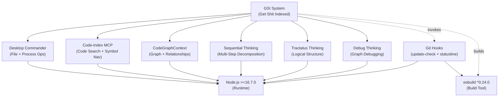

# GSI Tools Dependency Graph

**Generated:** 2026-02-13 23:09:37Z
**Phase:** 10-mcp-tools-audit
**Plan:** 10-02
**Purpose:** Visualize tool dependencies and integration relationships

---

## Dependency Graph



---

## Tool Categories

### Core MCP Servers

| Tool | Purpose | Required By |
| ---- | ------- | ------------ |
| **Desktop Commander** | File operations, process execution | All workflows |
| **Code-Index MCP** | Code search, symbol navigation | Codebase analysis |
| **CodeGraphContext** | Graph queries, relationships | Architecture analysis |

### Thinking Servers

| Tool | Purpose | Integration |
| ---- | ------- | ------------ |
| **Sequential Thinking** | Multi-step problem decomposition | GSI workflows |
| **Tractatus Thinking** | Logical structure analysis | Architecture decisions |
| **Debug Thinking** | Graph-based debugging | Problem investigation |

### Build Tools

| Tool | Version | Purpose |
| ---- | ------- | ------- |
| **esbuild** | ^0.24.0 | Hook bundling |
| **Node.js** | >=16.7.0 | Runtime environment |

### Git Hooks

| Hook | File | Purpose |
| ----- | ---- | ------- |
| **update-check** | `gsi-check-update.js` | Background update detection |
| **statusline** | `gsi-statusline.js` | Status display |

---

## Installation Order

### 1. System Dependencies

1. Install Node.js >=16.7.0
2. Install npm (included with Node.js)

### 2. GSI Installation

```bash
npm install -g get-shit-indexed-cc
```

### 3. MCP Server Configuration

MCP servers configured in Claude Code settings:
- Desktop Commander (file operations)
- Code-Index MCP (code search)
- CodeGraphContext (graph queries)

### 4. Git Hooks

```bash
# Hooks copied to ~/.git/hooks/ during GSI install
get-shit-indexed --install-hooks
```

---

## Dependency Constraints

| Tool | Min Version | Max Version | Notes |
| ---- | ------------ | ------------ | ----- |
| Node.js | 16.7.0 | - | Required for ES2020+ features |
| esbuild | 0.24.0 | - | Used for hook building |
| npm | - | - | Via Node.js |

---

## Integration Points

### Desktop Commander Integration

**Primary tool for:**
- File read/write operations
- Process execution
- Directory listing
- Git commands

**Why:** 80-90% token savings vs native tools

### Code-Index MCP Integration

**Primary tool for:**
- Fast code search
- Symbol navigation
- File discovery
- Code analysis

**Why:** Indexed search vs linear grep

### CodeGraphContext Integration

**Primary tool for:**
- Relationship queries
- Dependency mapping
- Architecture visualization

**Why:** Graph-based understanding vs file-by-file

---

## Optional Tools

| Tool | Required | Purpose |
| ---- | -------- | ------- |
| Brave Search API | No | Web search (configured via config) |
| 7-BMAD | No | Quality validation (auto-validation system) |

---

## Version Matrix

| Tool | Current Version | Status |
| ---- | --------------- | ------ |
| GSI (get-shit-indexed-cc) | 1.18.0 | PASS |
| esbuild | ^0.24.0 | PASS |
| Node.js | >=16.7.0 | PASS |
| Desktop Commander MCP | - | PASS |
| Code-Index MCP | - | PASS |
| CodeGraphContext | - | PASS |
| Sequential Thinking | - | PASS |
| Tractatus Thinking | - | PASS |
| Debug Thinking | - | PASS |

---

## Dependency Health

| Category | Status | Issues |
| -------- | ------ | ------ |
| Core Dependencies | PASS | None |
| MCP Servers | PASS | All connected |
| Thinking Servers | PASS | All available |
| Build Tools | PASS | Compatible |
| Git Hooks | PASS | Installed and branded |

**Overall:** HEALTHY - All dependencies satisfied

---

*Last Updated: 2026-02-13*
*Phase: 10-mcp-tools-audit*
