---
phase: 03-documentation-consolidation
plan: 03
type: execute
wave: 3
depends_on: [03-01, 03-02]
files_modified: [.planning/codebase/TOOL-CHAIN-REFERENCE.md]
autonomous: true
user_setup: []

must_haves:
  truths:
    - "TOOL-CHAIN-REFERENCE.md exists as unified guide"
    - "All 24 patterns from TOOL-CHAIN-PATTERNS.md consolidated"
    - "Mermaid diagrams document linear, circular, and hybrid patterns"
    - "Cross-references to CODE-INDEX-MCP-GUIDE.md, GOLDEN-PATTERN.md, TOOL-PRIORITY-RULES.md"
    - "CG server integration documented in applicable patterns"
  artifacts:
    - path: ".planning/codebase/TOOL-CHAIN-REFERENCE.md"
      provides: "Unified tool chain reference with Mermaid diagrams"
      min_lines: 450
      contains: ["Mermaid", "linear", "circular", "hybrid", "decision tree", "CG"]
  key_links:
    - from: "TOOL-CHAIN-REFERENCE.md"
      to: ["CODE-INDEX-MCP-GUIDE.md", "GOLDEN-PATTERN.md", "TOOL-PRIORITY-RULES.md"]
      via: "cross-reference section"
      pattern: "See.*GUIDE|See.*PATTERN|See.*RULES"
---

<objective>
Create TOOL-CHAIN-REFERENCE.md as unified guide consolidating all 24 tool chain patterns with Mermaid visual diagrams, decision trees, and cross-references to existing documentation.

Purpose: Provide single-source reference for tool chain pattern selection with visual diagrams, reducing cognitive load for workflow authors.

Output: 450+ line unified reference with Mermaid diagrams for all pattern categories (15 linear, 4 circular, 5 hybrid), including CG server integration.
</objective>

<execution_context>
@C:\Users\mose\.claude\get-shit-indexed\workflows\execute-plan.md
@C:\Users\mose\.claude\get-shit-indexed\templates\summary.md
</execution_context>

<context>
@.planning/STATE.md
@.planning/ROADMAP.md
@.planning/codebase/TOOL-CHAIN-PATTERNS.md
@.planning/codebase/GOLDEN-PATTERN.md
@.planning/codebase/CODE-INDEX-MCP-GUIDE.md (from 03-01)
@.planning/codebase/TOOL-PRIORITY-RULES.md (from 03-02)
@.planning/codebase/MCP-SERVER-STATUS.md (from 03-02)
</context>

<tasks>

<task type="auto">
  <name>Task 1: Create TOOL-CHAIN-REFERENCE.md structure with overview</name>
  <files>.planning/codebase/TOOL-CHAIN-REFERENCE.md</files>
  <action>
Create unified reference file with:
- Header explaining purpose (consolidated tool chain patterns)
- Overview of 24 patterns (15 linear, 4 circular, 5 hybrid)
- Pattern category summaries
- Quick decision flow diagram (Mermaid)
- Cross-reference section to other guides
- How to use this reference

Template:
```markdown
# Tool Chain Reference Guide

**Created:** [date]
**Purpose:** Unified reference for all 24 proven tool chain patterns

## Overview

This guide consolidates all tool chain patterns into a single reference with visual diagrams.

### Pattern Categories

| Category | Count | Description | Use When |
|----------|-------|-------------|----------|
| Linear Patterns | 15 | Sequential one-way flows | Straightforward operations |
| Circular Patterns | 4 | Loops for iterative refinement | Verification, TDD, refinement |
| Hybrid Patterns | 5 | Complex multi-path workflows | Parallel ops, adaptive selection |

### Server Legend

- **DC** = Desktop Commander (files, processes)
- **CI** = Code-Index MCP (search, symbols)
- **CG** = CodeGraphContext (relationships, dependencies)

## Quick Decision Flow (Mermaid)
[Decision tree diagram]

## Cross-References
- CODE-INDEX-MCP-GUIDE.md: CI tool details and parameters
- GOLDEN-PATTERN.md: Full golden pattern documentation
- TOOL-PRIORITY-RULES.md: Tool selection hierarchy

## How to Use This Guide

1. Start with Quick Decision Flow to identify pattern category
2. Browse patterns in that category for specific match
3. Refer to tool documentation for parameter details
4. Cross-reference to other guides for deeper information
```
  </action>
  <verify>File exists with overview, category table, Mermaid decision flow, cross-refs</verify>
  <done>Reference structure created with Mermaid decision diagram</done>
</task>

<task type="auto">
  <name>Task 2: Document Linear Patterns 1-6 (Single-server) with Mermaid</name>
  <files>.planning/codebase/TOOL-CHAIN-REFERENCE.md</files>
  <action>
Add single-server linear patterns (1-6) with Mermaid flow diagrams:
```markdown
## Linear Patterns (1-15)

Linear patterns flow in one direction with no loops. Simple and predictable.

### DC-Only Patterns (1-3)

#### Pattern 1: DC Read

**Use:** Simple file reading
**Token:** ~85% savings vs native Read
**Example:** Read package.json to check version

#### Pattern 2: DC Write

**Use:** Creating new files
**Token:** ~80% savings vs native Write

#### Pattern 3: DC Edit
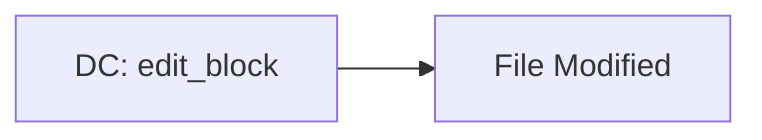
**Use:** Surgical text replacement
**Token:** ~75% savings vs native Edit

### CI-Only Patterns (4-6)

#### Pattern 4: CI Search
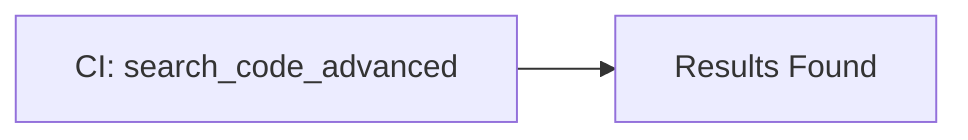
**Use:** Finding code patterns
**Token:** ~80% savings vs native Grep
**Example:** Find all uses of useState hook

#### Pattern 5: CI Symbol
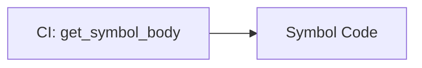
**Use:** Function implementation details
**Token:** ~85% savings vs manual search + read

#### Pattern 6: CI Analysis
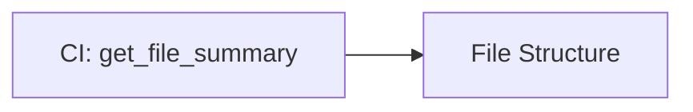
**Use:** Understanding file architecture
**Token:** ~75% savings vs manual analysis
```
  </action>
  <verify>Patterns 1-6 documented with Mermaid diagrams, use cases, token savings</verify>
  <done>Single-server linear patterns documented (6 of 15 linear)</done>
</task>

<task type="auto">
  <name>Task 3: Document Two-Server Linear Patterns 7-12 with Mermaid</name>
  <files>.planning/codebase/TOOL-CHAIN-REFERENCE.md</files>
  <action>
Add two-server linear patterns (7-12) with Mermaid diagrams:
```markdown
### Two-Server Patterns (7-12)

#### Pattern 7: CG → CI Discovery
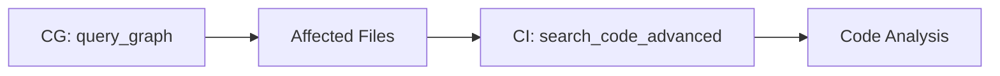
**Use:** Finding files affected by changes
**Token:** ~82% combined savings
**Example:** Find all files importing User model

#### Pattern 8: CG → CI Path Discovery
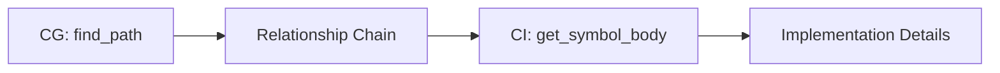
**Use:** Tracing import dependencies
**Token:** ~83% combined savings
**Example:** Trace how auth module depends on User model

#### Pattern 9: DC → CI Impact Analysis
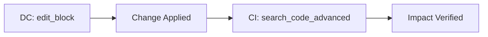
**Use:** Making change and checking usage
**Token:** ~78% combined savings
**Example:** Update function name and find all call sites

#### Pattern 10: DC → CI Verification
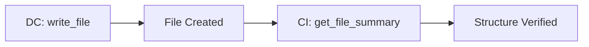
**Use:** Creating new file and verifying structure
**Token:** ~77% combined savings

#### Pattern 11: CI → DC Implementation
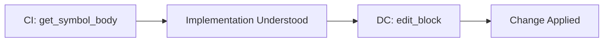
**Use:** Understanding existing pattern then applying elsewhere
**Token:** ~81% combined savings
**Example:** Read existing route pattern, create similar route

#### Pattern 12: CI → DC Multi-File
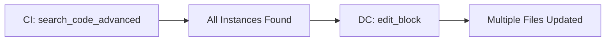
**Use:** Finding pattern instances across files
**Token:** ~84% combined savings (batch operation)
**Example:** Update import path in 5 files using old module
```
  </action>
  <verify>Patterns 7-12 documented with Mermaid diagrams showing server transitions</verify>
  <done>Two-server linear patterns documented (12 of 15 linear)</done>
</task>

<task type="auto">
  <name>Task 4: Document Golden Pattern and Variants (13-15) with Mermaid</name>
  <files>.planning/codebase/TOOL-CHAIN-REFERENCE.md</files>
  <action>
Add remaining linear patterns (13-15) including Golden Pattern:
```markdown
### Golden Pattern & Variants (13-15)

#### Pattern 13: Golden Pattern (Full)
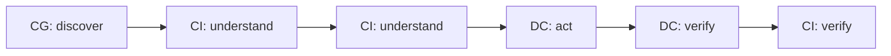
**Use:** Complex multi-file refactors
**Steps:**
1. CG query_graph - Find affected files
2. CI search_code_advanced - Understand patterns
3. CI get_symbol_body - Deep implementation dive
4. DC edit_block - Apply changes
5. DC read_file - Verify write success
6. CI search_code_advanced - Verify integration

**Token:** ~86% savings vs native
**Details:** See GOLDEN-PATTERN.md for full documentation

#### Pattern 14: Golden Pattern (CI-only fallback)
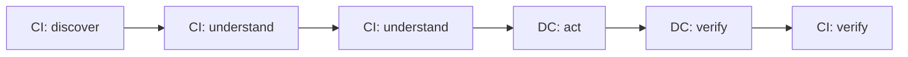
**Use:** Golden pattern when CG unavailable
**Difference:** Uses CI for discovery instead of CG
**Token:** ~75% savings (vs ~86% with CG)

#### Pattern 15: DC Process → CI Verify
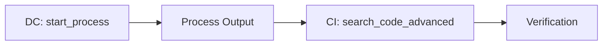
**Use:** Running tests and verifying results
**Example:** Run type check and verify no new errors
**Token:** ~70% combined savings
```
  </action>
  <verify>Patterns 13-15 documented, Golden Pattern references GOLDEN-PATTERN.md</verify>
  <done>All 15 linear patterns documented with Mermaid diagrams</done>
</task>

<task type="auto">
  <name>Task 5: Document Circular Patterns 16-19 with Mermaid loop diagrams</name>
  <files>.planning/codebase/TOOL-CHAIN-REFERENCE.md</files>
  <action>
Add circular patterns (16-19) with Mermaid loop diagrams:
```markdown
## Circular Patterns (16-19)

Circular patterns include loops for iterative refinement or verification.

### Pattern 16: CI Verify → DC Act → CI Verify
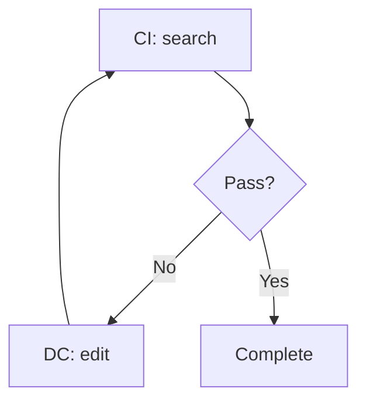
**Use:** Verification loop during refactoring
**Loop:** Until verification passes
**Example:** TDD workflow - test fails, fix code, test again

### Pattern 17: DC Act → CI Analyze → DC Adjust
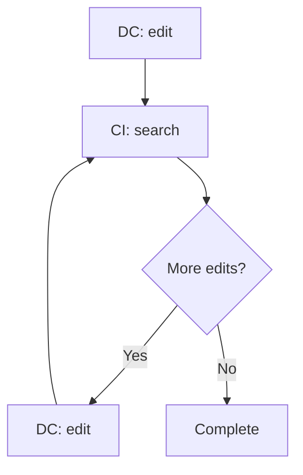
**Use:** Progressive refinement
**Loop:** Until no more edits needed
**Example:** Make change, find affected files, update affected files, repeat

### Pattern 18: CG Discover → CI Understand → CG Refine
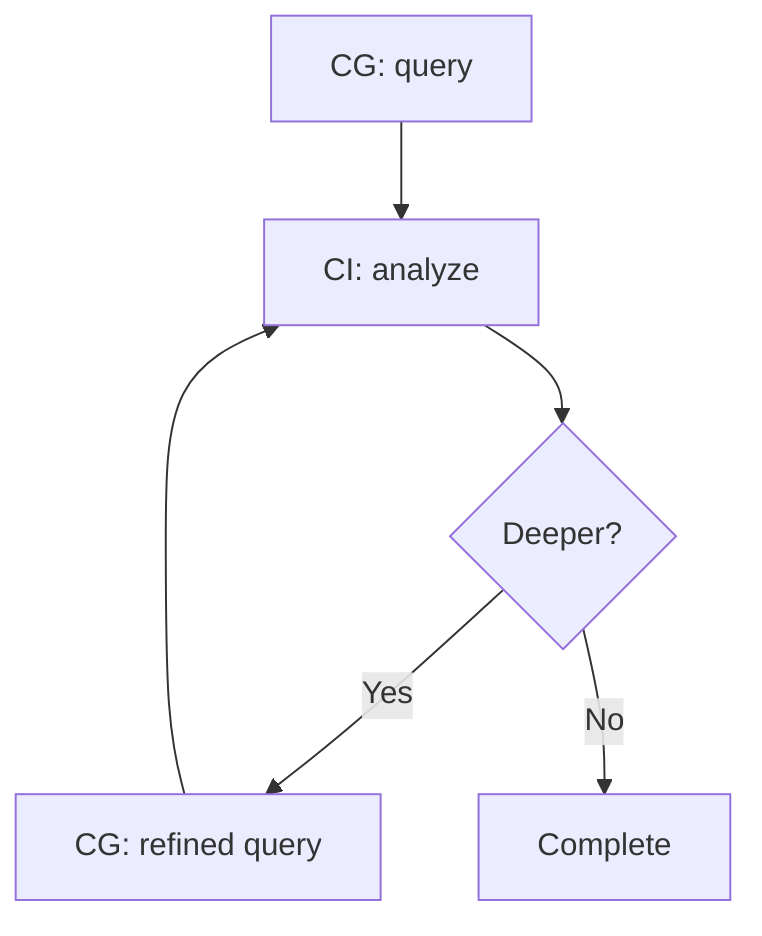
**Use:** Deep relationship exploration
**Loop:** Until full dependency chain mapped
**Example:** Find modules using User, analyze auth usage, find modules depending on auth

### Pattern 19: CI Symbol → DC Apply → CI Re-index
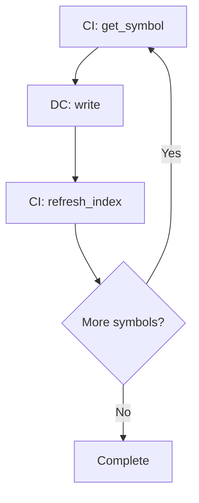
**Use:** Multi-step code generation
**Loop:** Until all symbols processed
**Example:** Generate interface methods one at a time, re-indexing after each
```
  </action>
  <verify>Patterns 16-19 documented with Mermaid loop diagrams showing iteration</verify>
  <done>All 4 circular patterns documented with loop visualization</done>
</task>

<task type="auto">
  <name>Task 6: Document Hybrid Patterns 20-24 with Mermaid parallel diagrams</name>
  <files>.planning/codebase/TOOL-CHAIN-REFERENCE.md</files>
  <action>
Add hybrid patterns (20-24) with Mermaid parallel/branch diagrams:
```markdown
## Hybrid Patterns (20-24)

Hybrid patterns combine multiple flows or use parallel operations.

### Pattern 20: Parallel DC Operations
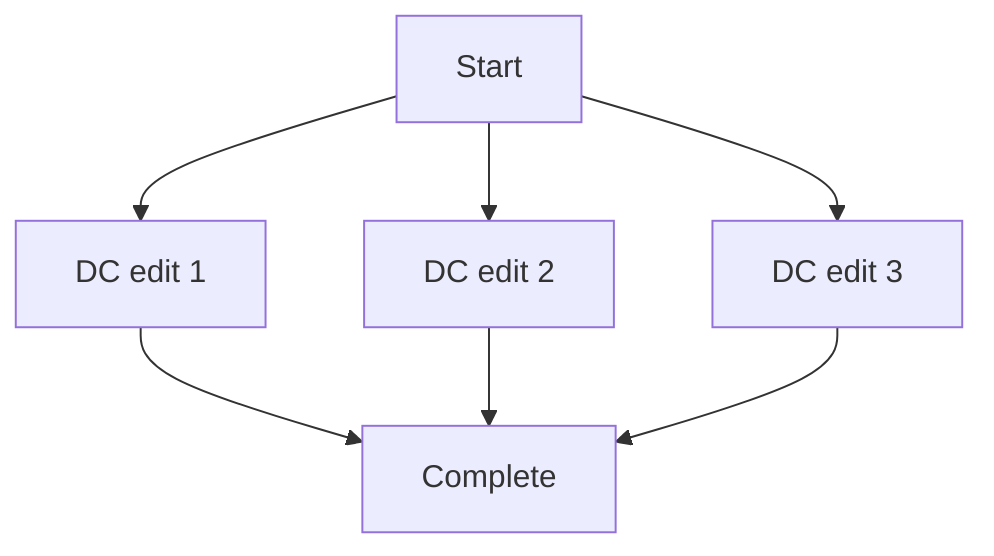
**Use:** Independent file operations
**Token:** Highest efficiency via parallelization
**Example:** Create 3 test files simultaneously

### Pattern 21: Batch CI → DC
```mermaid
flowchart TB
    A[Start] --> B[CI search 1]
    A --> C[CI search 2]
    A --> D[CI summary]
    B --> E[DC act]
    C --> E
    D --> E
```
**Use:** Multiple analyses before action
**Token:** Batch queries share index context
**Example:** Search for error patterns, then implement consistent handling

### Pattern 22: CG-Guided Multi-File DC
```mermaid
flowchart TB
    A[CG: dependency_map] --> B[DC edit 1]
    A --> C[DC edit 2]
    A --> D[DC edit 3]
    B --> E[Complete]
    C --> E
    D --> E
```
**Use:** Relationship-aware coordinated edits
**Token:** Single CG query guides multiple DC operations
**Example:** Update User model and all files that import it

### Pattern 23: CI Pre-Analysis → DC → CI Verify
```mermaid
flowchart LR
    A[CI: analysis 1] --> F[Context]
    B[CI: analysis 2] --> F
    F --> G[DC: act]
    G --> H[CI: verify]
```
**Use:** High-confidence changes with dual verification
**Token:** Dual verification reduces rollback likelihood
**Example:** Analyze current and target states, make change, verify both match

### Pattern 24: Adaptive Pattern Selection
```mermaid
flowchart TB
    A[Analyze Context] --> B{Complexity}
    B -->|Simple| C[DC-only]
    B -->|Medium| D[CI → DC]
    B -->|Complex| E[Golden Pattern]
    C --> F[Execute]
    D --> F
    E --> F
```
**Use:** Dynamic workflow selection
**Decision Criteria:**
- Simple (single file): DC-only
- Medium (multi-file): CI → DC
- Complex (dependencies): Golden Pattern
```
  </action>
  <verify>Patterns 20-24 documented with Mermaid diagrams showing parallel/branch flows</verify>
  <done>All 5 hybrid patterns documented with visualization</done>
</task>

<task type="auto">
  <name>Task 7: Add pattern selection decision tree with Mermaid</name>
  <files>.planning/codebase/TOOL-CHAIN-REFERENCE.md</files>
  <action>
Add comprehensive decision tree for pattern selection:
```markdown
## Pattern Selection Decision Tree

### Visual Decision Tree
```mermaid
flowchart TB
    START[What operation type?] --> FILE{File operation only?}
    FILE -->|Yes| SINGLE{Single file?}
    SINGLE -->|Read| P1[Pattern 1: DC Read]
    SINGLE -->|Write| P2[Pattern 2: DC Write]
    SINGLE -->|Edit| P3[Pattern 3: DC Edit]
    
    FILE -->|No| CODE{Code analysis only?}
    CODE -->|Yes| SEARCH{What search?}
    SEARCH -->|Find code| P4[Pattern 4: CI Search]
    SEARCH -->|Get symbol| P5[Pattern 5: CI Symbol]
    SEARCH -->|Analyze file| P6[Pattern 6: CI Analysis]
    
    CODE -->|No| RELATION{Relationship discovery?}
    RELATION -->|Yes| COMPLEX{Complex change?}
    RELATION -->|No| DIRECTION{Primary direction?}
    DIRECTION -->|Analyze then act| P11[Pattern 11: CI → DC]
    DIRECTION -->|Act then analyze| P9[Pattern 9: DC → CI]
    COMPLEX -->|Yes| GOLDEN[Pattern 13: Golden Pattern]
    COMPLEX -->|No| P7[Pattern 7: CG → CI]
    
    START -->|Iterative?| CIRCULAR{Circular pattern?}
    CIRCULAR -->|Yes| C1[Patterns 16-19]
    
    START -->|Parallel ops?| HYBRID{Hybrid pattern?}
    HYBRID -->|Yes| H1[Patterns 20-24]
```

### Decision Questions

1. **What type of operation?**
   - File only → DC-only patterns (1-3)
   - Code only → CI-only patterns (4-6)
   - Mixed → Continue

2. **Relationship discovery needed?**
   - Yes → CG patterns (7-8) or Golden (13)
   - No → Continue

3. **What's the direction?**
   - Analyze then act → CI → DC (11-12)
   - Act then analyze → DC → CI (9-10)

4. **How complex?**
   - Simple → Single-server pattern
   - Medium → Two-server pattern
   - Complex → Golden Pattern

5. **Is iterative?**
   - Yes → Circular patterns (16-19)

6. **Can parallelize?**
   - Yes → Hybrid patterns (20-24)
```
  </action>
  <verify>Decision tree includes Mermaid diagram and decision questions with pattern mapping</verify>
  <done>Pattern selection decision tree documented</done>
</task>

<task type="auto">
  <name>Task 8: Add cross-reference summary and quick lookup table</name>
  <files>.planning/codebase/TOOL-CHAIN-REFERENCE.md</files>
  <action>
Add cross-reference section and quick lookup table:
```markdown
## Cross-Reference Summary

### Related Documentation

| Guide | Purpose | When to Use |
|-------|---------|-------------|
| CODE-INDEX-MCP-GUIDE.md | CI tool details and parameters | Need CI tool parameters, examples |
| GOLDEN-PATTERN.md | Full golden pattern documentation | Complex refactor workflow details |
| TOOL-PRIORITY-RULES.md | Tool selection hierarchy | Confirm tool priority order |

### Quick Lookup Table

| # | Pattern | Flow | Servers | Use Case | Token Savings |
|---|---------|------|---------|----------|--------------|
| 1 | DC Read | read | DC | Read file | ~85% |
| 2 | DC Write | write | DC | Create file | ~80% |
| 3 | DC Edit | edit | DC | Modify file | ~75% |
| 4 | CI Search | search | CI | Find code | ~80% |
| 5 | CI Symbol | symbol | CI | Get function | ~85% |
| 6 | CI Analysis | summary | CI | Understand file | ~75% |
| 7 | CG→CI | query→search | CG,CI | Find relationships | ~82% |
| 8 | CG→CI Path | path→symbol | CG,CI | Trace imports | ~83% |
| 9 | DC→CI | edit→search | DC,CI | Edit+check | ~78% |
| 10 | DC→CI | write→summary | DC,CI | Create+verify | ~77% |
| 11 | CI→DC | symbol→edit | CI,DC | Understand+edit | ~81% |
| 12 | CI→DC | search→edit | CI,DC | Multi-file edit | ~84% |
| 13 | Golden | CG→CI→CI→DC→DC→CI | All | Complex refactor | ~86% |
| 14 | Golden CI | CI→CI→CI→DC→DC→CI | CI,DC | Refactor no CG | ~75% |
| 15 | DC→CI | process→search | DC,CI | Run+verify | ~70% |
| 16-19 | Circular | Various | Various | Iterative | Variable |
| 20-24 | Hybrid | Various | Various | Parallel/adaptive | Variable |

### Pattern Categories Summary

| Category | Patterns | Primary Characteristic |
|----------|----------|----------------------|
| DC-Only | 1-3 | Simple file operations |
| CI-Only | 4-6 | Code analysis/search |
| CG→CI | 7-8 | Relationship discovery |
| DC→CI | 9-10, 15 | Act then analyze |
| CI→DC | 11-12 | Understand then act |
| Golden | 13-14 | Complex multi-file |
| Circular | 16-19 | Iterative refinement |
| Hybrid | 20-24 | Parallel/adaptive |
```
  </action>
  <verify>Cross-reference section includes guide table, lookup table (all 24 patterns), category summary</verify>
  <done>Cross-reference summary complete with navigation aids</done>
</task>

</tasks>

<verification>
1. TOOL-CHAIN-REFERENCE.md exists in .planning/codebase/
2. All 24 patterns documented with Mermaid diagrams
3. Linear patterns (15), Circular (4), Hybrid (5) clearly categorized
4. Each pattern includes Mermaid diagram, use case, token efficiency
5. Cross-references to CODE-INDEX-MCP-GUIDE.md, GOLDEN-PATTERN.md, TOOL-PRIORITY-RULES.md
6. Decision tree with Mermaid enables pattern selection
7. Quick lookup table provides rapid pattern reference
8. CG server integration documented in applicable patterns (7-8, 13-14, 18, 22)
</verification>

<success_criteria>
1. TOOL-CHAIN-REFERENCE.md is 450+ lines
2. Mermaid diagrams for all 24 patterns render correctly
3. Pattern selection decision tree included with Mermaid visualization
4. Cross-reference section enables navigation between all 4 guides
5. Visual diagrams reduce cognitive load for pattern selection
6. Quick lookup table provides rapid pattern reference
7. CG tools properly integrated in relationship-based patterns
</success_criteria>

<output>
After completion, create `.planning/phases/03-documentation-consolidation/03-03-SUMMARY.md`
</output>
