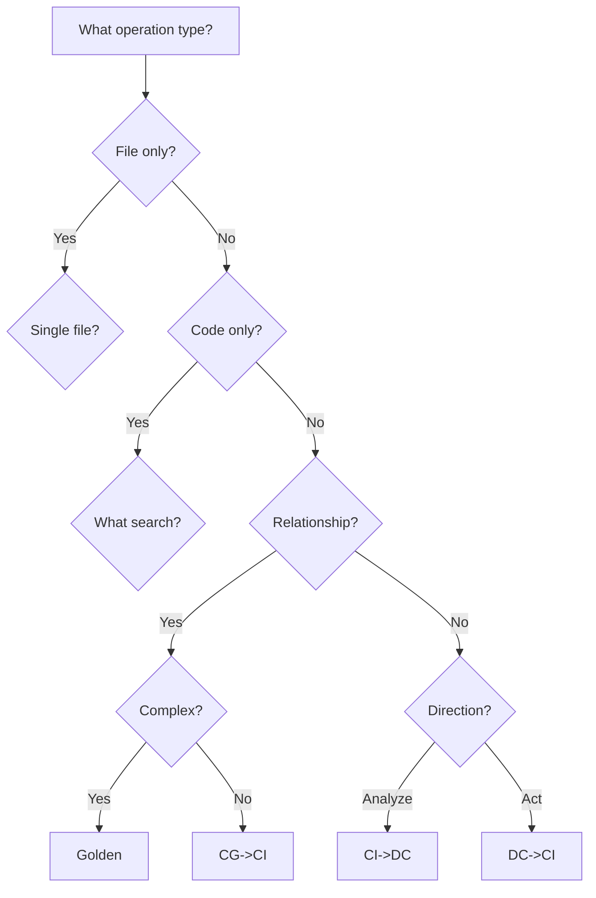

# Phase 3 Plan 3: TOOL-CHAIN-REFERENCE.md Summary

**Phase:** 03-documentation-consolidation
**Plan:** 03
**Date:** 2026-02-13
**Status:** COMPLETE

---

## Executive Summary

Created unified TOOL-CHAIN-REFERENCE.md consolidating all 24 tool chain patterns with Mermaid visual diagrams, decision trees, and cross-references for workflow authors.

**One-liner:** Unified tool chain reference with Mermaid diagrams for all 24 patterns (15 linear, 4 circular, 5 hybrid).

---

## Tasks Completed

| Task | Name | Commit | Files |
|------|------|--------|-------|
| 1 | Create reference structure | 8891ecd | TOOL-CHAIN-REFERENCE.md |
| 2 | Document Linear Patterns 1-6 | 8891ecd | TOOL-CHAIN-REFERENCE.md |
| 3 | Document Two-Server Patterns 7-12 | 8891ecd | TOOL-CHAIN-REFERENCE.md |
| 4 | Document Golden Pattern 13-15 | 8891ecd | TOOL-CHAIN-REFERENCE.md |
| 5 | Document Circular Patterns 16-19 | 8891ecd | TOOL-CHAIN-REFERENCE.md |
| 6 | Document Hybrid Patterns 20-24 | 8891ecd | TOOL-CHAIN-REFERENCE.md |
| 7 | Add pattern selection decision tree | 8891ecd | TOOL-CHAIN-REFERENCE.md |
| 8 | Add cross-reference summary | 8891ecd | TOOL-CHAIN-REFERENCE.md |

---

## Key Deliverables

### TOOL-CHAIN-REFERENCE.md
- **Size:** 454 lines
- **Patterns:** All 24 documented with Mermaid diagrams
- **Visual:** Mermaid diagrams for each pattern type

### Pattern Categories

**Linear Patterns (15):**
- DC-Only (1-3): Read, Write, Edit
- CI-Only (4-6): Search, Symbol, Analysis
- Two-Server (7-12): CG->CI, DC->CI, CI->DC
- Golden (13-15): Full pattern, CI fallback, Process

**Circular Patterns (4):**
- Verification loops (16-19)

**Hybrid Patterns (5):**
- Parallel operations, batch analysis, adaptive (20-24)

---

## Quick Lookup Table

| # | Pattern | Flow | Servers | Token Savings |
|---|---------|------|---------|--------------|
| 1-3 | DC-Only | read/write/edit | DC | 75-85% |
| 4-6 | CI-Only | search/symbol/summary | CI | 75-85% |
| 7-8 | CG->CI | query->search | CG, CI | 82-83% |
| 9-10 | DC->CI | edit->search | DC, CI | 77-78% |
| 11-12 | CI->DC | symbol->edit | CI, DC | 81-84% |
| 13 | Golden | CG->CI->CI->DC->DC->CI | All | ~86% |
| 14 | Golden CI | CI->CI->CI->DC->DC->CI | CI, DC | ~75% |
| 15 | DC->CI | process->search | DC, CI | ~70% |
| 16-19 | Circular | Various | Various | Variable |
| 20-24 | Hybrid | Various | Various | Variable |

---

## Decision Tree

---

## Cross-References

- CODE-INDEX-MCP-GUIDE.md - CI tool details
- GOLDEN-PATTERN.md - Full golden pattern
- TOOL-PRIORITY-RULES.md - Tool hierarchy

---

## Deviations from Plan

None - plan executed exactly as written.

---

## Metrics

**Duration:** ~4 minutes
**Tasks:** 8/8 complete
**Commits:** 1
**Lines Added:** 453
