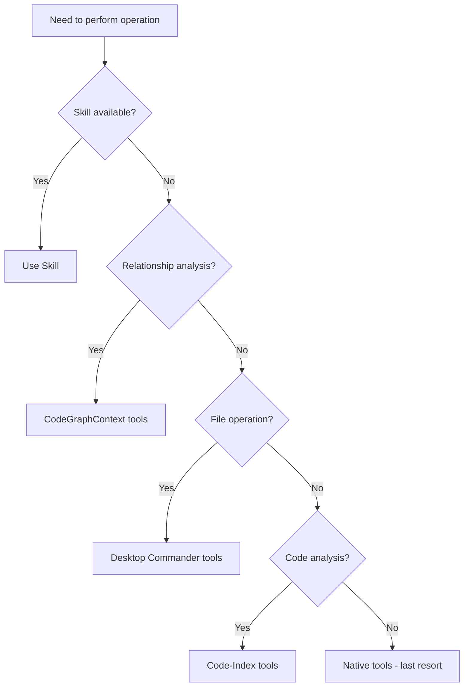
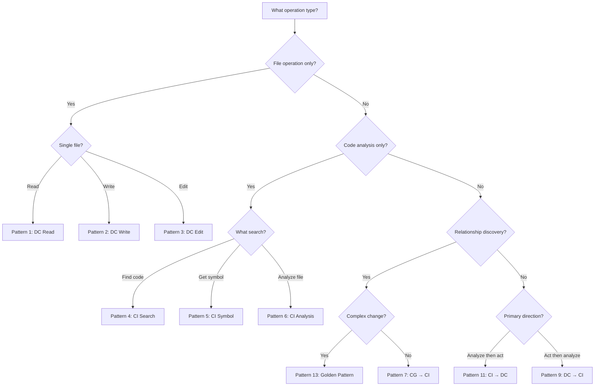
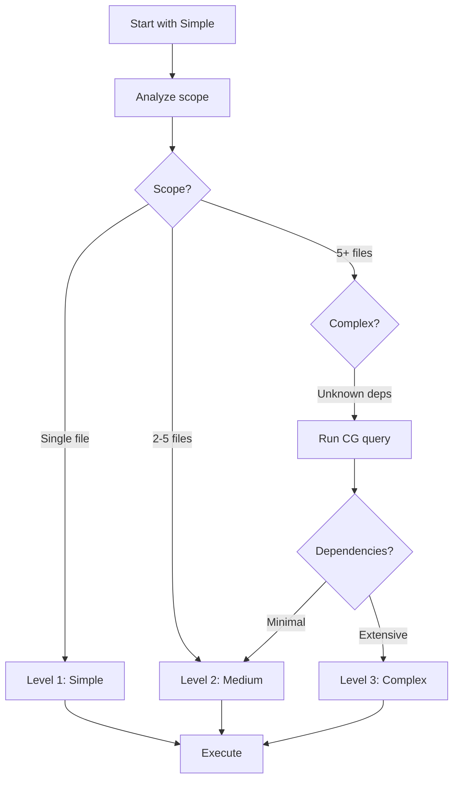
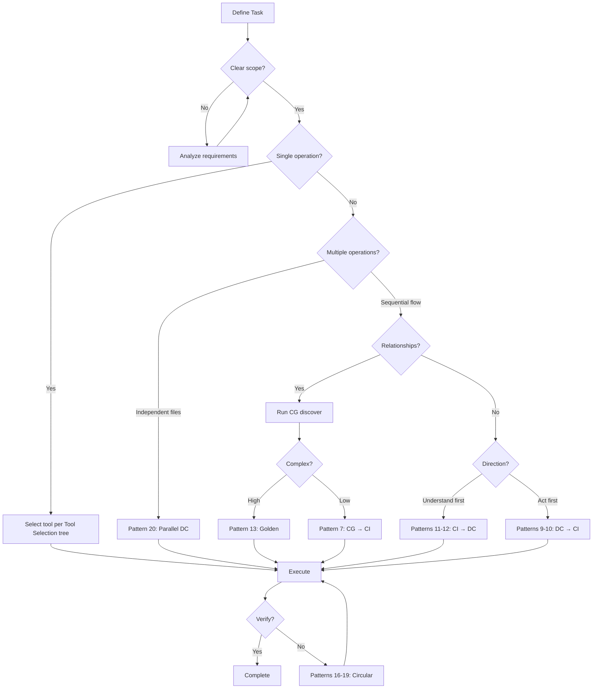
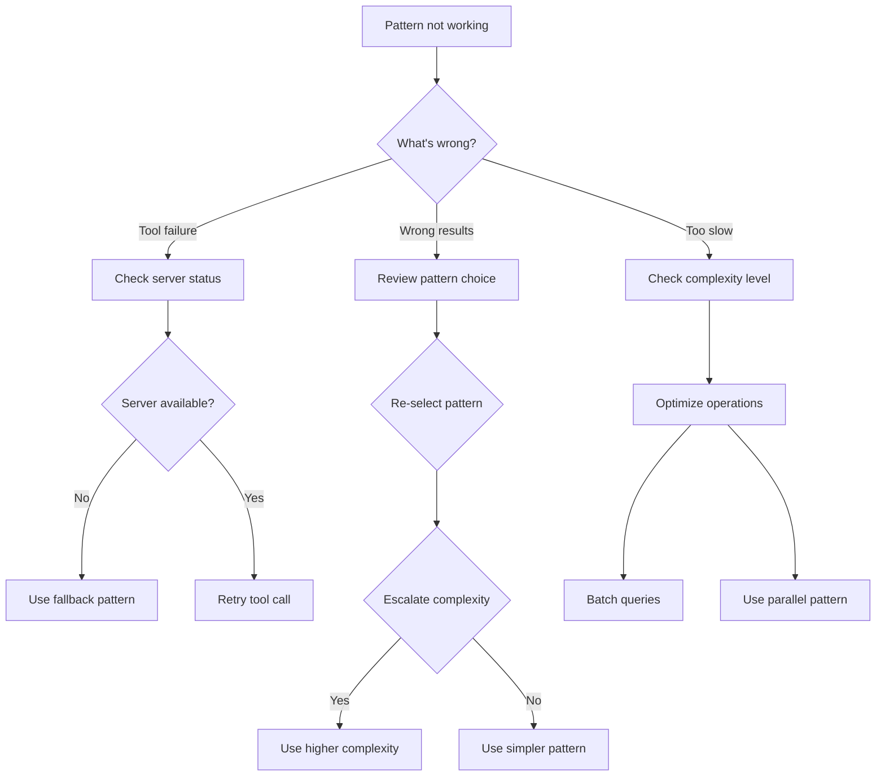

<objective>
Create DECISION-TREES.md with comprehensive decision trees for tool selection, pattern selection, and complexity escalation, enabling workflow authors to make optimal decisions without memorizing all patterns.

Purpose: Provide decision-making framework for selecting appropriate tools and patterns based on operation type, complexity, and available MCP servers.

Output: 350+ line decision tree guide with visual trees, complexity guidelines, and pattern selection flowcharts including CG server integration.
</objective>

<execution_context>
@C:\Users\mose\.claude\get-shit-done\workflows\execute-plan.md
@C:\Users\mose\.claude\get-shit-done\templates\summary.md
</execution_context>

<context>
@.planning/STATE.md
@.planning/ROADMAP.md
@.planning/codebase/TOOL-CHAIN-REFERENCE.md (from 03-03)
@.planning/codebase/CODE-INDEX-MCP-GUIDE.md (from 03-01)
@.planning/codebase/TOOL-PRIORITY-RULES.md (from 03-02)
@.planning/codebase/GOLDEN-PATTERN.md
@.planning/codebase/MCP-SERVER-STATUS.md (from 03-02)
</context>

<tasks>

<task type="auto">
  <name>Task 1: Create DECISION-TREES.md structure with overview</name>
  <files>.planning/codebase/DECISION-TREES.md</files>
  <action>
Create decision tree guide file with:
- Header explaining purpose (decision framework for tools and patterns)
- Overview of 4 decision trees (tool selection, pattern selection, complexity, workflow routing)
- Quick reference summary table
- How to use this guide section
- Server availability notes (CG at neo4j://localhost:7687)

Template:
```markdown
# Decision Trees for MCP Tool Chain Selection

**Created:** [date]
**Purpose:** Decision-making framework for optimal tool and pattern selection

## Overview

This guide provides four decision trees:
1. **Tool Selection:** Which MCP tool to use for specific operations
2. **Pattern Selection:** Which tool chain pattern fits your workflow
3. **Complexity Escalation:** When to escalate from simple to complex patterns
4. **Workflow Routing:** End-to-end decision flow from task to execution

## Server Availability

- **DC (Desktop Commander):** ✅ Connected - File and process operations
- **CI (Code-Index):** ✅ Connected - Code search and symbol navigation
- **CG (CodeGraphContext):** ✅ Connected at neo4j://localhost:7687 - Relationship analysis

## Quick Summary

| Operation Type | Recommended Tool | Pattern | Token Range |
|----------------|-----------------|---------|-------------|
| Read file | DC read_file | Pattern 1 | 3-8K |
| Search code | CI search_code_advanced | Pattern 4 | 5-12K |
| Find relationships | CG query_graph | Pattern 7 | 5-10K |
| Simple edit | DC edit_block | Pattern 3 | 3-8K |
| Multi-file refactor | Golden Pattern | Pattern 13 | 30-50K |

## How to Use This Guide

1. Start with Workflow Routing for end-to-end guidance
2. Use Tool Selection for specific tool choices
3. Use Pattern Selection for workflow patterns
4. Use Complexity Escalation to determine pattern depth
```
  </action>
  <verify>File exists with overview, quick summary table, 4-tree framework, server availability</verify>
  <done>Decision tree structure created with framework overview</done>
</task>

<task type="auto">
  <name>Task 2: Document Tool Selection Decision Tree with CG</name>
  <files>.planning/codebase/DECISION-TREES.md</files>
  <action>
Add comprehensive tool selection decision tree:
```markdown
## Tool Selection Decision Tree

### Visual Tree


### Decision Criteria

**Use Skills When:**
- Pre-compressed workflows exist (code-review-expert, sequential-thinking)
- Complex analysis with known patterns
- Token optimization is critical
- Examples: code review, deep thinking, tractatus analysis

**Use CodeGraphContext When:**
- Finding relationships between files/modules
- Tracing import/export chains
- Dependency impact analysis
- Understanding what depends on what
- Examples: "What uses User model?", "Trace import chain", "Impact of breaking change"

**Use Desktop Commander When:**
- Reading/writing files
- Creating/editing/deleting directories
- Running processes or commands
- File system operations
- Examples: "Read config", "Create file", "Run tests", "List directory"

**Use Code-Index When:**
- Searching for code patterns
- Getting symbol implementations
- Analyzing file structure
- Understanding function/class definitions
- Examples: "Find function definition", "Search for pattern", "Get file summary"

**Use Native Tools When:**
- No MCP equivalent exists (git commands, package managers)
- MCP tools are unavailable (fallback)
- Operation is extremely simple (edge case)

### Tool Selection Table

| Question | Answer | Tool |
|----------|--------|------|
| Need code relationships? | Yes | CG |
| Need to read file? | Yes | DC |
| Need to search code? | Yes | CI |
| Need to run command? | Yes | DC |
| Need complex analysis? | Yes | Skill |
| None of above? | - | Native (last resort) |
```
  </action>
  <verify>Tool selection tree includes Mermaid diagram, decision criteria, tool selection table</verify>
  <done>Tool selection decision tree documented with CG integration</done>
</task>

<task type="auto">
  <name>Task 3: Document Pattern Selection Decision Tree</name>
  <files>.planning/codebase/DECISION-TREES.md</files>
  <action>
Add pattern selection decision tree:
```markdown
## Pattern Selection Decision Tree

### Visual Tree


### Pattern Quick Reference

| Decision | Pattern | Flow | Servers |
|----------|---------|-----|---------|
| File operation only | 1-3 | DC-only | DC |
| Code analysis only | 4-6 | CI-only | CI |
| Need relationships | 7-8 | CG → CI | CG, CI |
| Understand then edit | 11-12 | CI → DC | CI, DC |
| Edit then analyze | 9-10 | DC → CI | DC, CI |
| Complex refactor | 13 | Golden Pattern | CG, CI, DC |
| Iterative refinement | 16-19 | Circular | Varies |
| Parallel operations | 20-24 | Hybrid | Varies |

### Decision Questions

1. **What type of operation?**
   - File only → DC-only patterns (1-3)
   - Code only → CI-only patterns (4-6)
   - Mixed → Continue

2. **Relationship discovery needed?**
   - Yes → CG patterns (7-8) or Golden (13)
   - No → Continue

3. **What's the direction?**
   - Analyze then act → CI → DC (11-12)
   - Act then analyze → DC → CI (9-10)

4. **How complex?**
   - Simple → Single-server pattern
   - Medium → Two-server pattern
   - Complex → Golden Pattern

5. **Is iterative?**
   - Yes → Circular patterns (16-19)

6. **Can parallelize?**
   - Yes → Hybrid patterns (20-24)
```
  </action>
  <verify>Pattern selection tree includes Mermaid diagram and quick reference table</verify>
  <done>Pattern selection decision tree documented</done>
</task>

<task type="auto">
  <name>Task 4: Document Complexity Escalation Guidelines</name>
  <files>.planning/codebase/DECISION-TREES.md</files>
  <action>
Add complexity escalation guidelines:
```markdown
## Complexity Escalation Guidelines

### When to Escalate

**Start Simple, Escalate as Needed**

### Level 1: Simple (DC-only or CI-only)

**Characteristics:**
- Single file operation
- No dependencies affected
- No verification beyond write confirmation
- Clear, isolated change

**Patterns:** 1-6 (DC-only or CI-only)

**Examples:**
- Update config value
- Read file content
- Search for function definition
- Create new file

**Token Budget:** ~3K-12K tokens

**Decision Point:** Use if task is clearly single-file with no dependencies

### Level 2: Medium (Two-Server Patterns)

**Characteristics:**
- Multi-file operation (2-5 files)
- Known dependencies
- Some analysis before action
- Verification recommended

**Patterns:** 7-12 (CG → CI, CI → DC, DC → CI)

**Examples:**
- Update import across 3 files
- Understand function then implement similar
- Edit file and check usage
- Add field to interface

**Token Budget:** ~15K-30K tokens

**Decision Point:** Use if search reveals 2-5 affected files or known dependencies

### Level 3: Complex (Golden Pattern)

**Characteristics:**
- Multi-file refactor (5+ files)
- Unknown/complex dependencies
- Breaking API changes
- Security-critical changes
- Architecture modifications

**Patterns:** 13 (Golden Pattern), 14 (CI-only fallback)

**Examples:**
- Add authentication to all routes
- Refactor shared utility used everywhere
- Change database schema
- Implement permissions system

**Token Budget:** ~30K-50K tokens (but saves 80% vs native)

**Decision Point:** Use if CG query reveals extensive dependency web or breaking changes

### Escalation Triggers

**Escalate from Simple → Medium when:**
- Search reveals 3+ affected files
- Change involves imports/exports
- Other files use the symbol being modified
- Unknown dependencies discovered

**Escalate from Medium → Complex when:**
- CG query reveals extensive dependency web
- Change affects shared contracts/interfaces
- Breaking change to API
- Security/permissions involved
- Architecture-level modification

### De-escalation Opportunities

**Use simpler pattern when:**
- CG reveals no actual dependencies (drop to DC-only)
- Single file affected despite expectations (drop to DC → CI)
- Change is isolated (no need for full Golden Pattern)
- After analysis, complexity was overestimated

### Escalation Flowchart

```
  </action>
  <verify>Complexity guidelines include 3 levels, escalation triggers, de-escalation opportunities, flowchart</verify>
  <done>Complexity escalation framework documented with visual flowchart</done>
</task>

<task type="auto">
  <name>Task 5: Add workflow examples with decision paths</name>
  <files>.planning/codebase/DECISION-TREES.md</files>
  <action>
Add practical workflow examples showing decision paths:
```markdown
## Workflow Examples

### Example 1: "Find where function X is defined"

**Decision Path:**
1. Operation type? → Code analysis only
2. What search? → Get symbol definition
3. **Result:** Pattern 5 (CI-only Symbol Navigation)

**Execution:**
```yaml
mcp__code-index-mcp__get_symbol_body:
  file_path: "unknown/path.ts"
  symbol_name: "functionX"
```

**Tokens:** ~5K (vs ~45K native grep + read)
**Decision Time:** < 1 minute

### Example 2: "Add authentication to 5 routes"

**Decision Path:**
1. Operation type? → Mixed (file changes + analysis)
2. Relationship discovery? → Yes (middleware integration)
3. Complexity? → Complex (multi-file, security)
4. **Result:** Pattern 13 (Golden Pattern)

**Execution:**
```yaml
Step 1: CG discover → Find all route files
Step 2: CI understand → Search auth middleware pattern
Step 3: CI understand → Get authenticate symbol body
Step 4: DC act → Edit routes to add middleware
Step 5: DC verify → Read files to confirm
Step 6: CI verify → Search for middleware usage
```

**Tokens:** ~33K (vs ~240K native)
**Decision Time:** ~2 minutes

### Example 3: "Update config in 3 independent files"

**Decision Path:**
1. Operation type? → File operations
2. Single file? → No, multiple independent files
3. **Result:** Pattern 20 (Parallel DC Operations)

**Execution:**
```yaml
Parallel:
  - DC edit config.json
  - DC edit .env.example
  - DC edit docker-compose.yml
```

**Tokens:** ~12K (vs ~50K sequential)
**Decision Time:** < 1 minute

### Example 4: "Rename export across codebase"

**Decision Path:**
1. Operation type? → Mixed
2. Relationship discovery? → Yes (find all usages)
3. Complexity? → Medium (multi-file, known pattern)
4. **Result:** Pattern 22 (CG-Guided Multi-File DC)

**Execution:**
```yaml
Step 1: CG query → Find all files using export
Step 2: Parallel DC edits → Rename in each file
```

**Tokens:** ~20K (vs ~120K sequential grep + edit)
**Decision Time:** ~1 minute

### Example 5: "Understand module dependencies"

**Decision Path:**
1. Operation type? → Mixed
2. Relationship discovery? → Yes
3. Complexity? → Simple (discovery only)
4. **Result:** Pattern 8 (CG → CI Relationship Discovery)

**Execution:**
```yaml
Step 1: CG find_path → Trace import chain
Step 2: CI get_symbol_body → Get implementation details
```

**Tokens:** ~8K (vs ~60K manual tracing)
**Decision Time:** < 1 minute
```
  </action>
  <verify>Examples show decision path, execution pattern, token comparison, decision time</verify>
  <done>Workflow examples demonstrate practical decision tree usage</done>
</task>

<task type="auto">
  <name>Task 6: Add workflow routing decision tree</name>
  <files>.planning/codebase/DECISION-TREES.md</files>
  <action>
Add end-to-end workflow routing decision tree:
```markdown
## Workflow Routing Decision Tree

### End-to-End Routing Flow


### Routing Summary

| Entry Point | Decision | Output Pattern |
|-------------|----------|----------------|
| Single operation | Tool selection | Direct tool use |
| Independent files | Parallelizable | Pattern 20 |
| Sequential + relationships | CG discover | Patterns 7, 8, 13, 22 |
| Sequential + no relationships | Direction | Patterns 9, 10, 11, 12 |
| Verification needed | Iterative | Patterns 16-19 |

### Routing Checklist

Before starting any workflow:
- [ ] Define task clearly
- [ ] Determine if single or multi-operation
- [ ] Check for independent operations (parallelize)
- [ ] Determine if relationship discovery needed
- [ ] Assess complexity level
- [ ] Select pattern based on above
- [ ] Plan verification strategy
```
  </action>
  <verify>Workflow routing includes Mermaid flowchart, routing summary table, checklist</verify>
  <done>End-to-end workflow routing decision tree documented</done>
</task>

<task type="auto">
  <name>Task 7: Add cross-reference summary and quick reference card</name>
  <files>.planning/codebase/DECISION-TREES.md</files>
  <action>
Add cross-reference section and quick reference card:
```markdown
## Cross-Reference Summary

### Related Documentation

| Guide | Purpose | When to Use |
|-------|---------|-------------|
| CODE-INDEX-MCP-GUIDE.md | CI tool details | Need CI tool parameters |
| TOOL-PRIORITY-RULES.md | Tool selection hierarchy | Confirm tool priority |
| TOOL-CHAIN-REFERENCE.md | All 24 patterns | Need pattern details |
| GOLDEN-PATTERN.md | Full golden pattern | Complex refactor workflow |
| MCP-SERVER-STATUS.md | Server availability | Check CG/CI/DC status |

### Quick Reference Card

**Tool Selection:**
```
Skill? → CG? → DC? → CI? → Native
```

**Pattern Selection:**
```
File only? → DC-only (1-3)
Code only? → CI-only (4-6)
Relationship? → CG patterns (7-8) or Golden (13)
Analyze → Act? → CI → DC (11-12)
Act → Analyze? → DC → CI (9-10)
Complex? → Golden (13)
```

**Complexity Escalation:**
```
Simple (3-12K tokens) → Medium (15-30K) → Complex (30-50K)
Escalate when: dependencies unknown, multi-file, breaking changes
```

**Server Availability:**
```
DC (Desktop Commander): ✅ Files, Processes
CI (Code-Index): ✅ Search, Symbols
CG (CodeGraphContext): ✅ Relationships at neo4j://localhost:7687
```

### Decision Checklist

Before starting any workflow:
- [ ] What operation type? (file/code/mixed)
- [ ] Relationship discovery needed? (CG)
- [ ] Single file or multi-file?
- [ ] What direction? (analyze-first or act-first)
- [ ] How complex? (simple/medium/complex)
- [ ] Can operations be parallelized?
- [ ] Select pattern based on answers above

### Token Budget Planning

| Pattern | Typical Token Cost | Native Equivalent | Savings |
|---------|-------------------|-------------------|---------|
| DC-only | 3-8K | 15-45K | 80-85% |
| CI-only | 5-12K | 25-60K | 80-81% |
| CG → CI | 8-15K | 50-90K | 82-85% |
| Two-server | 15-30K | 80-150K | 80-85% |
| Golden Pattern | 30-50K | 200-300K | 85-90% |

**Budget Planning Tips:**
- Start with simple pattern (3-12K)
- Escalate only when complexity demands it
- Parallel operations share context (savings)
- Verification costs tokens but saves rework
```
  </action>
  <verify>Cross-reference section includes guide table, quick reference, checklist, budget table</verify>
  <done>Decision trees complete with cross-references and quick reference</done>
</task>

<task type="auto">
  <name>Task 8: Add troubleshooting decision tree</name>
  <files>.planning/codebase/DECISION-TREES.md</files>
  <action>
Add troubleshooting decision tree for common decision issues:
```markdown
## Troubleshooting Decision Trees

### Issue: Selected Pattern Not Working

**Decision Tree:**


### Common Decision Pitfalls

| Pitfall | Symptom | Solution |
|---------|---------|----------|
| Over-engineering | Simple task takes 50K+ tokens | Drop to simpler pattern |
| Under-analysis | Changes break dependencies | Escalate to include CG |
| Sequential parallel | Independent ops run sequentially | Use Pattern 20 |
| Missing verification | Changes don't work | Add verification step |
| Wrong tool | Tool unavailable or fails | Check MCP-SERVER-STATUS.md |

### Pattern Adjustment Decision Tree

```
Current pattern not optimal?
  |
  v
Is task simpler than expected?
  YES → Drop complexity level (Golden → Two-server → Single-server)
  |
  v
Is task more complex than expected?
  YES → Escalate complexity (Single-server → Two-server → Golden)
  |
  v
Are operations independent?
  YES → Use parallel pattern (20-24)
  |
  v
Need verification loop?
  YES → Use circular pattern (16-19)
```
```
  </action>
  <verify>Troubleshooting section includes decision tree, common pitfalls table, pattern adjustment tree</verify>
  <done>Troubleshooting decision tree enables self-service correction</done>
</task>

</tasks>

<verification>
1. DECISION-TREES.md exists in .planning/codebase/
2. Four decision trees documented (tool selection, pattern selection, complexity, workflow routing)
3. Mermaid diagrams for each decision tree
4. Workflow examples show practical decision paths with token/time comparisons
5. Cross-reference section links to all 5 related guides
6. Quick reference card enables rapid decision-making
7. CG server integration documented in relationship-based decisions
8. Troubleshooting decision tree enables self-service correction
</verification>

<success_criteria>
1. DECISION-TREES.md is 350+ lines
2. All four decision trees have visual Mermaid diagrams
3. Complexity escalation guidelines include triggers and de-escalation opportunities
4. Workflow examples demonstrate token efficiency gains with decision time estimates
5. Decision checklist provides step-by-step decision framework
6. Cross-reference table enables navigation between all 5 guides
7. CG server integration (neo4j://localhost:7687) documented in applicable decisions
8. Troubleshooting section enables pattern adjustment when initial selection is suboptimal
</success_criteria>

<output>
After completion, create `.planning/phases/03-documentation-consolidation/03-04-SUMMARY.md`
</output>
