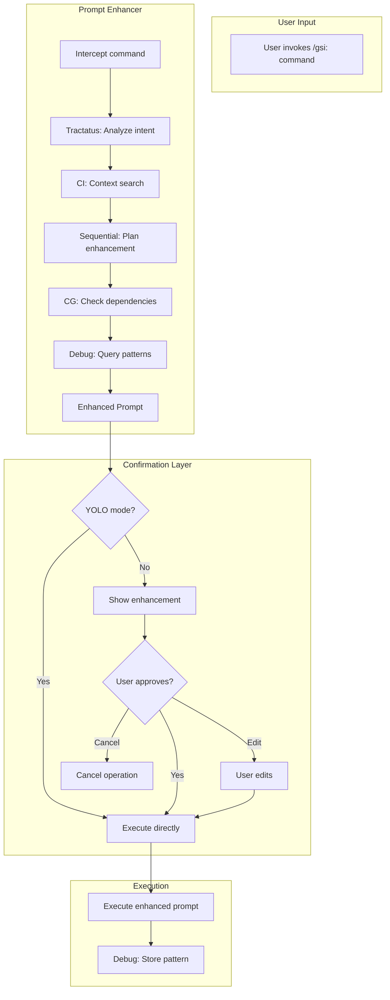

# Phase 19: Prompt Enhancer - Context

**Gathered:** 2026-02-15
**Status:** Ready for planning

<domain>
## Phase Boundary

Create an Integrated Prompt Enhancer that intercepts user input before command execution, rewrites it for clarity using the Three-Layer Cognitive Flow, asks for user confirmation (respects YOLO mode), and then executes the enhanced prompt.

This leverages Phase 17's cognitive architecture with an added confirmation layer.

</domain>

<decisions>
## Implementation Decisions

### Scope
- Applies to ALL `/gsi:` commands
- Intercepts before execution
- Enhancement is optional (can be bypassed with flag)

### Cognitive Flow (Reused from Phase 17)

**Phase 1: Structure Analysis (Tractatus + CI)**
- Tractatus: Analyze user intent and command structure
- CI Integration: Search for relevant context files
- Output: Structured understanding of what user wants

**Phase 2: Process Assessment (Sequential + CG)**
- Sequential: Plan enhancement steps
- CG Integration: Check dependencies between commands
- Output: Clearer, more specific prompt

**Phase 3: Pattern Learning (Debug + DC)**
- Debug: Query similar past prompts
- DC Integration: Read enhancement patterns
- Output: Learned enhancement based on history

### User Confirmation Flow
- **YOLO mode OFF**: Show enhanced prompt, wait for approval
- **YOLO mode ON**: Skip confirmation, execute directly
- **User options**: Approve / Edit / Cancel

### Integration Points
- PreToolUse hook extension for interception
- Reuse Phase 17's cognitive-flow.js module
- New confirmation UI component

### Claude's Discretion
- Exact enhancement phrasing
- How much context to include
- When to skip enhancement (simple commands)

</decisions>

<specifics>
## Specific Ideas

### Architecture



### Files to Create

```
lib/prompt-enhancer/
├── index.js                  # Main entry point
├── interceptor.js            # PreToolUse hook extension
├── enhancer.js               # Cognitive flow wrapper
├── confirmation.js           # User confirmation UI
└── patterns.json             # Learned enhancement patterns

hooks/pre-tool-use/
└── prompt-enhancer.js        # Hook for interception
```

### Example Enhancement

**Before:**
```
/gsi:plan-phase 17
```

**After Enhancement:**
```
/gsi:plan-phase 17
Context: Phase 17 implements Three-Layer Intelligence for complexity prediction.
Detected requirements: 
- Model Awareness (Layer 1)
- Cognitive Orchestration (Layer 2)  
- Auto-Split Decision (Layer 3)
Proceeding with standard planning flow.
```

</specifics>

<deferred>
## Deferred Ideas

- Enhancement API for external integrations - future phase
- Machine learning for prompt improvement - requires training data
- Multi-language prompt enhancement - out of scope

</deferred>

---

*Phase: 19-prompt-enhancer*
*Context gathered: 2026-02-15*
