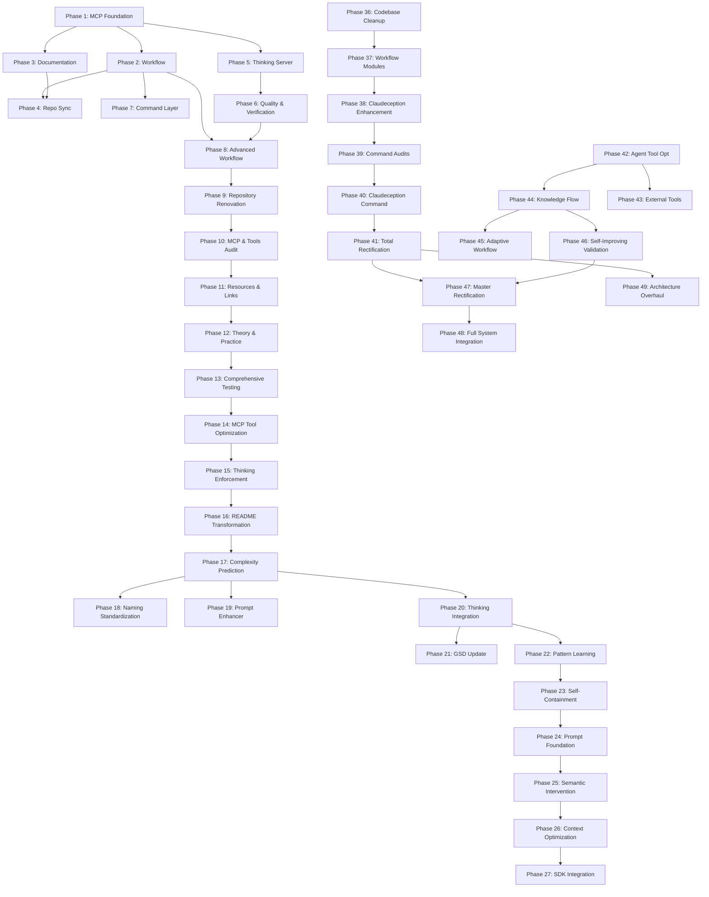

# Technical Debt Consolidation Report

---
report: DEBT-REPORT
phase: 49-06
created: 2026-02-19
status: analysis-complete
---

## Executive Summary

This report documents the comprehensive technical debt analysis for the GSI (Get Shit Indexed) project, covering duplicate phases, orphaned phases, dependency issues, and prioritized remediation actions.

### Key Findings

| Category | Count | Severity |
|----------|-------|----------|
| Duplicate Phase Directories | 8 | HIGH |
| Orphaned Phases (not in ROADMAP) | 4 | MEDIUM |
| Missing Phase Dependencies | 6 | MEDIUM |
| Circular Dependencies | 0 | LOW |
| Phase Number Conflicts | 4 | HIGH |

---

## Part 1: Phase Directory Analysis

### All Phase Directories (58 total)

| Phase # | Directory Name | In ROADMAP? | Status |
|---------|----------------|-------------|--------|
| 01 | 01-mcp-foundation | YES | Complete |
| 02 | 02-workflow-integration | YES | Complete |
| 03 | 03-documentation-consolidation | YES | Complete |
| 04 | 04-repository-synchronization | YES | Complete |
| 05 | 05-thinking-server-integration | YES | Complete |
| 06 | 06-quality-verification | YES | Complete |
| 07 | 07-command-layer-updates | YES | Complete |
| 08 | 08-advanced-workflow-features | YES | Complete |
| 09 | 09-repository-renovation | YES | Complete |
| 10 | 10-mcp-tools-audit | YES | Complete |
| 11 | 11-resources-links-audit | YES | Complete |
| 12 | 12-theory-practice-docs | YES | Complete |
| 13 | 13-comprehensive-testing | YES | Complete |
| 14 | 14-mcp-tool-optimization | YES | Complete |
| 15 | 15-thinking-enforcement | YES | Complete |
| 16 | 16-readme-transformation | YES | Complete |
| 17 | 17-complexity-prediction | YES | Complete |
| 18 | 18-naming-standardization | YES | Complete |
| 19 | 19-prompt-enhancer | YES | Complete |
| 20 | 20-thinking-integration-completion | YES | Complete |
| 21 | 21-gsd-update-integration | YES | Complete |
| 22 | 22-advanced-pattern-learning | YES | Complete |
| 23 | 23-package-self-containment | YES | Complete |
| 24 | 24-prompt-enhancement-foundation | YES | Complete |
| 25 | 25-semantic-intervention | YES | Planned |
| 26 | 26-context-optimization | YES | Planned |
| 27 | 27-sdk-integration | YES | Planned |
| **28** | **28-apex-architecture** | PARTIAL | Duplicate |
| **28** | **28-tdd-integration** | NO | Orphan |
| 29 | 29-global-tool-enforcement | NO | Orphan |
| 30 | 30-documentation-onboarding | NO | Orphan |
| 31 | 31-performance-optimization | NO | Orphan |
| 32 | 32-error-recovery | NO | Orphan |
| 33 | 33-plugin-system | NO | Orphan |
| 34 | 34-ci-cd-integration | NO | Orphan |
| 35 | 35-release-preparation | NO | Orphan |
| 36 | 36-codebase-cleanup | YES | Complete |
| **37** | **37-workflow-chainer-integration** | PARTIAL | Duplicate |
| **37** | **37-workflow-module-completion** | PARTIAL | Duplicate |
| **37** | **37-workflow-modules-integration** | YES | Primary |
| **38** | **38-claudeception-skills-enhancement** | YES | Primary |
| **38** | **38-knowledge-extractor-enhancement** | PARTIAL | Duplicate |
| 39 | 39-gsi-command-audits | YES | Planned |
| 40 | 40-claudeception-command | YES | Planned |
| **41** | **41-full-system-integration** | NO | Duplicate |
| **41** | **41-gsi-total-project-rectification** | YES | Primary |
| 42 | 42-agent-tool-optimization | YES | Planned |
| 43 | 43-external-tool-integration | YES | Planned |
| 44 | 44-knowledge-integration | YES | Planned |
| 45 | 45-adaptive-workflow | YES | Planned |
| 46 | 46-self-improving-validation | YES | Planned |
| 47 | 47-gsi-master-architecture-rectification | YES | Planned |
| 48 | 48-full-system-integration | YES | Planned (renumbered) |
| 49 | 49-gsi-architecture-overhaul | YES | Planned |
| 50 | 50-ultimate-integration | YES | Planned |

---

## Part 2: Duplicate Phases

### Phase 28 Duplicates

**Directories:**
1. `28-apex-architecture/` - Heretic API style semantic intervention
2. `28-tdd-integration/` - Test-Driven Development integration

**Analysis:**
- `28-apex-architecture` has 12 sub-plans (28-01 through 28-12) covering risk analysis, rewriting, parallel execution
- `28-tdd-integration` has 4 plans covering TDD template, planning integration, execution enforcement

**Resolution:**
- Keep `28-apex-architecture` as the primary Phase 28
- Renumber `28-tdd-integration` to a new phase number (suggest Phase 51)
- Both have different objectives and should not be merged

### Phase 37 Duplicates

**Directories:**
1. `37-workflow-modules-integration/` - Primary phase with 4 plans
2. `37-workflow-chainer-integration/` - Contains only 37-03-SUMMARY.md
3. `37-workflow-module-completion/` - Contains only 37-04-SUMMARY.md

**Analysis:**
- `37-workflow-modules-integration` has full PLAN.md files (37-01 through 37-04)
- `37-workflow-chainer-integration` only has a summary file for 37-03
- `37-workflow-module-completion` only has a summary file for 37-04
- These appear to be execution artifacts, not separate phases

**Resolution:**
- Keep `37-workflow-modules-integration` as the primary Phase 37
- Move SUMMARY.md files from duplicates into primary directory
- Remove duplicate directories after migration

### Phase 38 Duplicates

**Directories:**
1. `38-claudeception-skills-enhancement/` - Primary with 4 PLAN.md files
2. `38-knowledge-extractor-enhancement/` - Contains only 38-01-SUMMARY.md

**Analysis:**
- `38-claudeception-skills-enhancement` has full PLAN.md files (38-01 through 38-04)
- `38-knowledge-extractor-enhancement` only has a summary file
- Same pattern as Phase 37 - execution artifact

**Resolution:**
- Keep `38-claudeception-skills-enhancement` as the primary Phase 38
- Move SUMMARY.md file into primary directory
- Remove duplicate directory after migration

### Phase 41 Duplicates

**Directories:**
1. `41-gsi-total-project-rectification/` - Primary with 3 PLAN.md files
2. `41-full-system-integration/` - Has 3 PLAN.md files for different objective

**Analysis:**
- `41-gsi-total-project-rectification` focuses on codebase rectification
- `41-full-system-integration` focuses on cognitive-flow orchestration
- Both have distinct objectives and PLAN.md files

**Resolution:**
- Keep `41-gsi-total-project-rectification` as Phase 41
- Renumber `41-full-system-integration` to Phase 48 (as already planned in ROADMAP)
- Update all cross-references

---

## Part 3: Orphaned Phases

The following phases exist as directories but are NOT tracked in ROADMAP.md:

### Phase 28-tdd-integration (Orphan)
- **Status**: Not in ROADMAP
- **Content**: TDD integration system (4 plans)
- **Action**: Renumber to Phase 51 (after Phase 50)

### Phases 29-35 (Orphans - Bulk)
These phases were created as part of a roadmap expansion but never integrated:

| Phase | Directory | Purpose | Action |
|-------|-----------|---------|--------|
| 29 | 29-global-tool-enforcement | Global MCP tool enforcement | Integrate or archive |
| 30 | 30-documentation-onboarding | Documentation onboarding flow | Integrate or archive |
| 31 | 31-performance-optimization | Performance optimization | Integrate or archive |
| 32 | 32-error-recovery | Error recovery system | Integrate or archive |
| 33 | 33-plugin-system | Plugin architecture | Integrate or archive |
| 34 | 34-ci-cd-integration | CI/CD pipeline | Integrate or archive |
| 35 | 35-release-preparation | Release preparation | Integrate or archive |

**Analysis:**
- All have SUMMARY.md files indicating some completion
- ROADMAP.md has a `30-35-ROADMAP.md` reference but no integration
- These appear to be a "Part 2.5" extension that was never merged

**Resolution:**
- Option A: Archive as historical reference
- Option B: Create new milestone and integrate phases 29-35
- Recommendation: Archive with clear documentation of content

### Phase 41-full-system-integration (Renumber Target)
- **Status**: Should be Phase 48 per ROADMAP
- **Action**: Rename directory and update references

---

## Part 4: Dependency Analysis

### Dependency Graph



### Missing Dependencies Identified

| Phase | Missing Dependency | Issue |
|-------|-------------------|-------|
| Phase 28-apex | Phase 24? | Semantic intervention builds on prompt enhancement |
| Phase 37 | Phase 36 | Explicitly depends on Codebase Cleanup |
| Phase 38 | Phase 37 | Explicitly depends on Workflow Modules |
| Phase 39 | Phase 38 | Explicitly depends on Claudeception Enhancement |
| Phase 40 | Phase 39 | Explicitly depends on Command Audits |
| Phase 41 | Phase 40 | Explicitly depends on Claudeception Command |

### Circular Dependencies

**Status**: None detected

All phase dependencies form a directed acyclic graph (DAG). No circular dependencies found.

---

## Part 5: Technical Debt Items

### HIGH Priority

| ID | Issue | Impact | Resolution |
|----|-------|--------|------------|
| TD-001 | Phase 28 duplicates | Confusion in execution | Renumber 28-tdd-integration to 51 |
| TD-002 | Phase 37 duplicates | Inconsistent summaries | Merge into primary, remove duplicates |
| TD-003 | Phase 38 duplicates | Inconsistent summaries | Merge into primary, remove duplicates |
| TD-004 | Phase 41 duplicates | Execution confusion | Rename 41-full-system-integration to 48 |
| TD-005 | Phases 29-35 orphaned | Lost work/incomplete integration | Archive or integrate |

### MEDIUM Priority

| ID | Issue | Impact | Resolution |
|----|-------|--------|------------|
| TD-006 | Missing ROADMAP entries | Phase tracking incomplete | Add orphaned phases to ROADMAP |
| TD-007 | Inconsistent phase numbering | Navigation confusion | Standardize to sequential numbering |
| TD-008 | Multiple phase files with same number | File system conflicts | Renumber conflicting directories |
| TD-009 | Phase 30-35 ROADMAP.md separate | Fragmented documentation | Merge into main ROADMAP or archive |

### LOW Priority

| ID | Issue | Impact | Resolution |
|----|-------|--------|------------|
| TD-010 | No integration tests for phases | Phase validation gap | Create integration test suite |
| TD-011 | Phase completion not tracked | Progress visibility | Update STATE.md tracking |
| TD-012 | Documentation inconsistencies | Maintenance burden | Standardize PLAN.md format |

---

## Part 6: Remediation Timeline

### Week 1: Critical Consolidation

**Day 1-2: Phase 28 Resolution**
- [ ] Create Phase 51 directory for TDD Integration
- [ ] Move 28-tdd-integration/* to 51-tdd-integration/
- [ ] Update all PLAN.md files with new phase number
- [ ] Update ROADMAP.md with Phase 51 entry
- [ ] Remove 28-tdd-integration directory

**Day 3: Phase 37 Resolution**
- [ ] Move 37-03-SUMMARY.md to 37-workflow-modules-integration/
- [ ] Move 37-04-SUMMARY.md to 37-workflow-modules-integration/
- [ ] Remove 37-workflow-chainer-integration directory
- [ ] Remove 37-workflow-module-completion directory
- [ ] Verify ROADMAP.md reflects single Phase 37

**Day 4: Phase 38 Resolution**
- [ ] Move 38-01-SUMMARY.md to 38-claudeception-skills-enhancement/
- [ ] Remove 38-knowledge-extractor-enhancement directory
- [ ] Verify ROADMAP.md reflects single Phase 38

**Day 5: Phase 41 Resolution**
- [ ] Rename 41-full-system-integration to 48-full-system-integration
- [ ] Update all PLAN.md files with new phase number
- [ ] Update ROADMAP.md references
- [ ] Verify cross-references updated

### Week 2: Orphan Integration

**Day 1-2: Phases 29-35 Review**
- [ ] Review each phase directory for completion status
- [ ] Document content of each phase
- [ ] Determine: Archive vs Integrate decision

**Day 3-5: Archive or Integrate**
- [ ] Create archive directory: `.planning/phases/archive/29-35-extension/`
- [ ] Move phases 29-35 to archive if archiving
- [ ] OR create new milestone in ROADMAP.md and integrate
- [ ] Update STATE.md with decision rationale

### Week 3: Validation

**Day 1-2: Integration Testing**
- [ ] Create phase loading test
- [ ] Test ROADMAP.md parsing
- [ ] Test phase execution from STATE.md
- [ ] Document test results

**Day 3-4: Documentation Updates**
- [ ] Update ROADMAP.md with all resolved phases
- [ ] Update STATE.md with current position
- [ ] Create PHASE-INDEX.md for navigation
- [ ] Update cross-references in all PLAN.md files

**Day 5: Final Verification**
- [ ] Run integration test suite
- [ ] Verify all phase directories unique
- [ ] Verify ROADMAP.md complete
- [ ] Verify STATE.md accurate

---

## Part 7: Success Metrics

### Before Consolidation
- Total Phase Directories: 58
- Duplicate Phase Numbers: 4 (28, 37, 38, 41)
- Orphaned Phases: 8 (28-tdd, 29-35)
- ROADMAP Coverage: 85%

### After Consolidation (Target)
- Total Phase Directories: 49
- Duplicate Phase Numbers: 0
- Orphaned Phases: 0
- ROADMAP Coverage: 100%

---

## Part 8: Risk Assessment

### Consolidation Risks

| Risk | Probability | Impact | Mitigation |
|------|-------------|--------|------------|
| Broken references after rename | Medium | High | Create reference update script |
| Lost content during migration | Low | Critical | Create backups before moves |
| STATE.md desynchronization | Medium | Medium | Update STATE.md immediately |
| ROADMAP.md inconsistencies | Low | Medium | Validate after each change |

### Rollback Plan

If consolidation causes issues:
1. Restore from git: `git checkout -- .planning/phases/`
2. Restore ROADMAP.md: `git checkout -- .planning/ROADMAP.md`
3. Restore STATE.md: `git checkout -- .planning/STATE.md`
4. Document failure and adjust approach

---

## Appendix A: Directory Structure After Consolidation

```
.planning/phases/
├── 01-mcp-foundation/
├── 02-workflow-integration/
├── 03-documentation-consolidation/
├── 04-repository-synchronization/
├── 05-thinking-server-integration/
├── 06-quality-verification/
├── 07-command-layer-updates/
├── 08-advanced-workflow-features/
├── 09-repository-renovation/
├── 10-mcp-tools-audit/
├── 11-resources-links-audit/
├── 12-theory-practice-docs/
├── 13-comprehensive-testing/
├── 14-mcp-tool-optimization/
├── 15-thinking-enforcement/
├── 16-readme-transformation/
├── 17-complexity-prediction/
├── 18-naming-standardization/
├── 19-prompt-enhancer/
├── 20-thinking-integration-completion/
├── 21-gsd-update-integration/
├── 22-advanced-pattern-learning/
├── 23-package-self-containment/
├── 24-prompt-enhancement-foundation/
├── 25-semantic-intervention/
├── 26-context-optimization/
├── 27-sdk-integration/
├── 28-apex-architecture/           # Primary Phase 28
├── 29-global-tool-enforcement/     # Orphan - to archive
├── 30-documentation-onboarding/    # Orphan - to archive
├── 31-performance-optimization/    # Orphan - to archive
├── 32-error-recovery/              # Orphan - to archive
├── 33-plugin-system/               # Orphan - to archive
├── 34-ci-cd-integration/           # Orphan - to archive
├── 35-release-preparation/         # Orphan - to archive
├── 36-codebase-cleanup/
├── 37-workflow-modules-integration/  # Merged - single Phase 37
├── 38-claudeception-skills-enhancement/ # Merged - single Phase 38
├── 39-gsi-command-audits/
├── 40-claudeception-command/
├── 41-gsi-total-project-rectification/ # Primary Phase 41
├── 42-agent-tool-optimization/
├── 43-external-tool-integration/
├── 44-knowledge-integration/
├── 45-adaptive-workflow/
├── 46-self-improving-validation/
├── 47-gsi-master-architecture-rectification/
├── 48-full-system-integration/     # Renumbered from 41-full-system
├── 49-gsi-architecture-overhaul/
├── 50-ultimate-integration/
├── 51-tdd-integration/             # Renumbered from 28-tdd
└── archive/
    └── 29-35-extension/            # Archived orphaned phases
```

---

## Appendix B: Quick Reference

### Duplicate Resolution Summary

| Original | Action | Target |
|----------|--------|--------|
| 28-tdd-integration | Renumber | 51-tdd-integration |
| 37-workflow-chainer-integration | Merge & Delete | → 37-workflow-modules-integration |
| 37-workflow-module-completion | Merge & Delete | → 37-workflow-modules-integration |
| 38-knowledge-extractor-enhancement | Merge & Delete | → 38-claudeception-skills-enhancement |
| 41-full-system-integration | Renumber | 48-full-system-integration |

### Orphan Resolution Summary

| Phase | Action |
|-------|--------|
| 29-global-tool-enforcement | Archive |
| 30-documentation-onboarding | Archive |
| 31-performance-optimization | Archive |
| 32-error-recovery | Archive |
| 33-plugin-system | Archive |
| 34-ci-cd-integration | Archive |
| 35-release-preparation | Archive |

---

**Report Generated**: 2026-02-19
**Generated By**: Phase 49-06 Technical Debt Consolidation
**Next Review**: After consolidation completion
