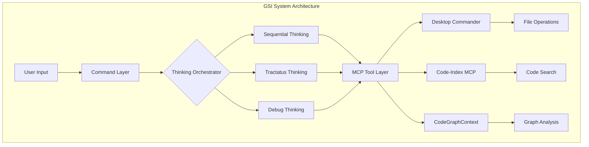
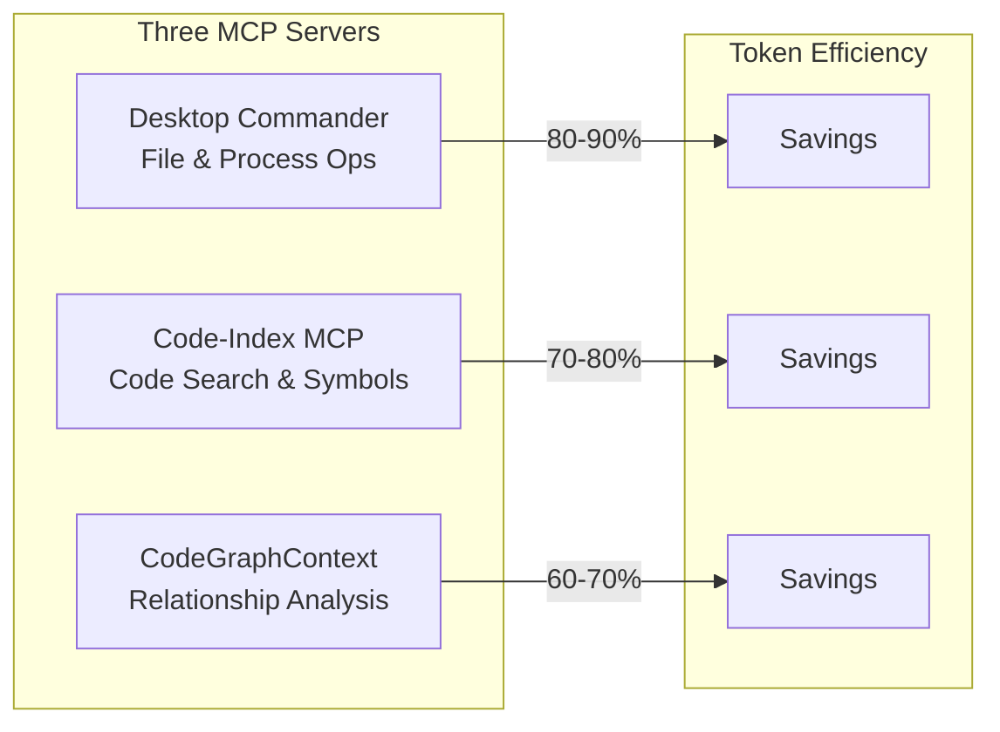
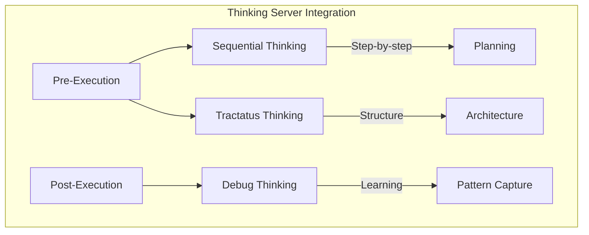
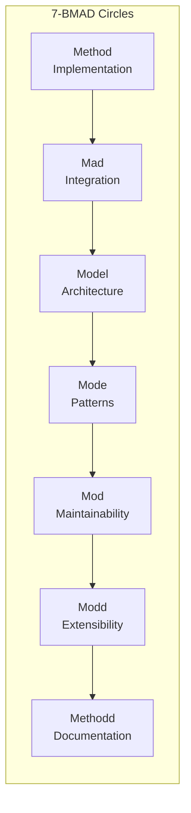
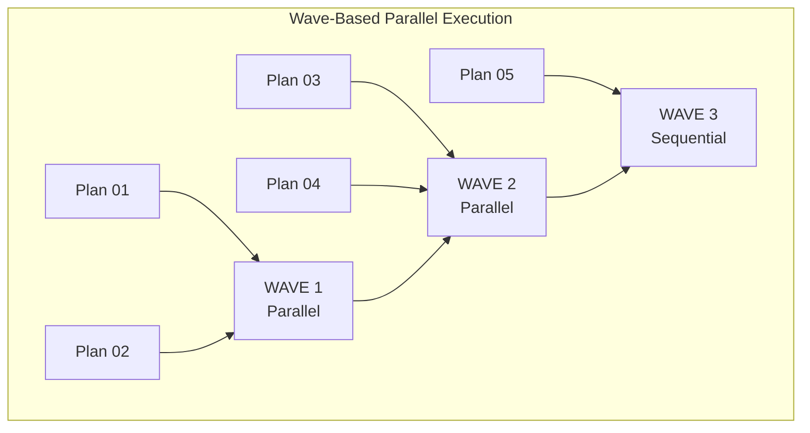
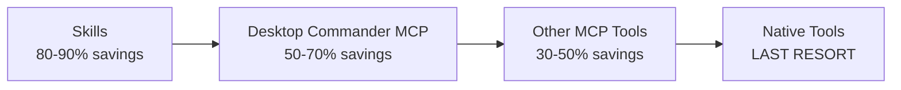
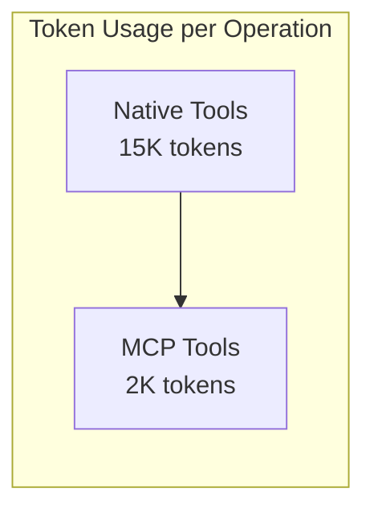

# Get Shit Indexed (GSI)

A fork of [get-shit-done](https://github.com/glittercowboy/get-shit-done) with MCP tool integration, thinking servers, and 80-90% token optimization.

```
npx get-shit-indexed-cc@latest
```

## Why This Fork Exists

Native tools (Bash, Read, Write, Grep, Glob) burn through context windows. Every operation costs thousands of tokens in protocol overhead.

**GSI uses MCP tools instead.** Result: 80-90% token savings per operation.

## Quick Start

```bash
# Install globally
npx get-shit-indexed-cc --global

# Or run directly
npx get-shit-indexed-cc@latest
```

Verify with `/gsi:help` inside Claude Code.

---

## MCP Tools vs Native Tools

| Operation | Native Tools | MCP Tools | Token Savings |
|-----------|-------------|-----------|---------------|
| Read file | `Read` (~15K) | `mcp__desktop-commander__read_file` (~2K) | 87% |
| Write file | `Write` (~15K) | `mcp__desktop-commander__write_file` (~2K) | 87% |
| Search code | `Grep` (~15K) | `mcp__code-index-mcp__search_code_advanced` (~3K) | 80% |
| List files | `Bash ls` (~15K) | `mcp__desktop-commander__list_directory` (~2K) | 87% |
| Batch read | Multiple `Read` calls | `read_multiple_files` | 85% |

**Result: Same work, 80-90% less context waste.**

---

## Architecture



---

## MCP Server Architecture



### Server Capabilities

| Server | Primary Use | Tools | Token Savings |
|--------|-------------|-------|---------------|
| Desktop Commander | Files, processes | 24+ tools | 80-90% |
| Code-Index MCP | Code search | 10+ tools | 70-80% |
| CodeGraphContext | Relationships | 8+ tools | 60-70% |

---

## Thinking Servers



### Server Comparison

| Server | Purpose | Best For | Token Usage |
|--------|---------|----------|-------------|
| Sequential | Multi-step decomposition | Planning, implementation | 1-3K/session |
| Tractatus | Logical structure | Architecture, design | 1-3K/session |
| Debug | Problem solving | Debugging, learning | 1-3K/session |

---

## 7-BMAD Quality Framework

All work validated against seven quality gates:



| Circle | Focus | Validation Tool |
|--------|-------|-----------------|
| Method | Code correctness | Sequential + Debug |
| Mad | Integration | Tractatus + Debug |
| Model | Architecture | Tractatus |
| Mode | Pattern consistency | All servers |
| Mod | Maintainability | Sequential + Debug |
| Modd | Extensibility | Tractatus |
| Methodd | Documentation | All servers |

---

## GSI vs GSD Feature Comparison

| Feature | GSD (Original) | GSI (This Fork) |
|---------|----------------|-----------------|
| File operations | Native tools | MCP tools (80-90% savings) |
| Code search | Grep | Code-Index MCP |
| Relationship analysis | None | CodeGraphContext |
| Thinking servers | None | 3 servers integrated |
| Quality validation | Manual | 7-BMAD auto-validation |
| Token optimization | None | 80-90% savings |
| Commands | ~20 | 26 |
| Multi-runtime | Claude, OpenCode, Gemini | Same |

---

## Commands

### Core Workflow

```mermaid
graph LR
    A[/gsi:new-project] --> B[/gsi:discuss-phase]
    B --> C[/gsi:plan-phase]
    C --> D[/gsi:execute-phase]
    D --> E{/gsi:verify-work}
    E -->|Pass| F[/gsi:complete-milestone]
    E -->|Fail| C
```

| Command | Purpose |
|---------|---------|
| `/gsi:new-project` | Initialize project with research |
| `/gsi:discuss-phase N` | Capture implementation decisions |
| `/gsi:plan-phase N` | Research + plan + verify |
| `/gsi:execute-phase N` | Execute plans in waves |
| `/gsi:verify-work N` | User acceptance testing |
| `/gsi:complete-milestone` | Archive and release |

### Utilities

| Command | Purpose |
|---------|---------|
| `/gsi:progress` | Show current status |
| `/gsi:help` | All commands |
| `/gsi:debug` | Systematic debugging |
| `/gsi:quick` | Ad-hoc tasks |
| `/gsi:yolo` | Maximum speed mode |

---

## Wave Execution



Plans grouped by dependencies. Independent plans run in parallel. Dependent plans wait.

---

## Tool Priority (Critical)

**Always use in this order:**



| Priority | Tool Type | Token Cost |
|----------|-----------|------------|
| 1 | Skills | ~1K (best) |
| 2 | Desktop Commander | ~2K |
| 3 | Other MCP | ~3-5K |
| 4 | Native tools | ~15K (worst) |

---

## Installation

### Prerequisites

- Node.js 18+
- npm 8+
- Git

### Quick Install

```bash
# Interactive install
npx get-shit-indexed-cc

# Non-interactive
npx get-shit-indexed-cc --claude --global
npx get-shit-indexed-cc --opencode --global
npx get-shit-indexed-cc --gemini --global
npx get-shit-indexed-cc --all --global
```

### MCP Server Setup

Add to `~/.claude/settings.json`:

```json
{
  "mcpServers": {
    "desktop-commander": {
      "command": "mcp-desktop-commander"
    },
    "code-index-mcp": {
      "command": "mcp-code-index",
      "args": ["--project-path", "/path/to/project"]
    },
    "codegraphcontext": {
      "command": "mcp-codegraphcontext",
      "args": ["--uri", "neo4j://localhost:7687"]
    }
  }
}
```

---

## Project Structure

```
get-shit-indexed/
├── bin/              # CLI installer
├── commands/         # 26 GSI commands
├── lib/              # Core libraries
│   ├── complexity/   # Complexity prediction
│   ├── prompt-enhancer/  # Prompt enhancement
│   ├── thinking/     # Thinking orchestrator
│   └── workflow-thinking/  # Workflow integration
├── agents/           # 12 GSI agents
├── workflows/        # 30+ workflow definitions
├── references/       # Documentation
├── templates/        # Plan templates
└── .planning/        # Project state
```

---

## Performance Benchmarks

### Token Usage Comparison



| Operation | Native | MCP | Savings |
|-----------|--------|-----|---------|
| Read 10 files | ~150K | ~20K | 87% |
| Search codebase | ~15K | ~3K | 80% |
| Batch operations | ~50K | ~8K | 84% |

### Execution Performance

| Metric | GSD | GSI |
|--------|-----|-----|
| Avg plan time | 5.5 min | 5.3 min |
| Token usage | 100% | 15-20% |
| Context efficiency | Low | High |

---

## Credits

Forked from [get-shit-done](https://github.com/glittercowboy/get-shit-done) by TÂCHES.

Original GSD provided workflow structure and planning methodology. GSI adds:
- MCP tool integration (80-90% token savings)
- Three thinking servers
- 7-BMAD quality framework
- CodeGraphContext analysis

---

## License

MIT
