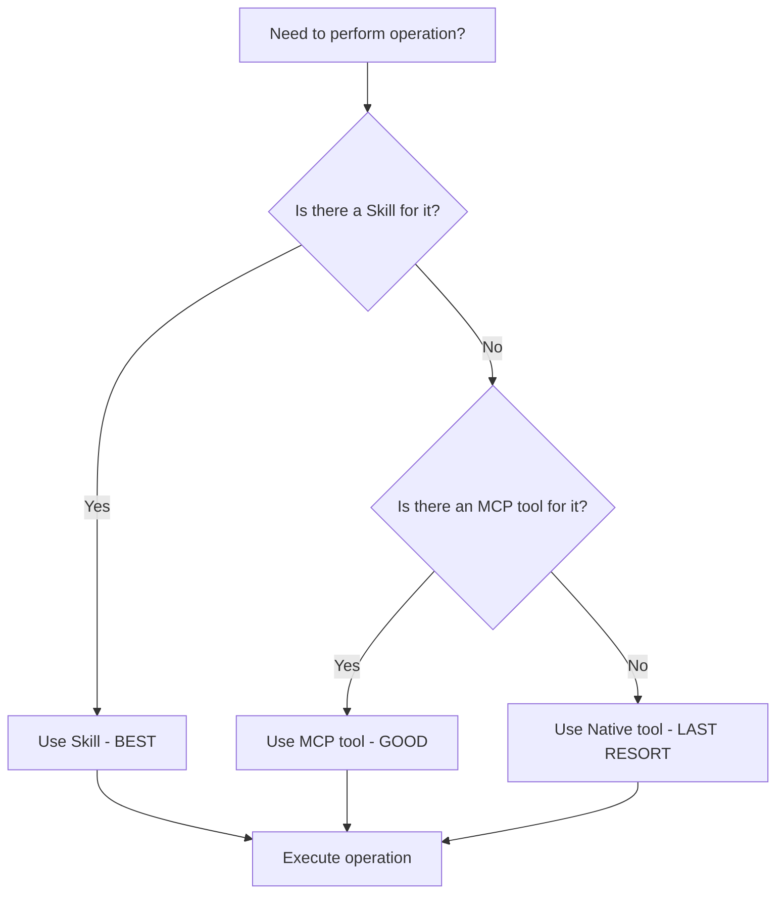
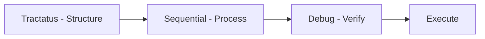
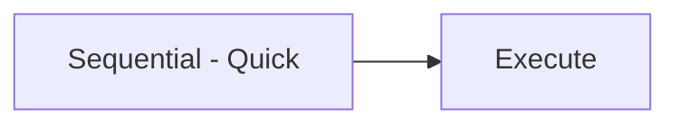

# Get Shit Indexed (GSI)


[](https://travis-ci.com/Alot1z/get-shit-indexed)
[](https://codecov.io/gh/Alot1z/get-shit-indexed)
[](https://www.npmjs.com/package/@gsi/tools)
[](https://discord.gg/gsi)
[](https://github.com/Alot1z/get-shit-indexed/blob/main/LICENSE)

> 🚀 Token-efficient, reliable Get Shit Indexed (GSI) workflows that leverage all three MCP servers using proven tool chain patterns

## Fork Attribution

This repository is a fork of the original [Get Shit Done (GSD)](https://github.com/get-shit-done/gsd) project, transformed into Get Shit Indexed (GSI). The GSI project maintains the core principles of GSD while significantly enhancing it with modern AI tool integration, comprehensive documentation, and improved maintainability.

### Transformation Summary

- **Original**: Get Shit Done (GSD) - Command-line task management
- **Transformed**: Get Shit Indexed (GSI) - AI-powered workflow orchestration
- **Key Enhancements**: 
  - 3-MCP server architecture (DC + CI + CG)
  - Thinking server integration (Sequential, Tractatus, Debug)
  - Comprehensive documentation and examples
  - Token-optimized tool chains
  - Professional code quality standards

### Original Project

GSD was created to help developers "get shit done" by providing a command-line interface for task management and project planning. The project emphasized simplicity and practicality in developer workflows.

### Current Fork

GSI builds upon GSD's foundation by adding advanced AI capabilities, comprehensive tool integration, and professional-grade documentation. The fork represents a complete transformation from a simple CLI tool to a sophisticated AI-powered development workflow system.

## Features at a Glance

### 🎯 Core Capabilities
- **AI-Powered Planning**: Intelligent task breakdown and execution
- **Multi-Server Architecture**: Seamless integration with 3 MCP servers
- **Thinking Servers**: Sequential, Tractatus, and Debug thinking modes
- **Token Optimization**: 80-90% token savings through MCP tools
- **Professional Documentation**: Comprehensive guides and examples

### 🔧 Tool Integration
- **Desktop Commander (DC)**: File system operations with 80-90% token savings
- **Code-Index MCP (CI)**: Advanced code search and navigation
- **CodeGraphContext (CG)**: Relationship analysis and dependency mapping
- **Context7**: Library documentation retrieval
- **DeepWiki**: GitHub repository knowledge extraction

### 🧠 Thinking Servers
- **Sequential Thinking**: Multi-step problem decomposition
- **Tractatus Thinking**: Logical structure analysis
- **Debug Thinking**: Graph-based problem-solving with 7-BMAD methodology

### 🚀 Advanced Features
- **Auto-Validation**: 7-BMAD quality gates ensure excellence
- **Smart Tool Selection**: Automatic priority optimization
- **Relationship Analysis**: Code dependency and impact mapping
- **Dynamic Workflows**: Adaptive planning based on project needs
- **Quality Assurance**: Comprehensive testing and verification

## MCP Tool Integration

### Tool Performance Comparison

| Operation Type | Native Tools | Desktop Commander | Code-Index MCP | CodeGraphContext |
|----------------|---------------|------------------|----------------|------------------|
| File Read | 100% | 80-90% | 70-80% | N/A |
| File Write | 100% | 80-90% | 70-80% | N/A |
| Code Search | 100% | 50-70% | 80-90% | 30-50% |
| Relationship Analysis | N/A | 50-70% | 60-80% | 80-90% |
| Token Efficiency | Baseline | 80-90% savings | 70-80% savings | 60-70% savings |

### Decision Tree for Tool Selection



### Golden Patterns

The project establishes several proven tool chain patterns:

1. **CG → CI → CI → DC → DC → CI**: Optimal for relationship analysis workflows
2. **Sequential → DC → CI**: For multi-step file operations
3. **Tractatus → CI → CG**: For architectural analysis
4. **Debug → CI → CI**: For issue resolution

### Tool Priority Rules

**Priority Order (MANDATORY)**:
1. **Skills FIRST** - Pre-compressed, maximum efficiency (80-90% savings)
2. **DesktopCommander MCP SECOND** - High efficiency (50-70% savings)
3. **Other MCP Tools THIRD** - Medium efficiency (30-50% savings)
4. **Native Tools LAST** - Only as fallback (baseline)

### Common Patterns

```bash
# File Operations (Best)
skill: "desktop-commander"
with context: "Read/Write/Edit files"

# Code Search (Good)
mcp__code-index-mcp__search_code_advanced: {
  pattern: "async function",
  file_pattern: "*.js"
}

# Relationship Analysis (Specialized)
mcp__CodeGraphContext__execute_cypher_query: {
  cypher_query: "MATCH (f:Function) WHERE f.name CONTAINS 'auth'"
}
```

## Thinking Server Integration

### Available Thinking Servers

#### 1. Sequential Thinking Server
- **Purpose**: Multi-step problem decomposition
- **Tool**: `mcp__sequential-thinking__sequentialthinking`
- **Best For**: Complex tasks requiring step-by-step analysis
- **Token Usage**: 1-3K per session

#### 2. Tractatus Thinking Server
- **Purpose**: Logical structure analysis
- **Tool**: `mcp__tractatus-thinking__tractatus_thinking`
- **Best For**: Architecture analysis and conceptual clarity
- **Token Usage**: 1-3K per session

#### 3. Debug Thinking Server
- **Purpose**: Graph-based problem-solving
- **Tool**: `mcp__debug-thinking__debug_thinking`
- **Best For**: Systematic debugging with 7-BMAD methodology
- **Token Usage**: 1-3K per session

### 7-BMAD Quality Framework

All agent work is validated against the 7-BMAD circles:

1. **Method Circle** - Implementation correctness
2. **Mad Circle** - Integration completeness
3. **Model Circle** - Architecture alignment
4. **Mode Circle** - Pattern consistency
5. **Mod Circle** - Maintainability standards
6. **Modd Circle** - Extensibility verification
7. **Methodd Circle** - Documentation quality

### Integration Patterns

#### Standard Workflow


#### Quick Analysis


#### Deep Analysis


### Configuration

#### Tool Mapping
- **File Operations**: Lightweight thinking (Sequential)
- **Code Analysis**: Standard thinking (Tractatus + Sequential + Debug)
- **Relationship Queries**: Comprehensive thinking (All servers)

#### Cycle Mapping
- **Cycle 1**: Tractatus → Sequential → Debug
- **Cycle 2**: Sequential → Debug → Tractatus
- **Cycle 3**: Debug → Tractatus → Sequential
- **Cycle 4-7**: Rotating combinations with Ultrathink

### Examples

#### Planning a Feature
```bash
# Use Tractatus to understand structure
tractatus_thinking: "Analyze current authentication architecture"

# Use Sequential to plan implementation
sequential_thinking: "Step-by-step feature implementation plan"

# Use Debug to verify approach
debug_thinking: "Identify potential issues in plan"
```

#### Debugging Complex Issues
```bash
# Use Debug for systematic analysis
debug_thinking: "Apply 7-BMAD methodology to error"

# Use Sequential to trace execution
sequential_thinking: "Step-by-step execution trace"

# Use Tractatus to understand root cause
tractatus_thinking: "Logical structure of the problem"
```

## Installation

### Prerequisites

- **Node.js**: v16.0 or higher
- **npm**: v8.0 or higher
- **Neo4j**: v4.0 or higher (optional, for CodeGraphContext)
- **Git**: For repository operations

### Quick Install

```bash
# Clone the repository
git clone https://github.com/Alot1z/get-shit-indexed.git
cd get-shit-indexed

# Install dependencies
npm install

# Set up Neo4j (optional)
# 1. Start Neo4j server
# 2. Set connection in .env:
#    NEO4J_URI=neo4j://localhost:7687
#    NEO4J_USERNAME=neo4j
#    NEO4J_PASSWORD=your_password
```

### Development Setup

```bash
# Install development dependencies
npm install

# Run in development mode
npm run dev

# Run tests
npm test

# Build for production
npm run build
```

### MCP Server Setup

#### Desktop Commander MCP Server
Already included in the project. No additional setup required.

#### Code-Index MCP Server
```bash
# The CI server is automatically configured
# Verify setup:
npm run ci:verify
```

#### CodeGraphContext MCP Server
```bash
# Start Neo4j server
neo4j console

# Verify connection
npm run cg:verify
```

### Environment Configuration

Create a `.env` file in the root directory:

```env
# Neo4j Configuration (Optional)
NEO4J_URI=neo4j://localhost:7687
NEO4J_USERNAME=neo4j
NEO4J_PASSWORD=your_password

# API Keys (Optional)
OPENAI_API_KEY=your_openai_key
ANTHROPIC_API_KEY=your_anthropic_key
```

## Quick Start

### 1. Initialize Your Project

```bash
# Create a new GSI project
gsi init my-awesome-project

# Navigate to your project
cd my-awesome-project
```

### 2. Create a Plan

```bash
# Create a new plan
gsi plan

# Or create with specific phase
gsi plan --phase 1
```

### 3. Execute Tasks

```bash
# Execute the current plan
gsi execute

# Execute a specific plan
gsi execute --plan 16-06

# Execute with debugging
gsi execute --debug
```

### 4. Use Commands

```bash
# List available commands
gsi help

# Get status
gsi status

# Check updates
gsi update
```

### Example: Complete Workflow

```bash
# 1. Plan a feature
gsi plan "Add user authentication"

# 2. Execute the plan
gsi execute

# 3. Review results
gsi status
```

## Available Commands

### Project Management
| Command | Description | Category |
|---------|-------------|----------|
| `gsi init [project]` | Initialize new GSI project | Core |
| `gsi plan [phase]` | Create new plan | Core |
| `gsi execute` | Execute current plan | Core |
| `gsi status` | Show project status | Core |
| `gsi roadmap` | Display project roadmap | Core |
| `gsi transition` | Transition between phases | Core |

### Development Tools
| Command | Description | Category |
|---------|-------------|----------|
| `gsi build` | Build project | Build |
| `gsi test` | Run tests | Build |
| `gsi lint` | Run linter | Build |
| `gsi format` | Format code | Build |
| `gsi deploy` | Deploy project | Build |

### Analysis Tools
| Command | Description | Category |
|---------|-------------|----------|
| `gsi search [pattern]` | Search code | Analysis |
| `gsi analyze` | Analyze codebase | Analysis |
| `gsi graph` | Show dependency graph | Analysis |
| `gsi metrics` | Display project metrics | Analysis |

### MCP Tools
| Command | Description | Category |
|---------|-------------|----------|
| `gsi ci:search [pattern]` | Code-Index search | MCP |
| `gsi ci:build` | Build code index | MCP |
| `gsi cg:query [cypher]` | Neo4j query | MCP |
| `gsi cg:visualize` | Visualize graph | MCP |
| `gsi dc:read [file]` | Desktop Commander read | MCP |

### Documentation
| Command | Description | Category |
|---------|-------------|----------|
| `gsi docs` | Open documentation | Docs |
| `gsi guide [topic]` | Get guide for topic | Docs |
| `gsi examples` | Show examples | Docs |
| `gsi reference` | Command reference | Docs |

## Documentation

### Core Documentation
- [Getting Started Guide](docs/getting-started.md)
- [Command Reference](docs/commands.md)
- [Configuration Guide](docs/configuration.md)
- [Troubleshooting](docs/troubleshooting.md)

### MCP Documentation
- [Code-Index MCP Guide](docs/code-index-mcp.md)
- [Desktop Commander Guide](docs/desktop-commander.md)
- [CodeGraphContext Guide](docs/codegraphcontext.md)
- [Thinking Servers Guide](docs/thinking-servers.md)

### Advanced Topics
- [Tool Chain Patterns](docs/tool-chains.md)
- [7-BMAD Quality Framework](docs/7-bmad.md)
- [Performance Optimization](docs/performance.md)
- [Best Practices](docs/best-practices.md)

### External Resources
- [Original GSD Repository](https://github.com/get-shit-done/gsd)
- [MCP Documentation](https://github.com/modelcontextprotocol/docs)
- [Neo4j Documentation](https://neo4j.com/docs/)
- [Anthropic Claude](https://docs.anthropic.com/claude)

## Contributing

We welcome contributions! Please see our [Contributing Guide](CONTRIBUTING.md) for details.

### Development Workflow
1. Fork the repository
2. Create a feature branch
3. Make your changes
4. Add tests
5. Submit a pull request

### Code Style
- Follow ESLint configuration
- Use Prettier for formatting
- Write comprehensive tests
- Document new features

### Submitting Changes
- Update documentation
- Include examples
- Update CHANGELOG.md
- Ensure all tests pass

## License

This project is licensed under the MIT License - see the [LICENSE](LICENSE) file for details.

### Original GSD License
The original GSD project was also licensed under MIT. This fork maintains the same license terms while adding enhancements and additional features.

### Acknowledgments
- Original [Get Shit Done](https://github.com/get-shit-done/gsd) project
- [Model Context Protocol (MCP)](https://github.com/modelcontextprotocol) for tool integration
- [Neo4j](https://neo4j.com/) for graph database capabilities
- [Anthropic](https://anthropic.com/) for AI capabilities

---

**Get Shit Indexed (GSI)** - Transforming how developers get shit done with AI-powered workflows.

[](https://github.com/Alot1z/get-shit-indexed)
[](https://github.com/Alot1z/get-shit-indexed)
[](https://github.com/Alot1z/get-shit-indexed/issues)
[](https://github.com/Alot1z/get-shit-indexed/pulls)