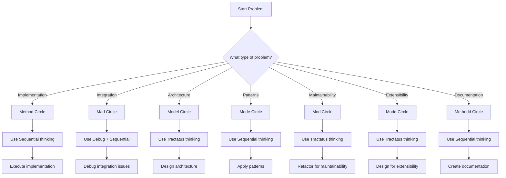

# 7-BMAD Thinking Integration Guide

## Overview

This guide documents the integration between the 7-BMAD quality methodology and the three thinking servers (Sequential, Tractatus, Debug) to create a structured problem-solving framework.

## 7-BMAD Circles Overview

1. **Method Circle** - Implementation correctness
2. **Mad Circle** - Integration completeness  
3. **Model Circle** - Architecture alignment
4. **Mode Circle** - Pattern consistency
5. **Mod Circle** - Maintainability standards
6. **Modd Circle** - Extensibility verification
7. **Methodd Circle** - Documentation quality

## Thinking Servers

- **Sequential** - Multi-step process decomposition
- **Tractatus** - Logical structure analysis
- **Debug** - Graph-based problem tracking

## Circle-to-Thinking Server Mapping

### 1. Method Circle → Sequential Thinking

**Purpose**: Break down implementation into manageable steps

**Sequential Thought Pattern**:
```
Step 1: Understand requirements
Step 2: Design approach
Step 3: Implement core logic
Step 4: Handle edge cases
Step 5: Test implementation
Step 6: Refactor if needed
```

**Example Implementation Planning**:
```markdown
# Task: Implement User Authentication

## Step 1: Requirements Analysis
- Need login endpoint
- Require JWT tokens
- Password hashing with bcrypt
- Session management

## Step 2: Architecture Design
- Express middleware for auth
- User service with DB operations
- Token generation/validation
- Error handling middleware

## Step 3: Implementation
- Create user model
- Implement login endpoint
- Add JWT generation
- Create auth middleware

## Step 4: Edge Cases
- Handle invalid credentials
- Token expiration
- Rate limiting
- Password reset flow

## Step 5: Testing
- Unit tests for auth functions
- Integration tests for endpoints
- Security testing
- Performance testing

## Step 6: Refinement
- Error message consistency
- Logging improvements
- Documentation updates
```

### 2. Model Circle → Tractatus Thinking

**Purpose**: Analyze and design system architecture

**Tractatus Operations**:
- `start`: Begin structural analysis
- `add`: Add architectural components
- `analyze`: Verify structural integrity

**Example Architecture Analysis**:
```markdown
# System Architecture Analysis

## Operation: start
**Concept**: Microservices Architecture

## Operation: add
### Component 1: API Gateway
- Responsibility: Request routing
- Dependencies: Service discovery
- Interfaces: HTTP/REST

### Component 2: User Service
- Responsibility: User management
- Dependencies: Database, Cache
- Interfaces: gRPC, Events

### Component 3: Order Service
- Responsibility: Order processing
- Dependencies: Payment service, Inventory
- Interfaces: REST, Events

### Component 4: Notification Service
- Responsibility: Send notifications
- Dependencies: Email service, SMS service
- Interfaces: REST, Webhooks
```

### 3. Mad Circle → Debug-thinking + Sequential

**Purpose**: Investigate and resolve integration issues

**Debug Graph Pattern**:
```
1. Identify integration point
2. Map dependencies
3. Trace data flow
4. Isolate failure point
5. Test hypotheses
6. Document findings
```

**Example API Integration Debug**:
```markdown
# Debugging API Connection Failure

## Graph Creation
- Node 1: Frontend login form
- Node 2: Auth API endpoint
- Node 3: User database
- Node 4: JWT service
- Edge 1-2: POST /login
- Edge 2-3: SELECT query
- Edge 2-4: JWT generation

## Hypothesis Testing
- Hypothesis 1: Network connectivity
  - Test: Ping auth service
  - Result: PASS

- Hypothesis 2: Database connection
  - Test: Manual DB query
  - Result: FAIL

- Hypothesis 3: Service availability
  - Test: Health check endpoint
  - Result: PASS

## Resolution
- Issue: Database connection pool exhausted
- Fix: Increase max connections from 10 to 50
- Verification: Connection successful
```

### 4. Mode Circle → Sequential Thinking

**Purpose**: Establish and maintain coding patterns

**Sequential Pattern Matching**:
```
1. Identify existing patterns
2. Document pattern rules
3. Apply consistently
4. Validate adherence
5. Refactor deviations
```

**Example Pattern Implementation**:
```markdown
# Authentication Pattern Implementation

## Step 1: Identify Patterns
- Error handling: try/catch blocks
- Response format: { success, data, error }
- Validation: joi schemas
- Logging: structured logging

## Step 2: Define Rules
```javascript
// Always wrap async operations
const asyncHandler = (handler) => {
  return async (req, res, next) => {
    try {
      await handler(req, res, next);
    } catch (error) {
      next(error);
    }
  };
};

// Always validate input
const validate = (schema) => {
  return (req, res, next) => {
    const { error } = schema.validate(req.body);
    if (error) return res.status(400).json({ error: error.message });
    next();
  };
};
```

## Step 3: Apply Consistently
- Update all auth endpoints
- Update all API handlers
- Update error middleware

## Step 4: Validate
- Run pattern detection tool
- Check for deviations
- Review codebase coverage
```

### 5. Mod Circle → Tractatus Thinking

**Purpose**: Ensure maintainable code structure

**Tractatus Maintainability Analysis**:
```markdown
# Code Maintainability Check

## Operation: start
**Concept**: User Service Architecture

## Operation: analyze
### Current Structure
- User model (120 lines)
- User service (450 lines)
- User controller (200 lines)
- User tests (300 lines)

### Maintainability Issues
1. User service too large (450 lines)
2. Mixed concerns (business logic + data access)
3. Hard-coded values scattered
4. Missing error handling patterns

### Operation: add
### Refactored Components
- User entity (80 lines)
- User repository (100 lines)
- User service (150 lines)
- User DTOs (50 lines)
- User validator (30 lines)
- User handler (100 lines)

### Operation: analyze
### Improved Metrics
- Max file size: 150 lines (target: 200)
- Clear separation of concerns
- Centralized validation
- Consistent error handling
```

### 6. Modd Circle → Tractatus Thinking

**Purpose**: Design extensible architecture

**Tractatus Extensibility Framework**:
```markdown
# Extensibility Analysis

## Operation: start
**Concept**: Plugin Architecture for Analytics

## Operation: add
### Plugin Interface
```javascript
interface AnalyticsPlugin {
  initialize(config): Promise<void>
  track(event: Event): Promise<void>
  report(): Promise<Report>
  destroy(): Promise<void>
}
```

### Plugin Registry
- Event plugins: Page views, Clicks
- Storage plugins: Database, File, Cloud
- Reporting plugins: Dashboard, Email
- Alert plugins: Slack, SMS

## Operation: analyze
### Extensibility Points
1. Event types can be extended
2. Storage backends can be swapped
3. Report formats can be customized
4. Alert channels can be added

### Future-Proofing
- Version API for backward compatibility
- Configuration-driven behavior
- Plugin hot-reloading
- Performance monitoring
```

### 7. Methodd Circle → Sequential Thinking

**Purpose**: Structure documentation creation

**Sequential Documentation Process**:
```markdown
# Documentation Creation Workflow

## Step 1: Understand Audience
- Developers: Technical details, examples
- Users: Getting started, tutorials
- Admins: Configuration, deployment

## Step 2: Structure Content
- API documentation
- Usage examples
- Configuration guide
- Troubleshooting

## Step 3: Create Drafts
- Overview section
- Quick start guide
- API reference
- Examples section
- FAQ section

## Step 4: Review and Refine
- Check completeness
- Verify examples work
- Update terminology consistency
- Add missing details

## Step 5: Publish and Maintain
- Version control integration
- Automated updates
- Usage analytics
- Regular reviews
```

## Decision Tree for Circle Selection



## Tool Integration Examples

### Example 1: Feature Development
```bash
# Method Circle - Sequential thinking
tractatus_thinking: {
  operation: "start",
  concept: "New feature development",
  depth: 3
}

sequentialthinking: {
  thought: "Break down feature into implementation steps",
  total_thoughts: 6
}

# After implementation
debug_thinking: {
  action: "create",
  nodeType: "observation",
  content: "Feature implemented with tests"
}
```

### Example 2: Architecture Refactor
```bash
# Model Circle - Tractatus thinking
tractatus_thinking: {
  operation: "start",
  concept: "Monolithic to microservices",
  depth: 5
}

# After refactoring
sequentialthinking: {
  thought: "Migration plan with rollback strategy",
  total_thoughts: 4
}

debug_thinking: {
  action: "create",
  nodeType: "solution",
  content: "Successful migration with zero downtime"
}
```

## Best Practices

1. **Circle First, Then Thinking**: Always identify the circle before selecting thinking server
2. **Iterative Approach**: Use multiple thinking servers for complex problems
3. **Document Decisions**: Track why specific thinking servers were chosen
4. **Validate Results**: Ensure thinking approach solved the problem
5. **Combine When Needed**: Use multiple circles for complex scenarios

## Common Patterns

### Pattern 1: Architecture First
```
Model Circle (Tractatus) → Method Circle (Sequential) → Modd Circle (Tractatus)
```

### Pattern 2: Integration Debug
```
Mad Circle (Debug + Sequential) → Model Circle (Tractatus) → Method Circle (Sequential)
```

### Pattern 3: Documentation Pipeline
```
Methodd Circle (Sequential) → Mode Circle (Sequential) → Method Circle (Sequential)
```

## Troubleshooting

### Issue: Thinking servers not helping
1. Verify circle selection matches problem type
2. Check thinking server parameters
3. Try different order of operations

### Issue: Missing integration points
1. Use Debug-thinking to map relationships
2. Apply Tractatus for structural analysis
3. Sequential for step-by-step integration

### Issue: Architecture unclear
1. Start with Tractatus operation "start"
2. Add components incrementally
3. Analyze relationships between components

---

*Last Updated: 2026-02-15*
*Integration Version: 1.0*