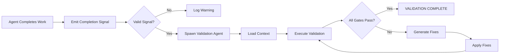

# Agent Completion Signal Format

## Overview

This document defines the standardized completion signal format that all agents must emit when completing work. This format enables automatic validation triggering.

## Signal Format

### Standard Completion Signal

```markdown
[COMPLETION]
Agent: {agent_name}
Task: {task_description}
Files: [list of changed files]
Status: {Success/Partial/Failed}
Deviations: {count or "None"}
[/COMPLETION]
```

### Required Fields

| Field | Description | Example |
|-------|-------------|---------|
| Agent | Name of the agent completing work | `GSI-executor`, `GSI-planner`, `sub-agent` |
| Task | Brief description of completed task | `Implemented JWT authentication` |
| Files | List of files created or modified | `["src/auth/jwt.ts", "src/types/user.ts"]` |
| Status | Completion status | `Success`, `Partial`, `Failed` |
| Deviations | Number of deviations from plan | `None`, `2` |

### Status Values

- **Success**: Task completed exactly as planned, no deviations
- **Partial**: Task completed with deviations (see Deviations field)
- **Failed**: Task could not be completed

## Signal Detection Mechanism

### How Validation System Detects Completion Signals

1. **Pattern Matching**: System monitors output for `[COMPLETION]`...`[/COMPLETION]` pattern
2. **Signal Parsing**: Extracts fields from signal block
3. **Validation Trigger**: Auto-spawns validation agent with signal context

### Trigger Conditions

A validation agent is auto-spawned when:

1. Completion signal detected in agent output
2. Signal contains all required fields
3. Status is `Success` or `Partial`
4. Files list is non-empty

### Malformed Signal Handling

If signal is malformed:

1. **Missing Fields**: Log warning, do not trigger validation
2. **Invalid Format**: Log error, do not trigger validation
3. **Empty Files**: Warning logged, validation may still trigger

## Signal Examples

### Example 1: GSI Executor Agent Completion

```markdown
[COMPLETION]
Agent: GSI-executor
Task: Phase 6 Plan 01 - 7-BMAD Quality Gates Implementation
Files:
  - references/validation-gates.md
  - references/agent-completion-signal.md
  - references/validation-workflow.md
Status: Success
Deviations: None
[/COMPLETION]
```

### Example 2: GSI Planner Agent Completion

```markdown
[COMPLETION]
Agent: GSI-planner
Task: Create execution plan for Phase 6
Files:
  - .planning/phases/06-quality-verification/06-01-PLAN.md
  - .planning/phases/06-quality-verification/06-02-PLAN.md
Status: Success
Deviations: None
[/COMPLETION]
```

### Example 3: Sub-Agent Completion (Partial)

```markdown
[COMPLETION]
Agent: code-analysis-subagent
Task: Analyze code for security vulnerabilities
Files:
  - reports/security-analysis.md
Status: Partial
Deviations: 1
  - [Rule 3 - Blocking] Missing dependency "crypto" library
[/COMPLETION]
```

### Example 4: Sub-Agent Completion (Failed)

```markdown
[COMPLETION]
Agent: data-migration-subagent
Task: Migrate user data to new schema
Files:
  - logs/migration-error.log
Status: Failed
Deviations: N/A
Error: Database connection timeout during migration
[/COMPLETION]
```

## Deviations Format

When deviations are present, include details:

```markdown
Deviations: {count}

### Deviations
1. [Rule X - Category] {Description}
   - Found during: {Task/Phase}
   - Fix: {What was done}
   - Files: {Affected files}

2. [Rule Y - Category] {Description}
   - Found during: {Task/Phase}
   - Fix: {What was done}
   - Files: {Affected files}
```

## Validation Agent Context

When validation agent spawns, it receives:

1. **Completion Signal**: Full signal block
2. **Agent Context**: Agent type and task description
3. **Files List**: All changed files for review
4. **Deviations**: If any, for gap analysis

## Error Handling

### Malformed Signals

#### Error: Missing Required Field
```
[COMPLETION]
Agent: GSI-executor
Task: Implement feature
[/COMPLETION]
```
**Issue**: Missing `Files` and `Status` fields  
**Action**: Log warning, do not trigger validation

#### Error: Invalid Status Value
```
[COMPLETION]
Agent: GSI-executor
Task: Implement feature
Files: ["src/feature.ts"]
Status: Done
[/COMPLETION]
```
**Issue**: Invalid status `Done` (must be `Success`/`Partial`/`Failed`)  
**Action**: Log warning, do not trigger validation

#### Error: Unmatched Delimiters
```
[COMPLETION]
Agent: GSI-executor
Task: Implement feature
Files: ["src/feature.ts"]
Status: Success
```
**Issue**: Missing closing `[/COMPLETION]`  
**Action**: Log error, do not trigger validation

## Signal Emission Guidelines

### When to Emit

1. **After Task Completion**: Always emit after completing a task
2. **After Plan Completion**: Emit after completing all tasks in a plan
3. **After Phase Completion**: Emit after completing all plans in a phase
4. **After Error Recovery**: Emit after recovering from a failure

### When NOT to Emit

1. **During Task Execution**: Don't emit mid-task progress updates
2. **For Planning Only**: Planning without execution doesn't trigger validation
3. **For Failed Dependencies**: If dependencies failed, signal should reflect this

### Best Practices

1. **Be Specific**: Task description should clearly identify what was done
2. **List All Files**: Include every file created, modified, or deleted
3. **Accurate Status**: Use `Partial` when deviations occurred
4. **Document Deviations**: Explain what changed from the plan

## Integration with Validation Workflow

### Flow Diagram



## Testing Completion Signals

### Validation Checklist

When creating completion signals, verify:

- [ ] All required fields present
- [ ] Field values use correct format
- [ ] Status is valid (Success/Partial/Failed)
- [ ] Files list is accurate
- [ ] Deviations documented if present
- [ ] Delimiters match correctly

### Test Signal Template

```markdown
[COMPLETION]
Agent: test-agent
Task: Test signal emission
Files:
  - test/file1.md
  - test/file2.md
Status: Success
Deviations: None
[/COMPLETION]
```

## References

- @references/validation-workflow.md - End-to-end validation workflow
- @references/validation-gates.md - 7-BMAD quality gates
- @workflows/execute-plan.md - Execution workflow with completion signals

---

**Version**: 1.0  
**Last Updated**: 2026-02-13  
**Status**: Active
