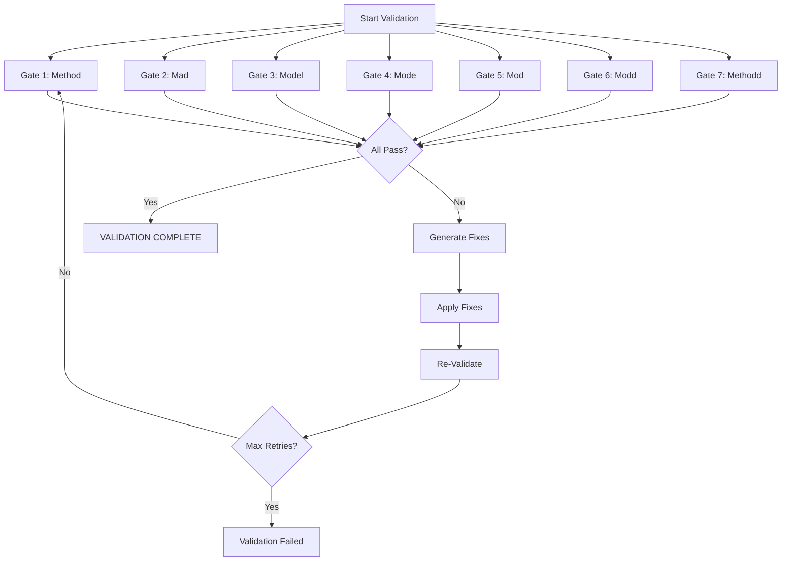

# 7-BMAD Quality Gates Specification

## Overview

This document defines the 7-BMAD (7-Scared Circle Method, Mad, Model, Mode, Mod, Modd, Methodd) quality gates used for automatic validation of all agent work.

Each gate represents a quality dimension that must pass validation for work to be considered complete.

## Gate 1: Method Circle (Implementation Correctness)

### Purpose
Verify that the implementation correctly fulfills requirements and functions as intended.

### Validation Criteria

#### Code Compilation/Execution
- [ ] Code compiles or runs without syntax errors
- [ ] No runtime errors during normal operation
- [ ] Build process succeeds

#### Logic Correctness
- [ ] Logic matches requirements exactly
- [ ] Output matches expected results
- [ ] Algorithms implement specified behavior
- [ ] Data transformations are correct

#### Edge Case Handling
- [ ] Null/undefined values handled properly
- [ ] Empty inputs processed correctly
- [ ] Boundary conditions tested
- [ ] Error cases covered

#### Performance Requirements
- [ ] Response time meets specifications
- [ ] Memory usage within limits
- [ ] Scalability requirements satisfied
- [ ] No obvious performance bottlenecks

#### Security
- [ ] No SQL injection vulnerabilities
- [ ] No XSS vulnerabilities
- [ ] Proper authentication/authorization
- [ ] Input validation present

#### Resource Management
- [ ] Connections properly closed
- [ ] Memory leaks absent
- [ ] File handles released
- [ ] Resources cleaned up

### Validation Tool
`code-review-expert` with focus on correctness

### Output Format
```markdown
## Method Circle: PASS/FAIL

### Issues Found
1. [Severity] [Location]: [Description]
2. [Severity] [Location]: [Description]

### Recommendations
1. [Specific fix suggestion]
2. [Specific fix suggestion]
```

### Severity Levels
- **Critical**: Security vulnerabilities, data corruption, crashes
- **High**: Logic errors, broken functionality, performance violations
- **Medium**: Minor edge cases, inefficient code
- **Low**: Style issues, minor optimizations

---

## Gate 2: Mad Circle (Integration Completeness)

### Purpose
Verify that all components are properly integrated and work together correctly.

### Validation Criteria

#### Dependency Integration
- [ ] All required dependencies installed/imported
- [ ] Dependency versions compatible
- [ ] No missing imports
- [ ] No unused dependencies

#### API/Interface Matching
- [ ] APIs match specifications exactly
- [ ] Interfaces implemented completely
- [ ] Function signatures correct
- [ ] Parameter types match

#### Data Flow
- [ ] Data flows correctly between components
- [ ] No broken data pipelines
- [ ] State changes propagate properly
- [ ] Data transformations complete

#### Integration Points
- [ ] No missing integration points
- [ ] All connectors present
- [ ] Cross-module calls work
- [ ] External integrations functional

#### Error Handling Across Boundaries
- [ ] Errors propagate correctly
- [ ] Error handling at boundaries
- [ ] Fallback mechanisms present
- [ ] Graceful degradation

#### Contract Compliance
- [ ] API contracts honored
- [ ] Data structure contracts met
- [ ] Protocol compliance
- [ ] Interface contracts satisfied

### Validation Tool
`code-review-expert` with focus on integration

### Output Format
```markdown
## Mad Circle: PASS/FAIL

### Integration Points
- [ ] Dependency A: Integrated
- [ ] API B: Mismatched (see issue #1)
- [ ] Data Flow C: Broken (see issue #2)

### Issues Found
[Detailed integration issues]

### Recommendations
[Specific integration fixes]
```

### Severity Levels
- **Critical**: Missing dependencies, broken APIs, data corruption
- **High**: Integration failures, contract violations
- **Medium**: Minor mismatches, incomplete error handling
- **Low**: Unused dependencies, minor inconsistencies

---

## Gate 3: Model Circle (Architecture Alignment)

### Purpose
Verify that the implementation follows established architectural patterns and principles.

### Validation Criteria

#### Architectural Patterns
- [ ] Follows project architectural patterns
- [ ] Consistent with established architecture
- [ ] Pattern usage appropriate for context
- [ ] No architectural violations

#### Separation of Concerns
- [ ] Clear separation between layers
- [ ] Modules have single responsibility
- [ ] No circular dependencies
- [ ] Appropriate abstraction levels

#### Design Principles
- [ ] SOLID principles followed
- [ ] DRY (Don't Repeat Yourself) respected
- [ ] KISS (Keep It Simple) applied
- [ ] YAGNI (You Aren't Gonna Need It) observed

#### Consistency with Codebase
- [ ] Consistent with existing code style
- [ ] Uses established conventions
- [ ] Fits into existing structure
- [ ] No structural anomalies

#### Modularity
- [ ] Components are modular
- [ ] Interfaces well-defined
- [ ] Modules cohesive
- [ ] Coupling appropriate

#### Scalability Considerations
- [ ] Design supports growth
- [ ] No inherent scalability limitations
- [ ] Appropriate use of patterns for scale

### Validation Tool
`tractatus-thinking` for structural analysis

### Output Format
```markdown
## Model Circle: PASS/FAIL

### Architectural Assessment
- Pattern Alignment: [PASS/FAIL]
- Separation of Concerns: [PASS/FAIL]
- Design Principles: [PASS/FAIL]
- Consistency: [PASS/FAIL]

### Issues Found
[Architectural issues]

### Recommendations
[Architectural improvements]
```

### Severity Levels
- **Critical**: Broken architecture, circular dependencies
- **High**: Pattern violations, poor separation
- **Medium**: Minor inconsistencies, unclear boundaries
- **Low**: Style variations, minor optimizations

---

## Gate 4: Mode Circle (Pattern Consistency)

### Purpose
Verify that coding patterns and conventions are consistently applied.

### Validation Criteria

#### Coding Patterns
- [ ] Uses established coding patterns
- [ ] Pattern application consistent
- [ ] Patterns appropriate for context
- [ ] No anti-patterns present

#### Naming Conventions
- [ ] Variables named consistently
- [ ] Functions named according to convention
- [ ] Classes follow naming standards
- [ ] Files named appropriately

#### Error Handling Patterns
- [ ] Error handling consistent
- [ ] Error patterns established
- [ ] Error propagation uniform
- [ ] Error messages follow format

#### State Management Patterns
- [ ] State management patterns aligned
- [ ] State updates consistent
- [ ] State mutations controlled
- [ ] State access patterns uniform

#### Code Structure Patterns
- [ ] File structure consistent
- [ ] Module organization uniform
- [ ] Code layout follows standards
- [ ] Section ordering consistent

#### Comment Patterns
- [ ] Comment style consistent
- [ ] Comment placement appropriate
- [ ] Comment format uniform
- [ ] Documentation comments complete

### Validation Tool
`code-review-expert` with pattern analysis

### Output Format
```markdown
## Mode Circle: PASS/FAIL

### Pattern Violations
1. [Pattern name]: [How it's violated]
2. [Pattern name]: [How it's violated]

### Consistency Issues
- Naming: [Issue description]
- Structure: [Issue description]

### Recommendations
- Apply pattern: [Pattern name]
- Refactor: [Specific refactoring]
```

### Severity Levels
- **Critical**: Security pattern violations, breaking patterns
- **High**: Major pattern inconsistencies
- **Medium**: Minor pattern violations
- **Low**: Style inconsistencies, minor variations

---

## Gate 5: Mod Circle (Maintainability Standards)

### Purpose
Verify that code is maintainable, readable, and follows best practices.

### Validation Criteria

#### Code Readability
- [ ] Code is clear and understandable
- [ ] Intent is obvious from reading
- [ ] No confusing constructs
- [ ] Self-documenting code

#### Comments
- [ ] Comments where necessary (not obvious)
- [ ] Comments explain WHY not WHAT
- [ ] No misleading comments
- [ ] Complex logic explained

#### Function/Class Size
- [ ] Function length reasonable (<50 lines)
- [ ] Class length reasonable (<300 lines)
- [ ] Parameter count limited (<5 parameters)
- [ ] Nesting depth controlled (<5 levels)

#### Complexity Management
- [ ] Cyclomatic complexity acceptable (<10)
- [ ] Cognitive complexity manageable
- [ ] No overly complex algorithms
- [ ] Simplification where possible

#### Test Coverage
- [ ] Unit tests present
- [ ] Tests cover critical paths
- [ ] Edge cases tested
- [ ] Tests are meaningful

#### Code Duplication
- [ ] No significant duplication (<3% similarity)
- [ ] DRY principle followed
- [ ] Shared code extracted
- [ ] No copy-paste programming

### Metrics
- Cyclomatic complexity: <10 per function
- Function length: <50 lines
- Class length: <300 lines
- Duplication: <3% similarity

### Validation Tool
`code-review-expert` with maintainability metrics

### Output Format
```markdown
## Mod Circle: PASS/FAIL

### Metrics
- Average complexity: [X]
- Max function length: [X] lines
- Duplication: [X]%

### Issues
1. [Maintainability issue]
2. [Maintainability issue]

### Recommendations
[Specific maintainability improvements]
```

### Severity Levels
- **Critical**: Unmaintainable code, extreme complexity
- **High**: Excessive complexity, significant duplication
- **Medium**: Minor maintainability issues
- **Low**: Style improvements, minor optimizations

---

## Gate 6: Modd Circle (Extensibility Verification)

### Purpose
Verify that code is designed for future extension and modification.

### Validation Criteria

#### Extension Ease
- [ ] Easy to extend functionality
- [ ] New features can be added cleanly
- [ ] Extension points clear
- [ ] No fundamental barriers to extension

#### Hard-Coding Avoidance
- [ ] No hard-coded assumptions
- [ ] Configuration externalized
- [ ] Magic numbers eliminated
- [ ] Hard-coded strings replaced

#### Configurability
- [ ] Behavior configurable where appropriate
- [ ] Settings externalized
- [ ] Feature flags present
- [ ] Environment-specific config

#### Plugin/Extension Points
- [ ] Plugin architecture clear
- [ ] Extension points documented
- [ ] Hooks provided
- [ ] Modular design

#### Abstraction Levels
- [ ] Appropriate abstractions
- [ ] Interfaces stable
- [ ] Implementation details hidden
- [ ] Abstraction leaks absent

#### Future-Proofing
- [ ] Design supports anticipated changes
- [ ] No dead-end architecture
- [ ] Migration paths available
- [ ] Versioning considered

### Validation Tool
`tractatus-thinking` for extensibility analysis

### Output Format
```markdown
## Modd Circle: PASS/FAIL

### Extensibility Assessment
- Extension Points: [CLEAR/UNCLEAR]
- Hard-Coding: [PRESENT/ABSENT]
- Configurability: [GOOD/POOR]
- Abstraction: [APPROPRIATE/INAPPROPRIATE]

### Issues
[Extensibility issues]

### Recommendations
[Extensibility improvements]
```

### Severity Levels
- **Critical**: Fundamentally non-extensible, hard-coded throughout
- **High**: Significant hard-coding, poor abstraction
- **Medium**: Limited configurability
- **Low**: Minor extensibility improvements

---

## Gate 7: Methodd Circle (Documentation Quality)

### Purpose
Verify that documentation is complete, accurate, and useful.

### Validation Criteria

#### README Updates
- [ ] README updated if functionality changed
- [ ] New features documented
- [ ] Usage instructions clear
- [ ] Installation steps accurate

#### API Documentation
- [ ] API documentation complete
- [ ] All public APIs documented
- [ ] Parameters documented
- [ ] Return values specified

#### Usage Examples
- [ ] Usage examples provided
- [ ] Examples are clear
- [ ] Examples cover common cases
- [ ] Examples are runnable

#### Changelog Updates
- [ ] Changes documented in changelog
- [ ] Change descriptions meaningful
- [ ] Breaking changes noted
- [ ] Version numbers correct

#### Inline Comments
- [ ] Complex code commented
- [ ] Non-obvious logic explained
- [ ] References to external sources
- [ ] TODO/FIXME comments appropriate

#### Architecture Documentation
- [ ] Architecture docs updated
- [ ] Design decisions documented
- [ ] System diagrams current
- [ ] Data flows documented

### Validation Tool
`code-review-expert` with documentation check

### Output Format
```markdown
## Methodd Circle: PASS/FAIL

### Documentation Checklist
- README: [Status]
- API docs: [Status]
- Examples: [Status]
- Changelog: [Status]

### Missing Documentation
- [ ] [What's missing]
- [ ] [What's missing]

### Recommendations
[Specific documentation additions]
```

### Severity Levels
- **Critical**: Missing critical documentation, misleading docs
- **High**: Incomplete documentation, unclear examples
- **Medium**: Minor documentation gaps
- **Low**: Documentation improvements, enhanced examples

---

## Gate Evaluation Workflow

### Overall Assessment



### Scoring and Aggregation

- All gates must pass (100% threshold)
- Each gate has equal weight (1/7)
- Critical issues block gate passage
- High issues may block gate passage
- Medium/Low issues generate warnings

### Pass/Fail Determination

**PASS**: All gates pass
- All critical issues resolved
- All high issues resolved
- No gate failures

**FAIL**: Any gate fails
- Critical issue present
- High issue present in standard/strict mode
- Gate criteria not met

**WARN**: Warnings present but no failures
- Medium issues present
- Low issues present
- Non-blocking concerns

---

## Decision Point Logic

### Pass Path
```
All Gates Pass → Mark Complete → Notify User → [VALIDATION COMPLETE]
```

### Fail Path
```
Any Gate Fails → Identify Failing Gates → Generate Fixes → Apply Fixes → Re-Validate
```

### Retry Logic
```
Attempt 1: Fix immediate issues
Attempt 2: Deeper analysis, architecture review
Attempt 3: Comprehensive refactor
After Attempt 3: If still failing → Detailed report to user
```

---

## Tool Selection by Gate

| Gate | Primary Tool | Secondary Tools |
|------|-------------|-----------------|
| Method | code-review-expert | find-skills |
| Mad | code-review-expert | tractatus-thinking |
| Model | tractatus-thinking | code-review-expert |
| Mode | code-review-expert | find-skills |
| Mod | code-review-expert | N/A |
| Modd | tractatus-thinking | code-review-expert |
| Methodd | code-review-expert | N/A |

---

## Integration Points

### Completion Signal Detection
- Monitor for `[COMPLETION]` signals
- Auto-spawn validation agent
- Load context from completion signal

### Validation Trigger
- Automatic after agent completion
- Manual trigger available
- Checkpoint validation optional

### User Notification
- Success: `[VALIDATION COMPLETE]` with quality score
- Failure: Detailed failure report with recommendations
- Warning: `[VALIDATION COMPLETE WITH WARNINGS]`

---

## References

- @C:\Users\mose\.claude\rules\auto-validation.md - Auto-validation system rules
- @references/code-review-criteria.md - Detailed code review criteria
- @references/code-review-workflow.md - Code review workflow with skill integration
- @references/validation-workflow.md - End-to-end validation workflow
- @references/validation-config.md - Configuration options

## Code Review Integration

### Code Review Tool Mapping

The following gates use `code-review-expert` skill with detailed criteria from @references/code-review-criteria.md:

- **Method Circle** → Implementation Correctness criteria
- **Mad Circle** → Integration Completeness criteria
- **Mode Circle** → Pattern Consistency criteria
- **Mod Circle** → Maintainability Standards criteria
- **Methodd Circle** → Documentation Quality criteria

See @references/code-review-criteria.md for detailed checklists, metrics, and output formats for each gate.

---

**Version**: 1.0  
**Last Updated**: 2026-02-13  
**Status**: Active
