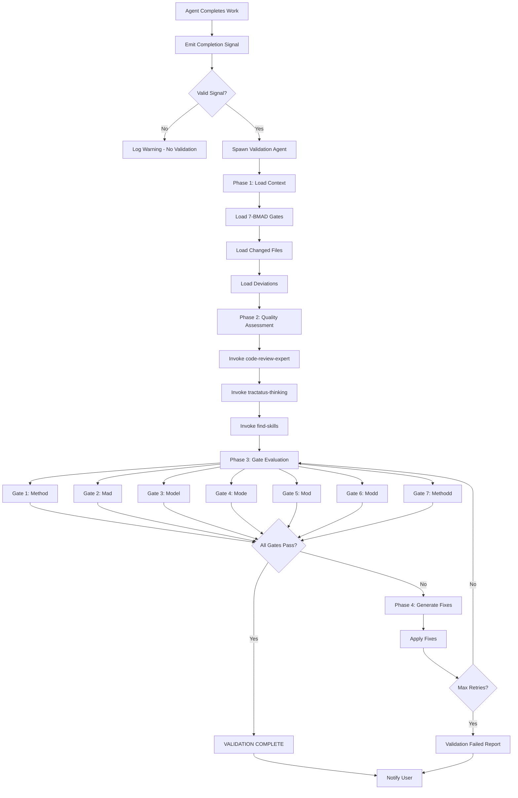

# End-to-End Validation Workflow

## Overview

This document defines the complete validation workflow that automatically triggers after agent completion, evaluates all 7-BMAD quality gates, and handles failures with retry logic.

## Workflow Phases

### Phase 1: Completion Detection

```
Agent signals completion
↓
System detects completion signal
↓
Validation agent auto-spawns
↓
Context loaded from completion signal
```

#### Signal Detection

1. **Pattern Matching**: Monitor for `[COMPLETION]`...`[/COMPLETION]` pattern
2. **Signal Validation**: Verify all required fields present
3. **Context Extraction**: Parse agent, task, files, status, deviations

#### Auto-Spawning

When valid completion signal detected:

1. Spawn validation agent with completion context
2. Load 7-BMAD gate specifications
3. Prepare validation environment

---

### Phase 2: Quality Assessment

```
Validation agent loads context
↓
Executes code-review-expert skill
↓
Runs find-skills for optimization check
↓
Applies 7-BMAD gate assessment
```

#### Context Loading

1. **Completion Signal**: Extract agent info, task description
2. **Files List**: Load all changed files
3. **Deviations**: Load deviation details if present
4. **Gate Specifications**: Load @references/validation-gates.md

#### Skill Invocation

**Code Review Expert** (for gates 1, 2, 4, 5, 7):
```
Use skill: code-review-expert
Focus: [Specific gate(s) to validate]
Context: [Relevant files/changes]
```

**Tractatus Thinking** (for gates 3, 6):
```
Use skill: tractatus-thinking
Operation: start
Concept: [Architecture/structure to analyze]
```

**Find-Skills** (optimization check):
```
Use skill: find-skills
Task: [Current implementation]
Goal: Token/quality optimization
```

---

### Phase 3: Gate Evaluation

#### Gate 1: Method Circle (Implementation Correctness)

**Tool**: `code-review-expert` with focus on correctness

**Checks**:
- Code compiles/runs without errors
- Logic matches requirements exactly
- Edge cases handled properly
- Performance requirements met

**Validation Tool**: `code-review-expert`

---

#### Gate 2: Mad Circle (Integration Completeness)

**Tool**: `code-review-expert` with focus on integration

**Checks**:
- All dependencies properly integrated
- APIs/interfaces match specifications
- Data flows correctly between components
- No integration points missing

**Validation Tool**: `code-review-expert`

---

#### Gate 3: Model Circle (Architecture Alignment)

**Tool**: `tractatus-thinking` for structural analysis

**Checks**:
- Follows project architectural patterns
- Maintains separation of concerns
- Adheres to design principles
- Consistent with existing codebase

**Validation Tool**: `tractatus-thinking`

---

#### Gate 4: Mode Circle (Pattern Consistency)

**Tool**: `code-review-expert` with pattern analysis

**Checks**:
- Uses established coding patterns
- Naming conventions followed
- Error handling patterns consistent
- State management patterns aligned

**Validation Tool**: `code-review-expert`

---

#### Gate 5: Mod Circle (Maintainability Standards)

**Tool**: `code-review-expert` with maintainability metrics

**Checks**:
- Code is readable and clear
- Comments where necessary (not obvious)
- Function/class size reasonable
- Complexity within acceptable limits

**Metrics**: Cyclomatic complexity <10, function length <50 lines, class length <300 lines

**Validation Tool**: `code-review-expert`

---

#### Gate 6: Modd Circle (Extensibility Verification)

**Tool**: `tractatus-thinking` for extensibility analysis

**Checks**:
- Easy to extend/modify
- No hard-coded assumptions
- Configurable where appropriate
- Plugin/extension points clear

**Validation Tool**: `tractatus-thinking`

---

#### Gate 7: Methodd Circle (Documentation Quality)

**Tool**: `code-review-expert` with documentation check

**Checks**:
- README updated if needed
- API docs complete
- Usage examples provided
- Changes documented in changelog

**Validation Tool**: `code-review-expert`

---

### Phase 4: Decision Point

```
All Gates Pass?
├── YES → Mark complete, notify user
└── NO  → Automatic fix attempt
         ↓
         Identify failing gates
         ↓
         Generate targeted fixes
         ↓
         Re-run validation
         ↓
         Max 3 retry attempts
         ↓
         If still failing → Notify user with details
```

#### Pass Path

When all gates pass:

```markdown
[VALIDATION COMPLETE]
Task: [Task description]
Quality Score: 7/7 gates passed
Optimizations: [Any optimizations applied]
[/VALIDATION COMPLETE]
```

#### Fail Path

When any gate fails:

1. **Identify Failing Gates**: List gates with issues
2. **Generate Fixes**: Create specific fix for each issue
3. **Apply Fixes**: Implement fixes automatically
4. **Re-Validate**: Run validation again
5. **Repeat**: Up to 3 attempts

---

## Retry Strategy

### Attempt 1: Fix Immediate Issues

- Fix immediate syntax errors
- Resolve missing imports
- Correct simple logic errors
- Add missing error handling

**Outcome**: Most issues resolved

### Attempt 2: Deeper Analysis

- Architecture review if needed
- Integration analysis
- Pattern consistency review
- Maintainability assessment

**Outcome**: Deeper issues resolved

### Attempt 3: Comprehensive Refactor

- Full code refactor if needed
- Architecture restructuring
- Pattern realignment
- Documentation completion

**Outcome**: Last attempt before manual intervention

### Final Failure

If still failing after 3 attempts:

```markdown
# Validation Failure Report

## Failing Gates
- Gate X: [Description]
- Gate Y: [Description]

## Issues Found
1. [Issue description with location]
2. [Issue description with location]

## Recommended Fixes
1. [Fix suggestion]
2. [Fix suggestion]

## Next Steps
Please review and either:
- Approve automatic fix attempts
- Provide guidance on resolution approach
```

---

## Token Optimization Strategy

### Compressed Skills

- Use pre-compressed validation skills (~80-90% token savings)
- Skills contain compressed validation logic
- Avoid redundant analysis

### Targeted Analysis

- Only analyze changed files
- Focus on relevant gates for file type
- Skip unrelated gates

### Incremental Validation

- Validate incrementally as tasks complete
- Cache validation results
- Reuse when possible

### Example Token Savings

```
Manual Review: ~100K tokens
+ Read all files
+ Manual analysis
+ Write detailed review

Code Review Expert Skill: ~10K tokens (compressed)
+ Pre-compressed review logic
+ Targeted analysis
+ Efficient output
```

---

## Validation Flow Diagram



---

## Monitoring and Metrics

### Track

- **Validation pass/fail rate**: Target 95%+ pass
- **Common failure patterns**: Top 10 issues
- **Retry success rate**: How often retry succeeds
- **Average validation duration**: Target <5 min standard
- **Token usage per validation**: Target 80%+ savings

### Goals

- 95%+ pass rate after fixes
- <5 minutes per standard review
- 80%+ token savings vs manual review
- 100% agent compliance

### Continuous Improvement

System learns from failures to:

1. **Improve detection patterns**
2. **Enhance fix suggestions**
3. **Optimize validation speed**
4. **Reduce false positives**

---

## Emergency Overrides

### Force Complete

User can force completion with:

```markdown
[FORCE COMPLETE]
Reason: [Why validation should be bypassed]
[/FORCE COMPLETE]
```

### Skip Gate

User can skip specific gate:

```markdown
[SKIP GATE]
Gate: [Gate number/name]
Reason: [Why gate should be skipped]
[/SKIP GATE]
```

### Override Audit

All overrides logged:
- Date/time
- User
- Override type
- Reason
- Review after completion

---

## Configuration

### Retry Limit

Default: 3 attempts
Configurable via: `references/validation-config.md`

### Gate Weights

All gates: Equal weight (1/7 each)
Pass threshold: 100% (all gates must pass)

### Timeout

Per-gate validation: 60 seconds
Total validation: 5 minutes

### Strictness

- **Lenient**: Only critical issues block approval
- **Standard**: Critical + high issues block approval
- **Strict**: All issues must be addressed

---

## References

- @references/validation-gates.md - 7-BMAD quality gate specifications
- @references/agent-completion-signal.md - Completion signal format
- @references/code-review-criteria.md - Detailed code review criteria
- @references/validation-config.md - Configuration options
- @C:\Users\mose\.claude\rules\auto-validation.md - Auto-validation system rules

---

## Retry Strategy and Failure Handling

### Retry Strategy

**Attempt 1: Fix Immediate Issues**
- Fix syntax errors
- Resolve missing imports
- Correct simple logic errors
- Add missing error handling
**Outcome**: Most issues resolved

**Attempt 2: Deeper Analysis**
- Architecture review if needed
- Integration analysis
- Pattern consistency review
- Maintainability assessment
**Outcome**: Deeper issues resolved

**Attempt 3: Comprehensive Refactor**
- Full code refactor if needed
- Architecture restructuring
- Pattern realignment
- Documentation completion
**Outcome**: Last attempt before manual intervention

### Failure Report Format

```markdown
# Validation Failure Report

## Failing Gates
- Gate X: [Description]
- Gate Y: [Description]

## Issues Found
1. [Issue description with location]
2. [Issue description with location]

## Recommended Fixes
1. [Specific fix suggestion]
2. [Specific fix suggestion]

## Next Steps
Please review and either:
- Approve automatic fix attempts
- Provide guidance on resolution approach
```

### Automatic Fix Generation

When validation fails:

1. **Identify Failing Gates**: List gates with issues
2. **Categorize Issues**: By severity (Critical, High, Medium, Low)
3. **Generate Fixes**: For each issue, create specific fix
4. **Apply Fixes**: Implement fixes automatically
5. **Re-Validate**: Run validation again

### Fix Generation by Gate Type

**Method Circle (Implementation)**:
- Fix syntax errors
- Correct logic errors
- Add edge case handling
- Fix security issues

**Mad Circle (Integration)**:
- Add missing dependencies
- Fix API mismatches
- Correct data flow issues
- Add error handling at boundaries

**Model Circle (Architecture)**:
- Restructure components
- Improve separation of concerns
- Align with design patterns
- Fix architectural violations

**Mode Circle (Patterns)**:
- Apply consistent patterns
- Fix naming conventions
- Standardize error handling
- Align state management

**Mod Circle (Maintainability)**:
- Reduce complexity
- Add comments
- Break up large functions
- Remove duplication

**Modd Circle (Extensibility)**:
- Remove hard-coding
- Add configuration options
- Improve abstraction
- Add extension points

**Methodd Circle (Documentation)**:
- Update README
- Complete API docs
- Add usage examples
- Update changelog

### Monitoring and Metrics

**Track**:
- Validation pass/fail rate
- Retry success rate
- Common failure patterns
- Average validation duration
- Token usage per validation

**Goals**:
- 95%+ pass rate after fixes
- <5 minutes per standard review
- 80%+ token savings vs manual review
- 100% agent compliance

**Continuous Improvement**:
- System learns from failures
- Update detection patterns
- Enhance fix suggestions
- Optimize validation speed

---

## Emergency Overrides

### Force Complete

User can force completion with:

```markdown
[FORCE COMPLETE]
Reason: [Why validation should be bypassed]
[/FORCE COMPLETE]
```

**Appropriate Use**:
- Emergency deployments
- Known acceptable risks
- Time-critical fixes

### Skip Gate

User can skip specific gate:

```markdown
[SKIP GATE]
Gate: [Gate number/name]
Reason: [Why gate should be skipped]
[/SKIP GATE]
```

**Appropriate Use**:
- Gate doesn't apply to current work type
- Temporary exception for specific reason
- Known limitation with workaround

### Override Audit Trail

All overrides logged:
- Date/time
- User
- Override type
- Reason
- Review after completion

**Override Review**:
- All overrides reviewed after completion
- Assess if override was appropriate
- Update validation rules if needed
- Document lessons learned

---

**Version**: 1.0  
**Last Updated**: 2026-02-13  
**Status**: Active
