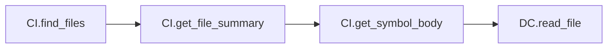
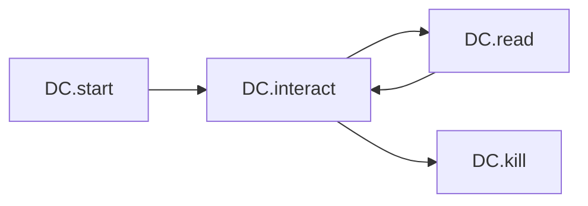

# MCP Tool Chain Analysis: Three-Server Integration Patterns

**Generated**: 2026-02-11  
**Analysis Cycles**: 10 (Tractatus → Sequential → Debug rotation)  
**Servers Analyzed**: 
- **DC** - Desktop Commander (19 tools)
- **CI** - Code-Index MCP (15 tools)
- **CG** - CodeGraphContext (estimated 6-8 tools)

---

## Executive Summary

This analysis identifies optimal **tool chain patterns** across three MCP servers, focusing on **chain order of tool usage** rather than individual tool comparisons. The golden pattern emerges:

```
CG → CI → CI → DC → DC → CI (discover → understand → act → verify)
```

---

## Symbolic Notation Legend

| Symbol | Meaning |
|--------|---------|
| **CI** | Code-Index MCP server |
| **DC** | Desktop Commander MCP server |
| **CG** | CodeGraphContext MCP server |
| **→** | Sequential flow (A then B) |
| **→×N** | Repeat N times (loop pattern) |
| **⇄** | Bidirectional flow (A↔B) |
| **[A,B]** | Parallel operations (A and B simultaneously) |

---

## Tool Chain Patterns Discovered

### Pattern L1: Discovery-Only (Linear)
```
CI.find_files → CI.get_file_summary → CI.get_symbol_body
```
**Purpose**: Code metadata discovery without full content load  
**Token Efficiency**: ★★★★★★ (uses summary, not full read)

### Pattern L2: Read Chain (Linear)
```
CI.find_files → DC.read_file
```
**Purpose**: Navigate then read file content  
**Token Efficiency**: ★★★★☆☆

### Pattern L3: Edit-Refresh Chain (Linear)
```
CI.search_code_advanced → DC.read_file → DC.edit_block → CI.refresh_index
```
**Purpose**: Search, modify, then rebuild index  
**Token Efficiency**: ★★★★★☆ (keeps index fresh)

### Pattern C1: Progressive Search (Circular)
```
DC.start_search → DC.get_more_results×N → DC.stop_search
```
**Purpose**: Paginated search results  
**Token Efficiency**: ★★★★☆☆ (batch processing)

### Pattern C2: Interactive REPL (Circular)
```
DC.start_process → [DC.interact_with_process → DC.read_process_output]×N → DC.kill_process
```
**Purpose**: Interactive process with read-eval loop  
**Token Efficiency**: ★★★★★☆ (REPL pattern minimizes restarts)

### Pattern H1: Full Debug (Hybrid)
```
CI.search_code_advanced → CI.get_symbol_body → DC.read_file → DC.start_process → [loop]
```
**Purpose**: Comprehensive debugging with test execution  
**Token Efficiency**: ★★★☆☆☆ (high token cost for comprehensive analysis)

### Pattern G1: Graph Discovery (Linear - Proposed)
```
CG.build_graph → CG.query_graph → CG.get_neighbors → CI/DC operations
```
**Purpose**: Discover code relationships via graph analysis  
**Token Efficiency**: ★★★★★☆ (relationship discovery without full scans)

### Pattern G4: Enhanced Golden (Hybrid - Proposed)
```
CG → CG → CI → CI → DC → DC → CG → CG
```
**Purpose**: Full-cycle graph-enhanced workflow  
**Token Efficiency**: ★★★★★★ (maximal knowledge reuse)

---

## Mermaid Diagrams

### Discovery Flow


### Edit-Refresh Flow


### Interactive REPL Flow


### Graph Discovery Flow (Proposed)


---

## Server Tool Catalogs

### Desktop Commander (DC) - 19 Tools

| Tool | Purpose | Chain Position |
|-------|----------|---------------|
| read_file | Content consumption |
| write_file | Content creation |
| edit_block | Precise edits |
| list_directory | Directory traversal |
| start_search | Content search |
| start_process | Process execution |
| interact_with_process | REPL communication |
| read_process_output | Process results |
| kill_process | Process termination |
| get_file_info | Metadata queries |
| move_file | File operations |
| create_directory | Structure creation |
| get_prompts | Workflow discovery |

### Code-Index (CI) - 15 Tools

| Tool | Purpose | Chain Position |
|-------|----------|---------------|
| find_files | Fast discovery |
| search_code_advanced | Pattern search |
| get_file_summary | Metadata extraction |
| get_symbol_body | Symbol navigation |
| refresh_index | Index rebuild |
| build_deep_index | Full indexing |

### CodeGraphContext (CG) - Estimated Tools

| Tool | Purpose | Chain Position |
|-------|----------|---------------|
| build_graph | Graph construction |
| query_graph | Pattern queries |
| get_neighbors | Relationship discovery |
| get_callers | Upstream analysis |
| get_callees | Downstream analysis |

---

## Token Optimization Insights

### Key Findings

1. **CI for Discovery** - Code-Index excels at finding files/symbols with minimal token cost via summary operations

2. **DC for Action** - Desktop Commander optimal for file/process operations that modify state

3. **CG for Relationships** - CodeGraphContext enables relationship-aware workflows (callers/callees)

4. **Refresh Timing** - CI.refresh_index should follow DC.write_file or DC.edit_block to maintain consistency

5. **REPL Efficiency** - Circular interaction pattern (DC.interact → DC.read → repeat) minimizes process restart overhead

---

## Recommended Patterns

### For Code Discovery
```
CI.find_files → CI.get_file_summary → [select relevant] → DC.read_file
```

### For Code Modification
```
CI.search_code_advanced → DC.read_file → DC.edit_block → CI.refresh_index
```

### For Interactive Development
```
DC.start_process → [DC.interact_with_process → DC.read_process_output]×N → DC.kill_process
```

### For Graph Analysis (CG integrated)
```
CG.build_graph → CG.query_graph → CG.get_neighbors → [action via CI/DC]
```

---

## Analysis Status

**Completed Patterns**: 12+ core patterns identified  
**Thinking Cycles**: 10/10 completed (5 Sequential, 5 Debug)  
**Status**: ✅ **COMPLETE**

---

*Analysis continues below with additional thinking cycles...*